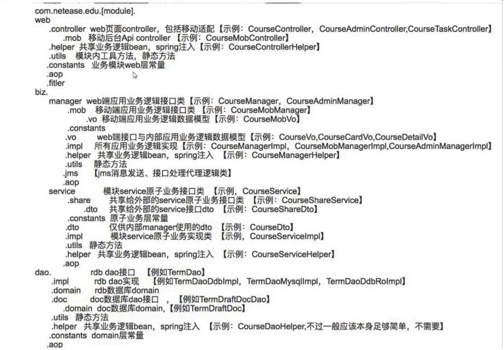

## 微服务架构

这里就不照本宣科，讲述一些微服务架构的基本概念了，这种内容网上多如牛毛，所以这里直接讲述微服务架构需要的的一些基本组件。废话少说，如图（图片来自网易）：

当然，实际上我们落地的微服务架构可能比这个还复杂的多得多，我们可以从上面的图中可以看出一个完整的微服务架构基本包含下面这些内容：

- CI/CD
- 性能与故障定位
- 服务注册中心
- 服务配置中心
- 分布式任务调度
- 日志搜集/大数据分析平台
- 分布式事务
- 负载均衡
- 服务容错保护

## 杂谈之服务落地、项目管理等

先聊聊`为什么分布式架构`。老生常谈的问题了，这里就不过多的赘述，一般而言，单体应用有以下一些弊病：

- 主体量大、无法整体更新维护
- 多版本共存
- 并发支持弱
- 管理难题：发布、测试、修改、排错困难

总的来说，个人感悟是分布式架构的一些内容并不是非要使用大厂、遵照国内某些大厂的标准。

因为从架构本身而言，都要立足于业务。诸如国内大厂的架构体系基本都是立足于其具体的业务而实现的，换句话说：人家那套你不一定合适。

那么我们要如何做架构方面的工作呢，前面说了，首先得立足于当前的业务。其次，我们的设计、方案乃至于管理，都需要提前作出总体的规划。就这点而言，往往是一个团队去协作的。所以对于要实现的具体的内容就更加需要落到实处，让我们的方案落地。

那我们再从项目落到实处出发，我们可能需要有一些具体的实操手段：

- 项目管理
- 知识分享
- JIRA+Wiki
- 团队建设
- 技术分享
- 工程师文化

其次，最重要的是，我们可以参照这样的顺序来保证顺利落地：

- 需求、设计（得让各负责人明确）
- 数据库
- 开发规范
- 项目管理（细分到具体的模块、项目、工单）

下面提供一个包结构和命名规范：

其次，除了一些规范之外，我们还必须要由诸如：模块分层及依赖关系、接口和类定义规范等等

## 杂谈之高效运作

