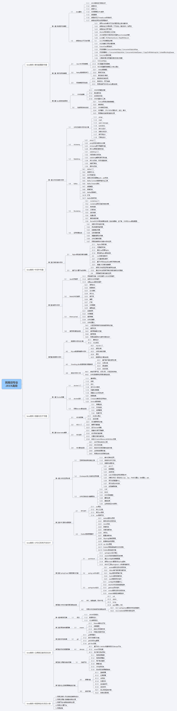

## 声明

**声明**：本系列主要内容是架构师课程个人学习笔记、总结，请勿用作商业用途。

## 想法

- 个人学习总结
- 给朋友们学习提供一些参考
- 积极讨论
- 骗取大量的`Star`

此外，这个系列希望能够帮助大家培养一套自己合适的学习方法。这里给大家提供一些学习方法：

1. 由浅入深、全局观意识
2. 合理规划时间、严格执行（1-2小时）
3. 大胆假设、小心求证
4. 学会提问、活用开源
5. 积极总结、举一反三（周总结、半月总结、月总结、季总结）

## 专题

学而不思则惘，思而不学则怠。以前工作的时候觉得会写代码、懂是什么、为什么就可以，实际上知识技术体系不成体系，希望这个系列能够帮助大家梳理清晰的只是技术体系并运用到时间。

下面是这个系列主要的专题：

| 专题名称               | 涵盖内容                                            |
| ---------------------- | --------------------------------------------------- |
| 高性能编程专题         | 多线程编程、网络编程、虚拟机性能优化                |
| 中间件专题             | 消息队列、负载均衡、分布式缓存、数据库              |
| 容器化技术             | Docker、K8S集群（服务编排、容器编排、应用弹性伸缩） |
| 分布式系统开发技术专题 | RPC、zookeeper、dubbo、SprignCloud                  |
| 项目实践               | 代码规范到具体研发流程、功能实现到运维              |
| 项目分享               | 案例分析                                            |

## 大纲

请支持正版，购买 [网易Java高级开发工程师课程](https://mooc.study.163.com/smartSpec/detail/1001485004.htm)

下面是课程大纲：

>

## 周期

这个系列前面提到过，因为类似于个人学习笔记、总结，所以持续时间比较长，理论上会持续到19年年底、20年年初，有想法的朋友可以持续跟踪。

再次声明，请尊重知识产权，购买正版！

## 目的

- 技术自驱动
- 技术储备
- 学习方法体系构建
