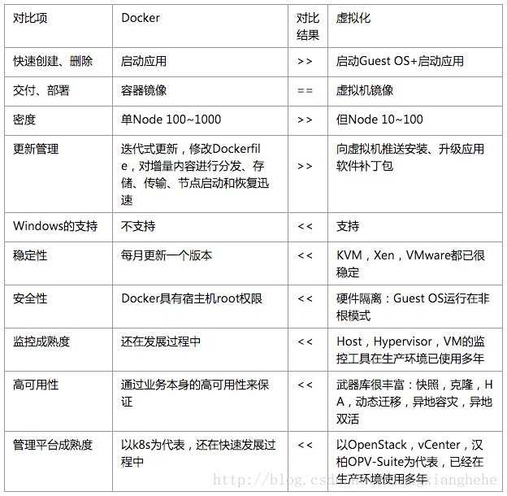

 - [Docker简介](#docker简介)
  - [1. 容器技术？](#1-容器技术)
  - [2. 容器与虚拟机的对比](#2-容器与虚拟机的对比)
  - [3. 什么是Docker](#3-什么是docker)
  - [4. Docker的目标](#4-docker的目标)
  - [5. Docker使用场景](#5-docker使用场景)

## 1.1 容器技术？

> 1. 一种虚拟化方案
> 2. 操作系统级别的虚拟化（当应用被封装成容器之后，它是一个相对独立的运行环境，它所依赖的一切：代码、运行环境、系统工具、系统库、设置等都已经被准备妥当）
> 3. 因为依赖操作系统，所以只能运行与相同或相似内核的操作系统
> 4. Docker依赖于Linux特性，NameSpace、Control Groups（Cgroups）
> 5. 注意：在容器内，应该最小化对外界的影响，如在容器中不能把宿主机的资源耗尽！

## 1.2 容器与虚拟机的对比

> 从下图我们可以看出
>
> 1. 虚拟机和容器都是依托于物理机操作系统
> 2. 虚拟机需要Hypervisor（即系统管理程序）的支持，建立在Hypervisor之上的虚拟机从Hypervisor的协作下获得物理机的系统资源
> 3. 容器技术则直接安装在主机系统之上，他直接利用宿主机的内核等特性，抽象层比虚拟机更少、更加轻量化，所以从这个层面上讲容器技术是比较复杂的。

> 下面给出Docker和虚拟化的详细对比

 

## 1.3 什么是Docker

> 1. 将应用程序自动部署到容器
> 2. Go语言编写
> 3. dotCloud公司发行
> 4. 基于Apache2.0协议

## 1.4 Docker的目标

> 1. 提供简单轻量的建模方式
> 2. 职责的逻辑分离
> 3. 快速开发周期
> 4. 鼓励使用面向服务的架构，高内聚、低耦合

## 1.5 Docker使用场景

> 1. 使用Docker容器开发、测试、部署服务
> 2. 创建隔离的运行环境
> 3. 搭建测试环境
> 4. 构建多用户的平台及服务，PaaS服务（云计算领域天然集成、OpenStack）
> 5. 提供软件及服务SaaS应用程序
> 6. 高性能、超大规模的宿主机部署

