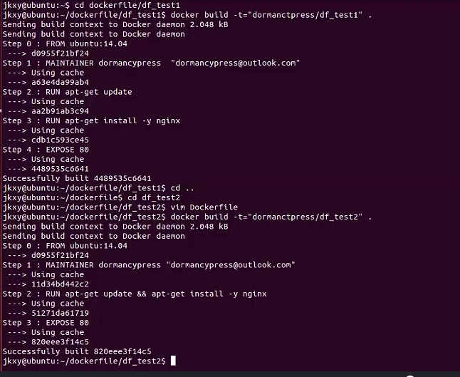

- [1 Dockerfile指令](#1-dockerfile指令)
  - [1.1 指令格式](#11-指令格式)
  - [1.2 Dockerfile例子](#12-dockerfile例子)
- [2 指令详解](#2-指令详解)
  - [2.1 FROM](#21-from)
  - [2.2 MAINTAINER](#22-maintainer)
  - [2.3 RUN](#23-run)
  - [2.4 EXPOSE](#24-expose)
  - [2.5 CMD](#25-cmd)
  - [2.6 ENTERYPOINT](#26-enterypoint)
  - [2.7 ADD/COPY](#27-addcopy)
  - [2.8 VOLUME](#28-volume)
  - [2.9 WORKDIR](#29-workdir)
  - [2.10 ENV](#210-env)
  - [2.11 USER](#211-user)
  - [2.12 ONBUILD](#212-onbuild)
- [3. 构建过程（原理）](#3-构建过程原理)
  - [3.1 Dockerfile执行过程](#31-dockerfile执行过程)
  - [3.2 中间层调试/镜像缓存](#32-中间层调试镜像缓存)

## 1 Dockerfile指令

### 1.1 指令格式

- 注释：以`#`开头，后面是注释的内容
- 指令：大写的指令名 + 指令参数

### 1.2 Dockerfile例子

```bash
# FIRST DOCKERFILE
FROM ubuntu:14.04

# 作者信息
MAINTAINER rexlin600 "rexlin600@gmail.com"

# 指令
RUN apt-get update
RUN apt-get install-y nginx

# 暴露端口
EXPOSE 80
```

分析：上面的例子其实给出了四种指令

1. `FORM`
2. `MAINTAINER`
3. `RUN`
4. `EXPOSE`

## 2 指令详解

### 2.1 FROM

- `FROM`后面的镜像必须存在
- `FORM`后面的镜像属于这个镜像的基础镜像
- `FROM`必须是一条非注释指令

### 2.2 MAINTAINER

- 镜像作者
- 镜像作者联系方式

### 2.3 RUN

> RUN命令是在镜像构建过程中执行！！！

- 指定当前镜像中运行的命令

```bash
# shell模式
RUN <COMMAND>
/bin/sh -c command
RUN echo hello

# exec模式
RUN ["executable" ,"param1", "param2"]
RUN ["/bin/bash", "-c", "echo hello"]

```

 PS：每一个命令相当于在镜像的上层新建一层镜像来运行相应的指令，下面给出一个图例（摘自极客学院）



### 2.4 EXPOSE

- 指定运行该镜像的容器指定额端口
- 可以指定多个
- 在容器启动时我们还是要手动指定容器的端口映射（因为虽然我们配置了暴露的端口，但是docker处于安全的考虑并不会打开相应的端口，所以需要我们在运行容器时指定需要打开的端口），如下

```bash
# EXPOSE命令格式
EXPOSE <port> [<port>...]

# 实例
docker run -i -t -p 80 -d rexlin600/web nginx -g "daemon off;"
```

### 2.5 CMD

> 和RUN命名一样都是运行命令，主要在于运行命令的时间不同，CMD是在容器运行时执行的命令

```bash
# shell模式
CMD ["executable", "param1", "param2"]

# exec模式
CMD command param1 param2

# 作为ENTRYPOINT的默认参数
CMD ["param1", "param2"]
```

**在docker run时如果指定了运行命令，那么会覆盖掉dockerfile中的cmd指令**

### 2.6 ENTERYPOINT

> ENTRYPOINT和CMD命令作用一致，不同点在于ENTRYPOINT不会被 `docker run` 指令中的命令覆盖！！！

```bash
# shell 模式
ENTRYPOINT ["executable", "param1", "param2"]

# exec 模式
ENTRYPOINT command param1 param2
```

### 2.7 ADD/COPY

> ADD 和 COPY 作用类似，都是将文件或目录复制到使用dockerfile构建的镜像当中，这是一个简单却非常重要的命令
>
> 说明：
>
> - 原地址 src
> - 目标地址（镜像中的绝对路径） dest
> - 原地址支持本地地址和远程地址（Docker不推荐使用远程地址，远程地址建议使用curl或wget命令）
>
> 区别：
>
> - ADD包含类似tar的解压功能
> - 如果单纯复制文件，Docker建议使用COPY指令
>
>

```bash
# ADD
ADD [src]...<dest>
# 适用于文件路径有空格的情况
ADD ["<src>"..."<dest>"]

# COPY
COPY [src]...<dest>
# 适用于文件路径有空格的情况
COPY ["<src>"..."<dest>"]
```

### 2.8 VOLUME

> 向基于镜像创建的容器添加卷

### 2.9 WORKDIR

> 在通过镜像创建容器时在容器内部设置工作目录，CMD、ENTRYPOINT命令都会在这样的目录中执行
>
> - 通常使用绝对路径
>
> - 使用相对路径则路径地址会传递下去，如
>
>   - WORKDIR /a
>   - WORKDIR /b
>
>   则后面的工作路径为 /a/b

### 2.10 ENV

> 设置环境变量，和WORKDIR类似，在构建和运行过程中都有效

```bash
ENV <key><value>
ENV <key>=<value>...
```

### 2.11 USER

> 指定镜像使用什么用户去运行容器，默认使用root用户

```bash
# USER 格式
USER user
USER uid
USER user:group
USER uid:uid
USER user:gid
USER uid:group

# 示例
USER daemon
USER nginx
```

### 2.12 ONBUILD

> 镜像触发器
>
> 当一个镜像被其他镜像作为基础镜像时执行
>
> 会在构建过程中插入指令

```bash
ONBUILD [INSTRUCTION]
```

说明：

 - 当我们在一个镜像中写了ONBUILD指令后，这时这个镜像构建发现ONBUILD指令并不会执行；
 - 当我们在另一个dockerfile中 `FORM` 上面的镜像，并重新构建发现会在构建过程中输出一个 `trigger` ,这时这个ONBUILD指令才执行了。

## 3. 构建过程（原理）

### 3.1 Dockerfile执行过程

1. 从基础镜像运行一个容器（ `FROM` 指定的镜像）
2. 执行一条指令，对容器做出修改 （`RUN` `ENTRYPOINT` `CMD`）
3. 执行类似 `docker commit` 的操作，提交一个新的镜像层（在每次中间层镜像构建层成功后会删除中间层生成的容器，但是并没有删除中间层的 `image`， 所以我们实际上可以通过 `docker run`命令来调试中间层的镜像，这给我们提供了调试的可能）
4. 再基于刚提交的镜像运行一个新容器
5. 执行 Dockerfile 中的吓一跳指令，直至所有指令执行完毕

### 3.2 中间层调试/镜像缓存

- 构建缓存（Docker默认在构建时，对于前面的构建保留缓存以提高构建效率）

- 不适用缓存

  ```bash
  在构建命令后面加上 --no-cache 即可
  ```

- 刷新缓存

  ```bash
  # 使用环境变量来标识缓存的刷新时间，实际使用时相当于在我们的各个镜像层它的生成时间是不一样的，我们这里指定一个时间会让这个时间后的镜像不使用缓存，方便我们调试镜像
  ENV REFRESH_DATE 2018-08-22
  ```


