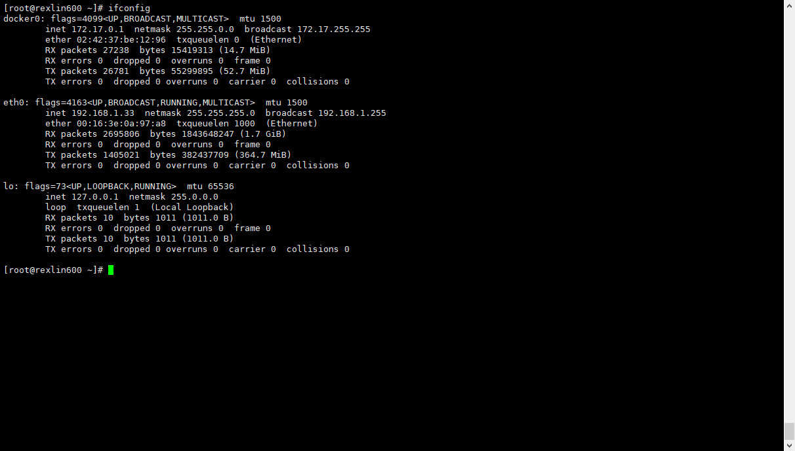
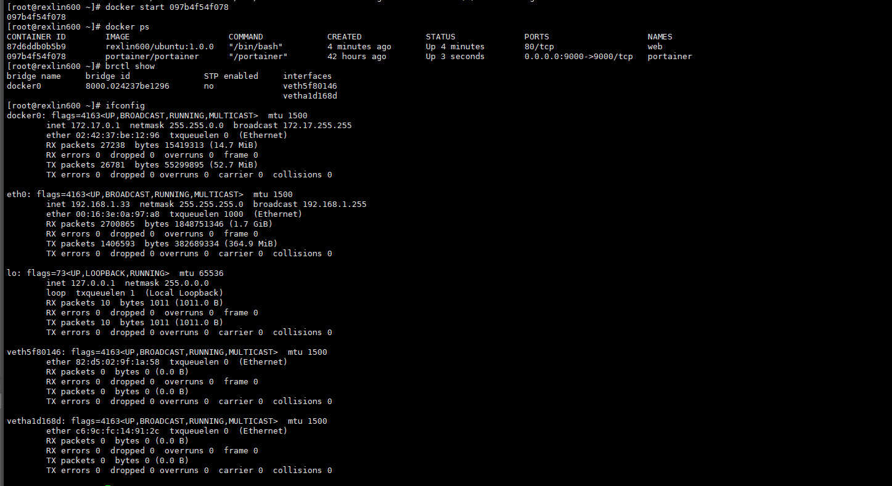

- [1 容器的网络连接基础](#1-容器的网络连接基础)
  - [1.1 docker0](#11-docker0)
    - [1.1.1 虚拟网桥特点：](#111-虚拟网桥特点)
    - [1.1.2 网桥与容器](#112-网桥与容器)
  - [1.2 自定义docker0](#12-自定义docker0)
  - [1.3 自定义虚拟网桥](#13-自定义虚拟网桥)
- [2. 容器的互联](#2-容器的互联)
  - [2.1 允许容器互联（默认）](#21-允许容器互联默认)
  - [2.2 拒绝容器间互联](#22-拒绝容器间互联)
  - [2.3 允许特定容器间连接](#23-允许特定容器间连接)
- [3. 容器与外部网络的连接](#3-容器与外部网络的连接)

## 1 容器的网络连接基础

`Docker`官方的网络模式说明：

- bridge：docker默认的网络模式，为容器创建独立的网络命名空间，容器具有独立的网卡等所有单独的网络栈，是最常用的使用方式。
- host：直接使用容器宿主机的网络命名空间。
- none：为容器创建独立网络命名空间，但不为它做任何网络配置，容器中只有lo，用户可以在此基础上，对容器网络做任意定制。
- 其他容器：与host模式类似，只是容器将与指定的容器共享网络命名空间。
- 用户自定义：docker 1.9版本以后新增的特性，允许容器使用第三方的网络实现或者创建单独的bridge网络，提供网络隔离能力。

| **模式**   | **是否支持多主机** | **南北向通信机制** | **东西向通信机制** |
| ---------- | ------------------ | ------------------ | ------------------ |
| bridge     | 否                 | 宿主机端口绑定     | 通过Linux bridge   |
| host       | 是                 | 按宿主机网络通信   | 按宿主机网络通信   |
| none       | 否                 | 无法通信           | 只能用link通信     |
| 其他容器   | 否                 | 宿主机端口绑定     | 通过link通信       |
| 用户自定义 | 按网络实现而定     | 按网络实现而定     | 按网络实现而定     |

- [参考文章](https://www.cnblogs.com/ilinuxer/p/6680205.html)

### 1.1 docker0

`docker0` ： Linux的虚拟网桥

OSI七层网络模型


> 网桥是一个纯粹的数据链路层应用，只不过docker0有一些不同。

#### 1.1.1 虚拟网桥特点：

- 可以设置IP地址
- 相当于拥有一个虚拟网卡

默认docker0的地址划分

- IP：172.17.42.1		子网掩码：255.255.255.0

- MAC：02:42:ac:11:00:00 到 02:42:ac:11:ff:ff

- 总共提供了65534个地址

  下图是我的docker服务的实际虚拟网桥的相关地址：
  



```bash
# 安装网桥
apt-get install bridge-utils

# 查看网桥设备
brctl show

# 我们这里使用 docker start 来启动之前构建的容器，如下(如果你没有创建过任何容器建议先看下前面的文章)
docker start web
docker start portainer
```



#### 1.1.2 网桥与容器

从上图我们可以看出这这时候网桥有两个接口，再结合下面这幅图我们不难发现：

1. docker0作为虚拟的网桥会通过 veth* 的虚拟网络接口和容器的 eth0 通信
2. 同一宿主机上，容器之间都是连接到docker0这个网桥上的，它可以作为虚拟交换机使容器可以相互通信
3. 由于宿主机的IP地址与容器veth pair的 IP地址均不在同一个网段，故仅仅依靠veth pair和namespace的技术，还不足以使宿主机以外的网络主动发现容器的存在。为了使外界可以方位容器中的进程，docker采用了端口绑定的方式，也就是通过iptables的NAT，将宿主机上的端口端口流量转发到容器内的端口上
4. Docker启动时，自动在主机上创建虚拟网桥docker0，并随机分配一个本地空闲私有网段的一个地址给docker0接口。 虚拟网桥docker0在内核层连通了其他的物理或虚拟网卡，将所有容器和本地主机都放到同一个网络。 docker0接口的默认配置包含了IP地址、子网掩码等，可以在docker服务启动的时候进行自定义配置。（见下图）


### 1.2 自定义docker0

```bash
# 通过 ifconfig 命令修改docker0地址
ifconfig docker0 192.168.200.1 netmask 255.255.255.0
```

### 1.3 自定义虚拟网桥

```bash
# 1 添加虚拟网桥
brctl addbr br0
ifconfig br0 192.168.100.1 netmask 255.255.255.0

# 2 CentOS更改docker守护进程的启动配置
/etc/sysconfig/docker中添加 OPTIONS 的值
-b=br0

# 2 Ubuntu系统值更改docker守护进程的启动配置
/etc/default/docker中添加 DOCKER_OPS 的值
-b=br0
```

## 2. 容器的互联

```bash
# 用于测试的Dockerfile
FROM ubuntu:14.04
RUN apt-get install -y ping
RUN apt-get update
RUN apt-get install -y nginx
RUN apt-get install -y curl
EXPOSE 80
CMD /bin/bash

# 创建镜像
docker build -t rexlin600/fcd .
```


### 2.1 允许容器互联（默认）

默认情况下，docker不限制容器的互相访问。容器的IP地址是不可靠的，它会随着容器的重启而改变。

docker提供了一个参数 `link` 来指定对应的容器

```bash
--link

# example
docker run --link=[CONTAINER_NAME]:[ALIAS] [IMAGE] [COMMAND]
```

其实就是给链接的容器起一个别名，这样的话每次容器即使重启，但是容器的别名和其启动后IP映射还是有的，所以永远可以互相访问。

### 2.2 拒绝容器间互联

```bash
--icc=false
```

### 2.3 允许特定容器间连接

```bash
# 1 配置
--icc=false
--iptables=true

# 2 容器启动时选项
--link

# 3 查看并清空iptables
iptalbes -L -n
iptables -F

# 4 重启docker服务

# 5 重启容器服务（需要互相访问的请加--link选项）
```

## 3. 容器与外部网络的连接