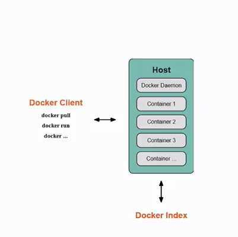
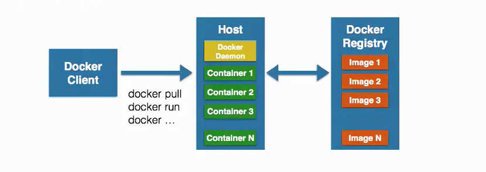

- [1 主要组成部分](#1-主要组成部分)
- [2 Docker 客户端/守护进程](#2-docker-客户端守护进程)
- [3 Docker 镜像](#3-docker-镜像)
- [4 Docker Container 容器](#4-docker-container-容器)
- [5 Docker Registry 仓库](#5-docker-registry-仓库)
- [6 Docker 基本组成图](#6-docker-基本组成图)

## 1 主要组成部分

- Docker Client 客户端
- Docker Daemon 守护进程
- Docker Image 镜像
- Docker Container 容器
- Docker Registry 仓库

## 2 Docker 客户端/守护进程

Docker是C/S架构，Docker客户端发送请求到Docker，Docker的守护进程与其交互并返回信息，如下图：

## 3 Docker 镜像

> 镜像是Docker容器的基石，Docker镜像是一个层叠的只读文件系统
>
> 1. 镜像最低端是bootfs引导系统
> 2. 第二层则是rootfs文件系统，如Ubuntu、CentOS，在Docker中root文件系统永远是只读的
> 3. Docker再通过联合加载（Union mount）来讲所有镜像文件加载在一起组成了这样一个层叠的只读文件系统
> 4. 镜像具有父子关系，最底层的镜像称之为基础镜像

## 4 Docker Container 容器

> 简单的理解就是：容器 = 各层镜像组合 + 读写层
>
> 1. 打包、构建出来的是镜像
> 2. 通过镜像启动、执行后的则是容器
> 3. 写时复制

关于容器和镜像的更多说明，参考文章： [10张图带你深入理解Docker容器和镜像](http://dockone.io/article/783)

## 5 Docker Registry 仓库

> 分类：
>
> 1. 公有仓库
> 2. 私有仓库
>
> Docker官方提供的是一个Docker Hub公共仓库，不好的地方在于需要FQ，所以我们一般使用国内的其他第三方公共仓库

## 6 Docker 基本组成图

> Docker 客户端访问客户端守护进程，从而操作容器；而容器是通过镜像创建的，镜像则保存在Docker仓库中。

