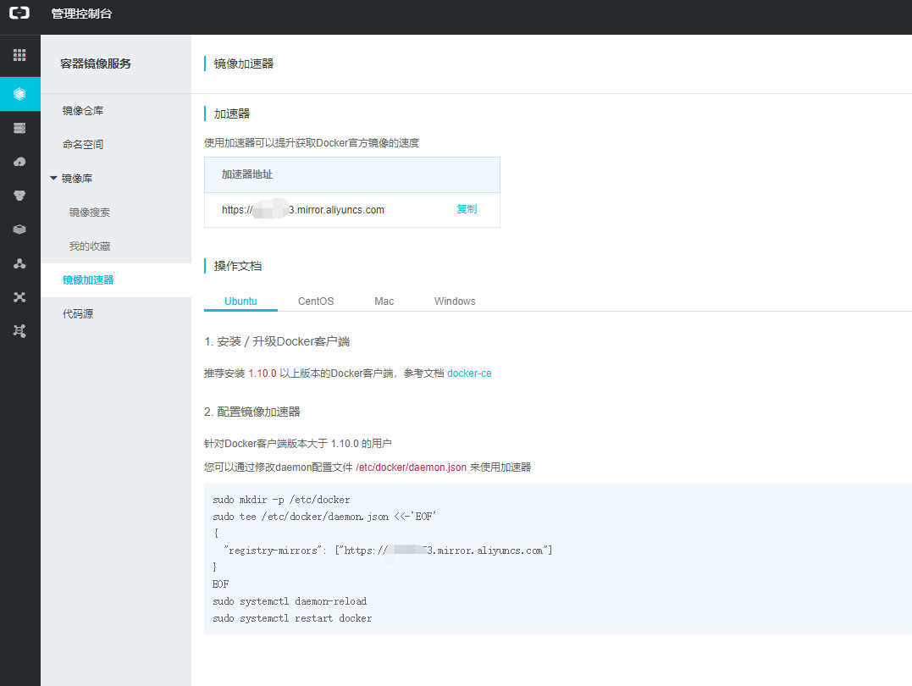

## 1 安装前检查

```bash
# Docker是依赖于内核特性的，所以选择Linux版本、Windows版本、MacOS版本都需要注意，这里以Linux内核为例，实际上Linux只能运行在Linux系统，Windows也是通过虚拟机实现的

# 内核版本
uname -a

# 检查设备驱动 Device Mapper
ls -l /sys/class/misc/device-mapper

# 如果没有则需要安装Docker的驱动程序（以centOS为例）
yum install device-mapper -y
modprobe dm_mod
```


## 2 安装Docker方式

> 方式一：使用CentOS/Ubuntu维护的版本（不推荐）
>
> 方式二：安装Docker维护的版本（推荐）


## 3 安装Docker

1. 采用方式一安装（稳定非最新）

   ```bash
   # ubuntu
   sudo apt-get install -y docker
   
   # centos
   sudo yum install -y docker
   ```

2. 采用方式二安装（安装的CE版，推荐，安装方式摘自https://imroc.io）

   - Ubuntu14.04/16.04

     ```bash
     # 执行安装前检查，见上面 1
     
     # step 1: 安装必要的一些系统工具(https认证及软件包)
     sudo apt-get update
     sudo apt-get -y install apt-transport-https ca-certificates curl software-properties-common
     
     # step 2: 安装GPG证书
     curl -fsSL http://mirrors.aliyun.com/docker-ce/linux/ubuntu/gpg | sudo apt-key add -
     # Step 3: 写入软件源信息
     sudo add-apt-repository "deb [arch=amd64] http://mirrors.aliyun.com/docker-ce/linux/ubuntu $(lsb_release -cs) stable"
     
     # Step 4: 更新并安装 Docker-CE
     sudo apt-get -y update
     # sudo apt-get -y install docker-ce
     
     ############################################
     
     # 安装指定版本的Docker-CE:
     # Step 1: 查找Docker-CE的版本:
     apt-cache madison docker-ce
     
     #   docker-ce | 17.03.1~ce-0~ubuntu-xenial | http://mirrors.aliyun.com/docker-ce/linux/ubuntu xenial/stable amd64 Packages
     #   docker-ce | 17.03.0~ce-0~ubuntu-xenial | http://mirrors.aliyun.com/docker-ce/linux/ubuntu xenial/stable amd64 Packages
     
     # Step 2: 安装指定版本的Docker-CE: (VERSION 例如上面的 17.03.1~ce-0~ubuntu-xenial)
      sudo apt-get -y install docker-ce=[VERSION]
     
     ```

   - CentOS 7

     ```bash
     # step 1: 安装必要的一些系统工具
     sudo yum install -y yum-utils device-mapper-persistent-data lvm2
     # Step 2: 添加软件源信息
     sudo yum-config-manager --add-repo http://mirrors.aliyun.com/docker-ce/linux/centos/docker-ce.repo
     # Step 3: 更新并安装 Docker-CE
     sudo yum makecache fast
     sudo yum -y install docker-ce
     # Step 4: 开启Docker服务
     sudo service docker start
     
     # 注意：
     # 官方软件源默认启用了最新的软件，您可以通过编辑软件源的方式获取各个版本的软件包。例如官方并没有将测试版本的软件源置为可用，你可以通过以下方式开启。同理可以开启各种测试版本等。
     # vim /etc/yum.repos.d/docker-ee.repo
     #   将 [docker-ce-test] 下方的 enabled=0 修改为 enabled=1
     #
     # 安装指定版本的Docker-CE:
     # Step 1: 查找Docker-CE的版本:
     # yum list docker-ce.x86_64 --showduplicates | sort -r
     #   Loading mirror speeds from cached hostfile
     #   Loaded plugins: branch, fastestmirror, langpacks
     #   docker-ce.x86_64            17.03.1.ce-1.el7.centos            docker-ce-stable
     #   docker-ce.x86_64            17.03.1.ce-1.el7.centos            @docker-ce-stable
     #   docker-ce.x86_64            17.03.0.ce-1.el7.centos            docker-ce-stable
     #   Available Packages
     # Step2 : 安装指定版本的Docker-CE: (VERSION 例如上面的 17.03.0.ce.1-1.el7.centos)
     # sudo yum -y install docker-ce-[VERSION]
     ```

## 4 配置加速器

> 众所周知，Docker的官方镜像因为种种原因我们下载很慢，所以需要使用加速器以提高效率。常用的加速器有：
>
> 1. DotCloud
> 2. 阿里云（推荐）


登录阿里云后台并转到容器服务中，如下图（Ubuntu和CentOS的配置是一样的，这里就不贴出了）：




## 5 卸载Docker（CentOS 7）

> 卸载Docker（centos 7）
>
> - [卸载Docker](https://blog.csdn.net/liujingqiu/article/details/74783780)