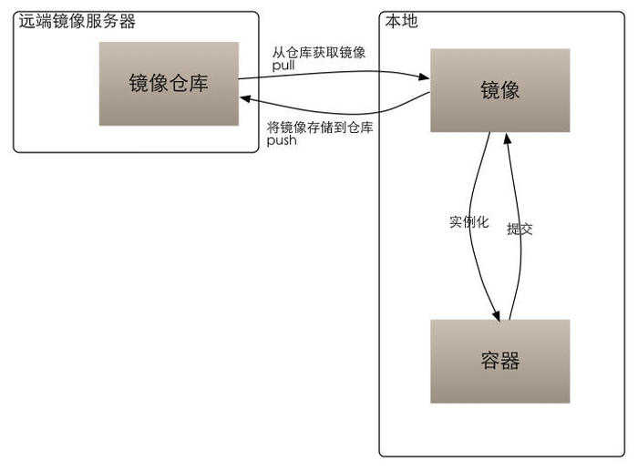

- [1 镜像、容器、仓库](#1-镜像容器仓库)
  - [1.1 镜像](#11-镜像)
  - [1.2 容器](#12-容器)
  - [1.3 仓库](#13-仓库)

## 1 镜像、容器、仓库

> 镜像（Image） docker 
>
> 容器（Container） 
>
> 仓库（Repository）
>
> 这三部分组成了Docker的生命周期，如下图（图片摘自 [CSDN](https://blog.csdn.net/qq_33326449/article/details/79623361) )

从上面我们可以看出：

- 本地从仓库获取/推送镜像  ------>  本地镜像构建（实例化）生成容器

- 容器（commit）提交为镜像

简言之，构建镜像的过程其实就是镜像实例化为一个沙箱式的容器的过程，从而容器可以作为一个单独的个体独立运行。

### 1.1 镜像

镜像类似于虚拟机的镜像，是一个只读的模板，一个独立的文件系统，包括所有运行容器所需要的数据，可以用来创建新的容器

Docker 镜像实际上由一层一层的文件系统组成，这种层级的文件系统成为 `unionFS`， 镜像可以基于 Dockerfile创建， Dockerfile是一个描述文件，里面包含若干条指令，每条指令都会对基础文件系统创建新的层次结构，

> 镜像：
>
> - 容器的基石
> - 层叠的只读文件系统
> - 联合加载（union mount）
> - docker镜像存储在 /var/lib/docker （可以使用docker info命令查看相关信息）

### 1.2 容器

> Docker利用容器来运行应用，Docker容器是由Docker镜像创建的运行实例，Docker容器类似于虚拟机，可以支持的操作包括启动、停止、删除等等，每个容器之间是相互隔离的，容器会运行特定的应用，包含特定应用的代码及所需依赖的文件

可以把容器理解为一个简易版的Linux系统（包含root权限、进程空间、用户空间、网络空间等）和运行在其中的应用**

相对于镜像来说容器时动态的，镜像是只读的，镜像构建为容器并运行相当于在层叠的文件系统（镜像）的最上层创建了一层可写层。

### 1.3 仓库

> 仓库的概念这里就不介绍了

Docker 仓库是用来包含镜像的位置，Docker提供一个注册服务器（Register）来保存多个仓库，每个仓库又可以包含多个具备不同tag的镜像。Docker运行中使用的默认仓库是 Docker Hub 公共仓库。
