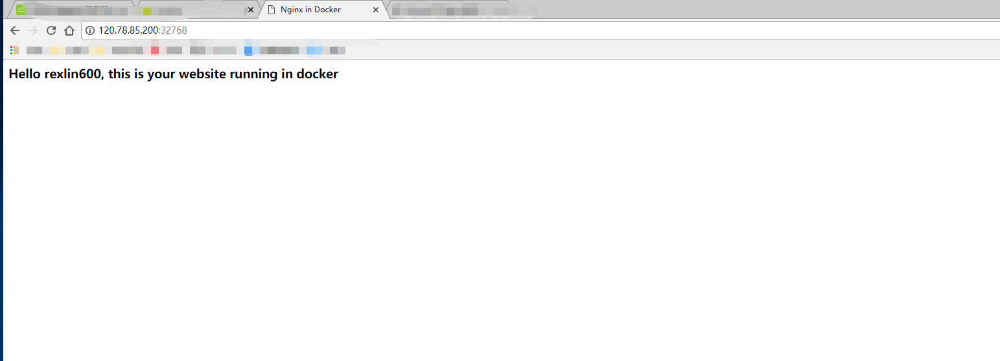

- [1 容器的基本操作](#1-容器的基本操作)
  - [1.1 启动容器](#11-启动容器)
  - [1.2 启动机交互式容器](#12-启动机交互式容器)
  - [1.3 查看容器](#13-查看容器)
  - [1.4 重新启动已停止的容器](#14-重新启动已停止的容器)
  - [1.5 删除容器](#15-删除容器)
  - [1.6 守护式容器](#16-守护式容器)
  - [1.7 运行中的容器内启动新线程](#17-运行中的容器内启动新线程)
  - [1.8 停止运行中的容器](#18-停止运行中的容器)
  - [1.9 容器的端口映射](#19-容器的端口映射)
  - [1.10 在容器中部署静态网站](#110-在容器中部署静态网站)
  - [1.11 进入正在运行的容器](#111-进入正在运行的容器)
  - [1.12 获取容器元数据](#112-获取容器元数据)
  - [1.13 查看容器中运行的进程信息](#113-查看容器中运行的进程信息)
  - [1.14 获取容器的日志](#114-获取容器的日志)
  - [1.15 列出指定的容器的端口映射](#115-列出指定的容器的端口映射)
  - [1.16 从容器中创建一个镜像](#116-从容器中创建一个镜像)
  - [1.17 容器和主机间的数据拷贝](#117-容器和主机间的数据拷贝)
  - [1.18 检查容器里文件结构的更改](#118-检查容器里文件结构的更改)
- [2 镜像的基本操作](#2-镜像的基本操作)
  - [2.1 列出镜像](#21-列出镜像)
  - [2.2 获取一个新镜像](#22-获取一个新镜像)
  - [2.3 查找镜像](#23-查找镜像)
  - [2.4 拉取镜像](#24-拉取镜像)
  - [2.5 创建镜像](#25-创建镜像)
  - [2.6. 更新镜像](#26-更新镜像)
  - [2.7 构建一个新镜像](#27-构建一个新镜像)
  - [2.8 设置镜像标签](#28-设置镜像标签)
- [3 Docker信息](#3-docker信息)
  - [3.1 查看系统信息](#31-查看系统信息)
  - [3.2 查看Docker版本](#32-查看docker版本)
- [4 Docker命令大全](#4-docker命令大全)

> 核心：学习命令的最好方式就是查看手册，在Linux系统中安装Docker后即可使用诸如：
>
> 	man docker
> 	
> 	man docker ps
>
> 等命令来查看对应的操作手册说明


## 1 容器的基本操作

### 1.1 启动容器

```bash
# run 在docker中启动容器并执行命令
docker run IMAGE [COMMAND] [ARGS...]

# example
docker run ubuntu echo 'Hello Docker'
```

> 自定义容器名称方式
>
> 	docker run --name=容器名 -i -t ubuntu /bin/bash


### 1.2 启动机交互式容器

```bash
# 交互式的容器
docker run -i -t IMAGE /bin/bash

# -i --interactivetrue|false 默认false，始终打开标准输入

# -t --tty=true|false 默认false，为新创建的容器分配一个tty终端
```

### 1.3 查看容器

```bash
# docker ps 是查看运行中/运行过的容器
docker ps [OPTIONS]

# -a 列出所有的容器
docker ps -a

# -l 列出最新创的一个容器
docker ps -l

# -f 过滤特定的容器
docker ps -f "name=redis:4.0.0"

# -n 列出最新的N个创建的容器
docker ps -n=3

# -s 展示容器的大小
docker ps -s

###############################

# 查看容器详细信息，包括容器名称、ID、配置等等
docker inspect [OPTIONS] NAME|ID [NAME|ID...]

# 这里的name即上面提到的指定容器名称方式运行的名字
```

### 1.4 重新启动已停止的容器

```bash
docker start [OPTIONS] CONTAINER [CONTAINER...]
```

### 1.5 删除容器

```bash
# 删除停止的容器
docker rm 容器名
```

### 1.6 守护式容器

```bash
# 交互式容器运行方式，交互式！
docker run -i -t IMAGE /bin/bash

# 退出交互式容器，容器后台运行
CTRL + P + Q

# 附加到运行时容器，重新进入后台正在运行的容器
docker attach 容器名/容器ID

# 使用CTRL +P +Q只会退出容器的bash操作界面，如果进入容器后使用exit命令则会导致容器停止运行

###############################################

# 守护式容器启动方式，守护式！
docker run -d 镜像名 [COMMAND] [ARGS...]

# example,使用-c 脚本是因为容器-d参数只是在后台运行，命令结束后容器还是会退出
docker run --name redisTest -d redis:4.0.11 /bin/sh -c "while true; do echo hello docker; sleep 1;done"

# 查看容器运行的日志
docker logs [OPTIONS] CONTAINER

# -f 一致跟踪日志变化并返回结果

# -t 显示日志的时间戳

# --tail 展示最新的多少行日志记录，默认是all
docker logs --tail 10 容器名
```

### 1.7 运行中的容器内启动新线程

```bash
# exec命令
docker exec [-d] [-i] [-t] 容器名 [COMMAND] [ARG...]

# example
docker exec -i -t 容器名 /bin/bash

######################################

# 查看运行中容器的进程
docker top
```

### 1.8 停止运行中的容器

```bash
# stop，发送一个SIGN给容器，等待容器停止
docker stop 容器名

# kill，直接停止容器
docker kill 容器名
```

### 1.9 容器的端口映射

```bash
# docker run [-P] [-p]

# -P，将为容器暴露的所有端口映射

# -p，指定那些端口映射
```

> 映射方式
>
> 1. containerPort：指定映射容器的端口，宿主机的端口随机
> 2. hostPort：指定宿主机端口和容器端口
> 3. ip::containerPort：指定ip和容器的端口
> 4. ip::hostPort::containerPort：指定ip和宿主机端口以及映射的容器端口


### 1.10 在容器中部署静态网站

```bash
# 启动并进入容器bash界面，一般我们用指定映射的IP地址！！！
docker run -p 80 --name web -i -t ubuntu /bin/bash

# 可能需要更新一下
apt update

# 安装nginx
apt install -y nginx

# 安装vim
apt install -y vim

# 创建网站
mkdir -p /var/www/html
cd /var/www/html
vim index.html

# 配置nginx参数，略

# 使用docker ps查看正在运行的容器

# 使用docker prot 容器名 查看映射的端口
docker port web

# 使用docker top 容器名 查看容器线程运行情况
docker top web
```

最终访问我们部署的容器（访问端口是我们前面查询出来映射的端口）：



### 1.11 进入正在运行的容器

```bash
docker attach [OPTIONS] CONTAINER
```

- **-d :**分离模式: 在后台运行
- **-i :**即使没有附加也保持STDIN 打开
- **-t :**分配一个伪终端

### 1.12 获取容器元数据

```bash
docker inspect [OPTIONS] NAME|ID [NAME|ID...]
```

- **-f :**指定返回值的模板文件。
- **-s :**显示总的文件大小。
- **--type :**为指定类型返回JSON。

### 1.13 查看容器中运行的进程信息

```bash
docker top [OPTIONS] CONTAINER [ps OPTIONS]
```

### 1.14 获取容器的日志

```bash
docker logs [OPTIONS] CONTAINER
```

OPTIONS说明：

- **-f :** 跟踪日志输出
- **--since :**显示某个开始时间的所有日志
- **-t :** 显示时间戳
- **--tail :**仅列出最新N条容器日志

### 1.15 列出指定的容器的端口映射

```bash
# 列出指定的容器的端口映射，或者查找将PRIVATE_PORT NAT到面向公众的端口。
docker port [OPTIONS] CONTAINER [PRIVATE_PORT[/PROTO]]
```

### 1.16 从容器中创建一个镜像

```bash
docker commit [OPTIONS] CONTAINER [REPOSITORY[:TAG]]
```

- **-a :**提交的镜像作者；
- **-c :**使用Dockerfile指令来创建镜像；
- **-m :**提交时的说明文字；
- **-p :**在commit时，将容器暂停。

### 1.17 容器和主机间的数据拷贝

```bash
docker cp [OPTIONS] CONTAINER:SRC_PATH DEST_PATH|-
docker cp [OPTIONS] SRC_PATH|- CONTAINER:DEST_PATH
```

**-L :**保持源目标中的链接


### 1.18 检查容器里文件结构的更改

```bash
docker diff [OPTIONS] CONTAINER
```


## 2 镜像的基本操作

### 2.1 列出镜像

```bash
docker images

root@rexlin600:~$ docker images           
REPOSITORY          TAG                 IMAGE ID            CREATED             SIZE
ubuntu              14.04               90d5884b1ee0        5 days ago          188 MB
php                 5.6                 f40e9e0f10c8        9 days ago          444.8 MB
nginx               latest              6f8d099c3adc        12 days ago         182.7 MB
mysql               5.6                 f2e8d6c772c0        3 weeks ago         324.6 MB
httpd               latest              02ef73cf1bc0        3 weeks ago         194.4 MB
ubuntu              15.10               4e3b13c8a266        4 weeks ago         136.3 MB
hello-world         latest              690ed74de00f        6 months ago        960 B
training/webapp     latest              6fae60ef3446        11 months ago       348.8 MB
```

各项参数说明：

- **REPOSITORY：**表示镜像的仓库源
- **TAG：**镜像的标签
- **IMAGE ID：**镜像ID
- **CREATED：**镜像创建时间
- **SIZE：**镜像大小

### 2.2  获取一个新镜像

```bash
docker pull 镜像名称
```

### 2.3 查找镜像

```bash
docker search 镜像名称
```

### 2.4 拉取镜像

```bash
docker pull 镜像名称
```

### 2.5 创建镜像

```bash
1.从已经创建的容器中更新镜像，并且提交这个镜像

2.使用 Dockerfile 指令来创建一个新的镜像（优先）
```

### 2.6. 更新镜像

```bash
# 1 运行一个镜像 ...

# 2 exec 进入镜像并进行一些操作 ...

# 3 提交修改
root@rexlin600:~$ docker commit -m="has update" -a="runoob" e218edb10161 runoob/ubuntu:v2
sha256:70bf1840fd7c0d2d8ef0a42a817eb29f854c1af8f7c59fc03ac7bdee9545aff8
```

### 2.7 构建一个新镜像

每一个指令都会在镜像上创建一个新的层，每一个指令的前缀都必须是大写的。

第一条FROM，指定使用哪个镜像源

RUN 指令告诉docker 在镜像内执行命令，安装了什么。。。

然后，我们使用 Dockerfile 文件，通过 docker build 命令来构建一个镜像。

```bash
# 构建镜像
root@rexlin600:~$ docker build -t root/centos:6.7 .
Sending build context to Docker daemon 17.92 kB
Step 1 : FROM centos:6.7
 ---&gt; d95b5ca17cc3
Step 2 : MAINTAINER Fisher "fisher@sudops.com"
 ---&gt; Using cache
 ---&gt; 0c92299c6f03
Step 3 : RUN /bin/echo 'root:123456' |chpasswd
 ---&gt; Using cache
 ---&gt; 0397ce2fbd0a
Step 4 : RUN useradd runoob
......

# 参数说明
-t ：指定要创建的目标镜像名
. ：Dockerfile 文件所在目录，可以指定Dockerfile 的绝对路径
```

### 2.8 设置镜像标签

```bash
root@rexlin600:~$ docker tag 860c279d2fec runoob/centos:dev
```

## 3 Docker信息

### 3.1 查看系统信息

```bash
docker info [OPTIONS]
```

### 3.2 查看Docker版本

```bash
docker version [OPTIONS]
```

## 4 Docker命令大全

```bash
# 容器生命周期管理
    run
    start/stop/restart
    kill
    rm
    pause/unpause
    create
    exec
    
# 容器操作
    ps
    inspect
    top
    attach
    events
    logs
    wait
    export
    port

# 容器rootfs命令
    commit
    cp
    diff

# 镜像仓库
    login
    pull
    push
    search

# 本地镜像管理
    images
    rmi
    tag
    build
    history
    save
    import
    info|version
    info
    version
```

