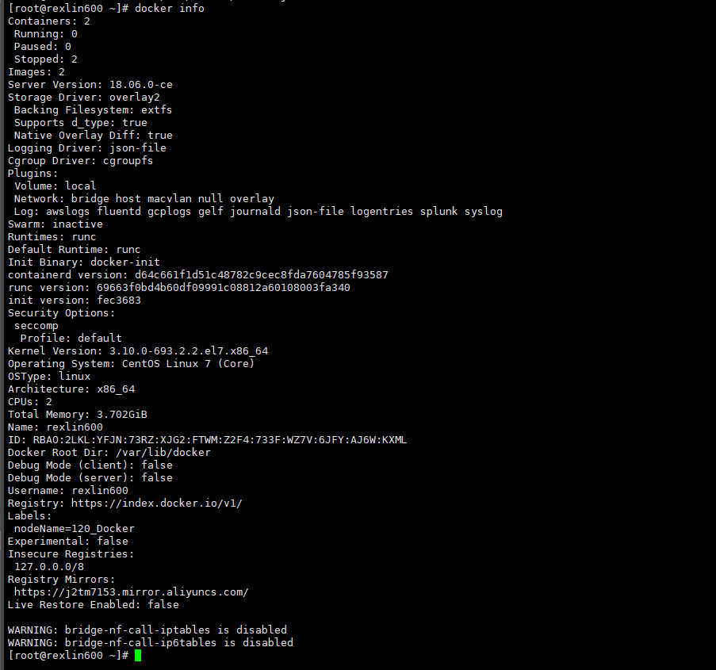

- [1 Docker的客户端和守护进程架构、API介绍](#1-docker的客户端和守护进程架构api介绍)
  - [1.1 C/S架构](#11-cs架构)
  - [1.2 Remote API](#12-remote-api)
- [2. 客户端与守护线程通信连接方式](#2-客户端与守护线程通信连接方式)
  - [2.1 连接方式](#21-连接方式)
  - [2.2 连接Docker](#22-连接docker)
- [3 遇到的坑及问题](#3-遇到的坑及问题)
  - [3.1 关于`daemon.json`配置的坑](#31-关于daemonjson配置的坑)
  - [3.2 Ubuntu下Docker17/18配置文件不生效问题](#32-ubuntu下docker1718配置文件不生效问题)
- [4 Docker守护进程操作](#4-docker守护进程操作)
  - [4.1 启动/重启/停止](#41-启动重启停止)
  - [4.2 守护进程的启动选项](#42-守护进程的启动选项)

## 1 Docker的客户端和守护进程架构、API介绍

### 1.1 C/S架构

> Docker C/S 模式，下面给出一个官方提供的C/S架构的Docker示例图
>
> 下面这幅图主要描述了 Docker 和 守护进程 之间的通信和操作


---

下面这幅图简化了 Docker 和 守护进程 间的通信


### 1.2 Remote API

> Docker除了使用命令让用户通过客户端与docker的守护线程进行通信之外，还允许使用远程API的方式来提供通信
>
> 另外也支持
>
> - STDIN
> - STDOUT
> - STDERR
>
> 的方式来进行通信


这里给出官方的Remote API的Reference：

-  [Remote API Refernce](https://docs.docker.com/reference/api/docker_remote_api/) 需要FQ

- [中文Docker文档](https://docs.docker-cn.com/)

## 2. 客户端与守护线程通信连接方式

### 2.1 连接方式

- unix:///var/run/docker.sock
- tcp://host:port
- fd://socketfd


### 2.2 连接Docker

```bash
# 查看docker版本等信息
docker version

# 关于/var/run/docker.sock将在另一篇文章中单独说明，这里只是提一下关于通过sockt与Docker的守护线程通信需要的一些环境，如netcat、了解configure的用法和说明等
```

我们通过 `docker version` 命令可以看到有关当前docker的相关信息如下：


> 关于 `nc` 命令：nc命令是netcat命令的简称，都是用来设置路由器。
>
> -  [NC命令](http://man.linuxde.net/nc_netcat)
>
> 如果你的Linux系统（CentOS）中没有安装netcat，则按照下面的步骤安装，`./configure`详解地址
>
> - [configure详解](https://www.cnblogs.com/Betterman-sun/p/5387175.html)

```bash
# 获取netcat软件包，这里下载可能比较慢，建议FQ下载后上传到服务器

# 解压
tar -zxvf netcat-0.7.1.tar.gz

# 进入目录
cd ./netcat-0.7.1/

# 编译并安装， 
./configure --prefix=/opt/netcat
make && make install

# 配置参数
vi /etc/profile

# 在文件中添加
NETCAT_HOME=/opt/netcat
PATH=$PATH:$NETCAT_HOME/bin
export PATH

# 保存
source /etc/profile
```

## 3 遇到的坑及问题

### 3.1 关于`daemon.json`配置的坑

> 一般在docker安装后有一个文件 `daemon.json` （默认是没有的，需要手动创建 /etc/docker/daemon.json），这里的配置参数对启动参数也适用。笔者使用的是docker-1.18.x版本
>
> **坑：如果在daemon.json文件中进行配置，需要docker版本高于1.12.6(在这个版本上不生效，1.13.1以上是生效的)**
>
> - 查看Linux系统日志 journalctl -xe
>
> 而Ubuntu则在 /etc/default/docker 中
>
> 下面给出一个给Docker所在服务器指定label的方法

CentOS下（Ubuntu下修改docker的info信息也是在daemon.json中修改）：

```bash
# 先查看docker信息
docker info

# 编辑文件
vim /etc/docker/daemon.json

# 修改如下,registry-mirrors为镜像地址（通常的说法是加速镜像地址）
{
        "registry-mirrors": ["https://j2xxxx53.mirror.aliyuncs.com"],
        "labels" : ["nodeName=120_Docker"]
}

# 然后更新、重启docker服务
docker daemon-raload
docker restart docker

# 接着查看docker信息发现labels标签变化为 nodeName=120_Docker 了
docker info
```




- [Docker CLI 参考](https://docs.docker.com/engine/reference/commandline/dockerd/)
- [daemon.json配置参考](https://blog.csdn.net/u013948858/article/details/79974796)


### 3.2 Ubuntu下Docker17/18配置文件不生效问题

> 这个问题发生的原因很简单，Docker没有找到该配置文件，所以只需要以下操作即可

```bash
# 打开docker服务配置
vim /lib/systemd/system/docker.service

# 在service标签下添加以下配置， - 代表忽略error
EnvironmentFile=-/etc/default/docker

# 然后在ExecStart节点后加上 $DOCKER_OPTS 即可

# 然后
systemctl daemon-reload

# 重启服务
srvice docker restart
```

## 4 Docker守护进程操作

### 4.1 启动/重启/停止

>- service docker start
>- service docker restart
>- service docker stop 

### 4.2 守护进程的启动选项

```bash
# 以守护形式运行的选项
docker -d [OPTIONS]

########### 运行相关
-D,--debug=false

-e,--exec-driver="native"

-g,--graph="var/lib/docker"

--icc=true

-l,--log-level="info"

--label=[]

-p,--pidfile="/var/run/docker.pid"


########### 服务连接相关
-G,--group="docker"

-H,--host=[]

# 安全相关的选项
--tls=false

--tlscacert="/home/sven/.docker/ca.pem"

--tlscert="/home/sven/.docker/cert.pem"

--tlskey="/home/sven/.docker/key/pem"

--tlsverify=false

########### Remote API相关的选项
--api-enable-cors=false

########### 存储驱动相关的选项
-s,--storage-driver=""

--selinux-enabled=false

--storage-opt=[]

########### 仓库Registry相关的选项
--insecure-registry=[]

--registry-mirror=[]

########### 网络设置相关的选项
-b,--bridge=""

--bip=""

--fixed-cidr=""

--fixed-cidr-v6=""

--dns=[]

--dns-search=[]

--ip=0.0.0.0

--ip-forward=true

--ip-masq=true

--iptables=true

--ipv6=false

--mtu=0

```


