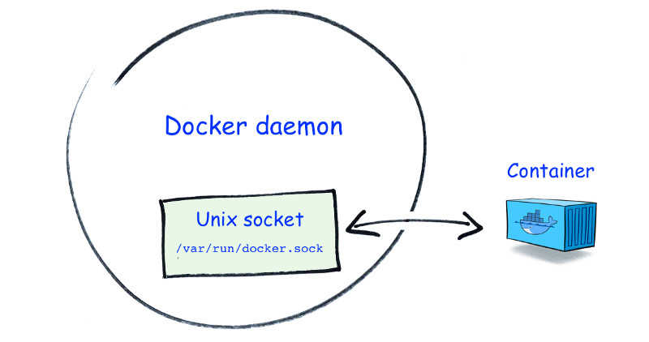

- [1 Docker守护进程补充（Socket）](#1-docker守护进程补充socket)
	- [1.1 本文必先读](#11-本文必先读)
	- [1.2 套接字说明](#12-套接字说明)
- [2 portainer使用](#2-portainer使用)

## 1 Docker守护进程补充（Socket）

### 1.1 本文必先读

运行过一些容器之后你应该会有一些经验，有一些容器运行需要挂载/var/run/docker.sock，为什么呢，因为它是Docker守护进程(Docker daemon)默认监听的Unix域套接字(Unix domain socket)，容器中的进程可以通过它与Docker守护进程进行通信。

举例：

下面第2节会介绍portainer，这个镜像实例化为容器运行时则需要挂载/var/run/docker.sock以提供portainer与docker守护进程进行通信从而管理容器！

### 1.2 套接字说明

> 关于  /var/run/docker.sock 我们需要知道：
>
> 1. 这个文件是什么
> 2. 这个文件能干什么

```bash
	我们知道在某些Docker的镜像运行过程中，其中一些容器需要挂载 /var/run/docker.sock 文件，[1]简单的说这个文件其实就是Docker守护进程（Docker Daemon）默认监听的Unix域套接字（Unix Domain Socket），[2]容器中的进程可以通过它与Docker守护进程进行通信。
```

- 图片来源:  [http://blog.honeybadger.io](http://blog.honeybadger.io/how-unicorn-talks-to-nginx-an-introduction-to-unix-sockets-in-ruby/)




## 2 portainer使用

> portainer是一款提供图形化操作界面的用于管理Docker主机和Swarm集群的软件，如果我们需要使用Portainer管理Docker主机的话，就必须使用前面的.sock文件并绑定
>
> - 为什么呢，前面的文章我们已经讲了客户端和Docker守护进程进行通信总共就三种方式，那么portainer也不能脱离其中，自然也就是使用套接字通信辣

```bash
# 第一步，从docker hub拉取portainer镜像
docker login

# 输入用户名/密码

# 先查看一下有哪些portainer，当然我们要么找官方的，要么找stars最多的
docker search portainer
```


```bash
# 拉取官方的镜像
docker pull portainer/portainer

# 准备运行portainer(我这里是后台运行，命令不熟悉请参见前面的文章)
docker run -i -t -d --name "portainer" -p 9000:9000 -v /var/run/docker.sock:/var/run/docker.sock portainer/portainer
```


```bash
# 访问浏览器地址
http://your ip:9000/

# 首次登陆会要求你输入用户名/密码
```


> 选择portainer的环境
>
> - 我们这里选择 `local` 即可


> 注意下面的红色字体部分的内容，这就是我们前面提到为什么启动portainer必须加上 -v ... 参数的证据！
>
> portainer会提醒你容器启动时确认是否添加了这样的启动配置参数。
>
> 如果没有添加则portainer无法和守护进程通信，相当于是白搭。


> 然后正常配置登陆之后就可以看到下面这个界面


后面的就不介绍了，就是具体的工具使用了。


