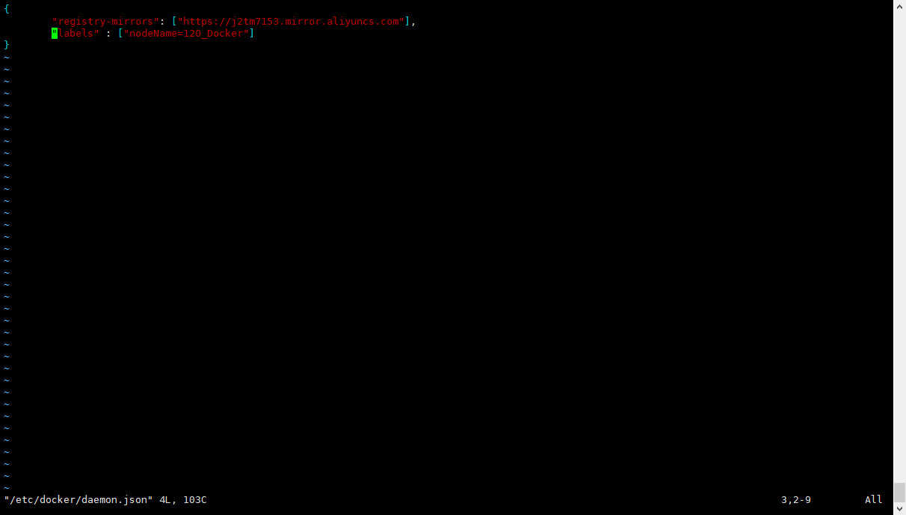
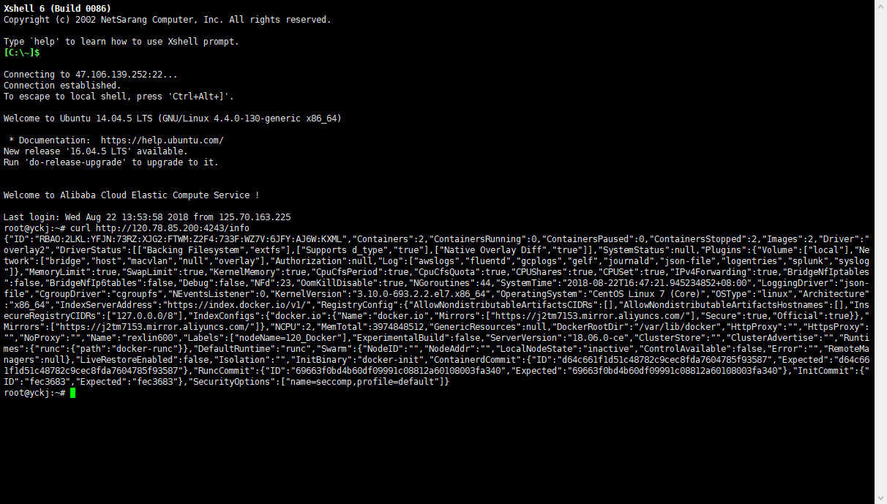

- [1 Docker远程访问](#1-docker远程访问)
  - [1.1 准备](#11-准备)
  - [1.2 修改服务器配置](#12-修改服务器配置)
  - [1.3 远程访问](#13-远程访问)
  - [1.4 精华：修改客户端配置](#14-精华修改客户端配置)

## 1 Docker远程访问

> Docker客户端与守护进程的远程访问
>
> - Docker客户端与守护线程不在同一台服务器

### 1.1 准备

- 需要第二台安装了Docker的服务器
- 修改Docker守护进程启动选项，区别服务器
- 保证Client API 与 Server API 版本一致

> 修改Docker的labels标签，见前面分享的坑
>
> [daemon.json配置参考](https://blog.csdn.net/u013948858/article/details/79974796)

### 1.2 修改服务器配置

- 修改Docker守护进程启动选项

  \- H	tcp://host:port

  	unix:///path/to/socket,
		
  	fd://* or fd://socketfd	

- 守护进程默认配置

  \- H	unix:///var/run/docker.sock

> 在centos中，修改docker的配置有以下几个方面（Docker 18）
>
> - /usr/lib/systemd/system/docker.service


> 这个文件没有需要自己创建，所以下面直接贴出的文件而不是图片
>
> - /etc/sysconfig/docker

```yaml
# /etc/sysconfig/docker

# Modify these options if you want to change the way the docker daemon runs
# 我们修改Docker的远程连接主要改这里，上面文件中在ExecStart里面加上 $OPTIONS 即可
OPTIONS='-H tcp://0.0.0.0:4243 -H unix:///var/run/docker.sock'
DOCKER_CERT_PATH=/etc/docker

# If you want to add your own registry to be used for docker search and docker
# pull use the ADD_REGISTRY option to list a set of registries, each prepended
# with --add-registry flag. The first registry added will be the first registry
# searched.
# ADD_REGISTRY='--add-registry registry.access.redhat.com'

# If you want to block registries from being used, uncomment the BLOCK_REGISTRY
# option and give it a set of registries, each prepended with --block-registry
# flag. For example adding docker.io will stop users from downloading images
# from docker.io
# BLOCK_REGISTRY='--block-registry'

# If you have a registry secured with https but do not have proper certs
# distributed, you can tell docker to not look for full authorization by
# adding the registry to the INSECURE_REGISTRY line and uncommenting it.
 INSECURE_REGISTRY='--insecure-registry dl.dockerpool.com:5000'

# On an SELinux system, if you remove the --selinux-enabled option, you
# also need to turn on the docker_transition_unconfined boolean.
# setsebool -P docker_transition_unconfined 1

# Location used for temporary files, such as those created by
# docker load and build operations. Default is /var/lib/docker/tmp
# Can be overriden by setting the following environment variable.
# DOCKER_TMPDIR=/var/tmp

# Controls the /etc/cron.daily/docker-logrotate cron job status.
# To disable, uncomment the line below.
# LOGROTATE=false

```

> - /etc/docker/daemon.json



### 1.3 远程访问

> 首先要知道前面修改的Docker服务器的IP地址，使用 `ipconfig` 命令查看
>
>  使用 `curl http://ip:port/info` 命令（如下图）即可看到远程访问到的Docker服务返回的信息
>
>
>
> **Docker客户端的远程访问**
>
> - 在另一台Docker服务器上使用 `docker -H tcp://ip:port info` 命令也可以访问到相应的信息（另一台不要忘了修改远程连接，如果你也要做远程连接操作的话）



### 1.4 精华：修改客户端配置

问题：当我们需要频繁的连接远程docker服务时，如果每次都写类似 `docker -H tcp://ip:port info` 的命令的话是否太愚蠢了？

**DOCKER_HOST环境变量**：

```bash
# docker提供了一个命令帮助我们解决上面的问题
export DOCKER_HOST="TCP://IP:PORT"

# 当我们操作结束后切换回本地docker服务时只需要执行
export DOCKER_HOST=""
```

**特别注意：**如果你足够细心的话会发现上面的 `/etc/sysconfig/docker` 中有这样一段配置

```bash
OPTIONS='-H tcp://0.0.0.0:4243 -H unix:///var/run/docker.sock'
```

我们前面只讲了如何远程连接，但是如果你不配置 `-H unix:///var/run/docker.sock` 的话将导致本机docker服务连接异常

之所以出现这个问题是因为我们指定了docker守护线程的连接方式为tcp，所以需要在多加一种方式，即上面你的unix以支持docker守护线程支持本地连接。（PS：从这里可以看出 \- H 参数是可以配置多个的）


