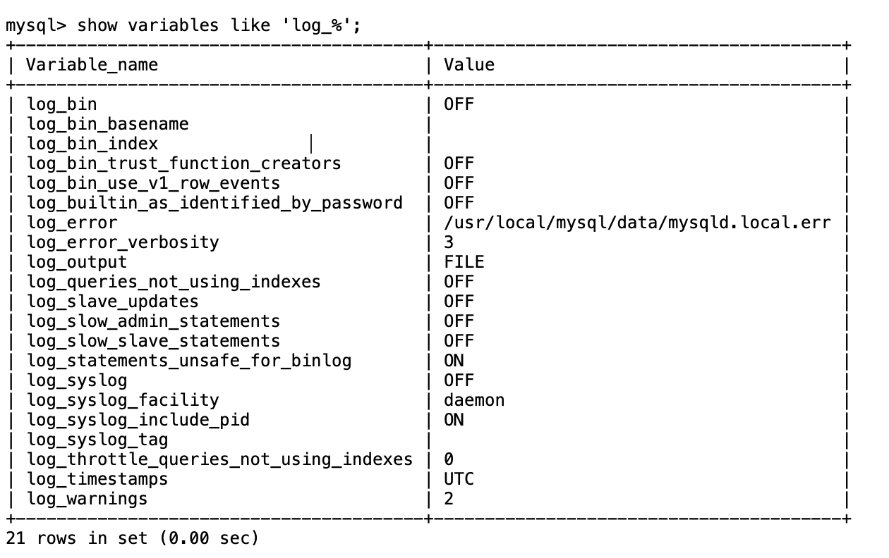

- [1 什么是 MySQL 的 binlog](#1-什么是-mysql-的-binlog)
- [2 MySQL 二进制日志的作用](#2-mysql-二进制日志的作用)
- [3 二进制日志模式、文件类型](#3-二进制日志模式文件类型)
  - [3.1 二进制日志模式](#31-二进制日志模式)
  - [3.2 二进制日志包含文件类型](#32-二进制日志包含文件类型)
- [4 检查是否开启二进制日志](#4-检查是否开启二进制日志)
- [5 开启 MySQL 二进制日志（binlog）](#5-开启-mysql-二进制日志binlog)
- [6 binlog 日志操作常用命令](#6-binlog-日志操作常用命令)
  - [6.1 查看所有 binlog 日志](#61-查看所有-binlog-日志)
  - [6.2 查看最新一条日志(最后一个事件pos结束点)](#62-查看最新一条日志最后一个事件pos结束点)
  - [6.3 刷新binlog日志](#63-刷新binlog日志)
  - [6.4 清空所有binlog日志](#64-清空所有binlog日志)
- [7 查看MySQL日志](#7-查看mysql日志)
  - [7.1 通过`mysqlbinlog`查看日志](#71-通过mysqlbinlog查看日志)
  - [7.3 示例](#73-示例)
- [8 数据恢复](#8-数据恢复)

## 1 什么是 MySQL 的 binlog

`MySQL` 的 `binlog`，我们通常说是 MySQL 的二进制日志，他记录了 MySQL 的所有 DDL 以及 DML 语句（除查询语句外），并且在 MySQL 中是以`Event`的形式存在的，此外还包括执行这条语句的`耗时时间`

当然，binlog 也会带来一定的性能损耗，官方给出的数据是 1%左右。有兴趣可以去看下。

**注意：**MySQL 的二进制日志是事务安全的。

## 2 MySQL 二进制日志的作用

通常来说，对于 MySQL 的二进制日志我们通常是以下两种作用：

1. Master-Slave 之间进行数据库同步，即 Master 将 binlog 日志传递给 Slave 从而实现数据的同步
2. 进行数据的数据（通过 mysqlbinlog 工具）

## 3 二进制日志模式、文件类型

### 3.1 二进制日志模式

查看MySQL二进制日志的格式：

```
show global variables like '%binlog_format%';
```

| Variable_name | Value |
| ------------- | ----- |
| binlog_format | ROW   |

目前有三种模式，分别是

- Statement 
每一条会修改数据的sql都会记录在binlog中。

优点：不需要记录每一行的变化，减少了binlog日志量，节约了IO，提高性能。

缺点：由于记录的只是执行语句，为了这些语句能在slave上正确运行，因此还必须记录每条语句在执行的时候的一些相关信息，以保证所有语句能在slave得到和在master端执行时候相同 的结果。另外mysql 的复制,像一些特定函数功能，slave可与master上要保持一致会有很多相关问题。

ps：相比row能节约多少性能与日志量，这个取决于应用的SQL情况，正常同一条记录修改或者插入row格式所产生的日志量还小于Statement产生的日志量，但是考虑到如果带条件的update操作，以及整表删除，alter表等操作，ROW格式会产生大量日志，因此在考虑是否使用ROW格式日志时应该跟据应用的实际情况，其所产生的日志量会增加多少，以及带来的IO性能问题。

- Row

5.1.5版本的MySQL才开始支持row level的复制,它不记录sql语句上下文相关信息，仅保存哪条记录被修改。

优点： binlog中可以不记录执行的sql语句的上下文相关的信息，仅需要记录那一条记录被修改成什么了。所以rowlevel的日志内容会非常清楚的记录下每一行数据修改的细节。而且不会出现某些特定情况下的存储过程，或function，以及trigger的调用和触发无法被正确复制的问题.

缺点:所有的执行的语句当记录到日志中的时候，都将以每行记录的修改来记录，这样可能会产生大量的日志内容。

ps:新版本的MySQL中对row level模式也被做了优化，并不是所有的修改都会以row level来记录，像遇到表结构变更的时候就会以statement模式来记录，如果sql语句确实就是update或者delete等修改数据的语句，那么还是会记录所有行的变更。

- Mixed

从5.1.8版本开始，MySQL提供了Mixed格式，实际上就是Statement与Row的结合。

在Mixed模式下，一般的语句修改使用statment格式保存binlog，如一些函数，statement无法完成主从复制的操作，则采用row格式保存binlog，MySQL会根据执行的每一条具体的sql语句来区分对待记录的日志形式，也就是在Statement和Row之间选择一种。

从 `MySQL 5.1` 开始支持 row, `默认是 row 模式`。

### 3.2 二进制日志包含文件类型

二进制日志包含两类文件，分别是`索引文件`、`日志文件`，如下：

1. `二进制日志索引文件`（文件名后缀为.index）用于记录所有的二进制文件
2. `二进制日志文件`（文件名后缀为.00000\*）记录数据库所有的 DDL 和 DML(除了数据查询语句)语句事件。

## 4 检查是否开启二进制日志

登陆服务器并登陆 MySQL：

```
// 登陆mysql
mysql -u root -p

// 输入你的mysql密码

// 查看是否开启二进制日志，见下面图片
mysql> show variables like 'log_%';
```

> 查看是否开启二进制日志，其中`log_bin`的 OFF 代表二进制日志已关闭、ON 代表已开启
>
> 

## 5 开启 MySQL 二进制日志（binlog）

开启二进制日志需要在`my.cnf`文件下面的`mysqld`下配置下面的内容：

```
[mysqld]
log-bin = mysql-bin #开启binlog
binlog-format = ROW #选择row模式
server_id = 1 #配置mysql replication需要定义，不能喝canal的slaveId重复
```

修改成功之后，记得`重启MySQL`服务！

再次使用上面的查看命令，就可以看见 MySQL 现在已经开启了 binlog 日志了。

## 6 binlog 日志操作常用命令

> binlog 常用命令无非就是：查看、刷新、重置

### 6.1 查看所有 binlog 日志

`mysql> show master logs;`

| Log_name         | File_sizes |
| ---------------- | ---------- |
| mysql-bin.000001 | 154        |

### 6.2 查看最新一条日志(最后一个事件pos结束点)

`mysql> show master status;`

| File             | Position | Binlog_Do_DB | Binlog_Ignore_DB | Executed_Gtid_Set |
| ---------------- | -------- | ------------ | ---------------- | ----------------- |
| mysql-bin.000001 | 154      |              |                  |                   |

### 6.3 刷新binlog日志

`mysql> flush logs;`

注：每当mysqld服务重启时，会自动执行此命令，刷新binlog日志；在mysqldump备份数据时加 -F 选项也会刷新binlog日志；

### 6.4 清空所有binlog日志

`mysql> reset master;`

## 7 查看MySQL日志

> 查看MySQL的二进制日志一般有两种方式，一种是通过`mysqlbinlog`的方式，另一种是`show binlog events [IN 'log_name'] [FROM pos] [LIMIT [offset,] row_count];`的命令方式。

### 7.1 通过`mysqlbinlog`查看日志

```
rexlin600@zhuyan:/$sudo /usr/local/mysql/bin/mysqlbinlog /usr/local/mysql/data/mysql-bin.000001
Password: 
```

**重要：** 可以使用`--base64-output=decode-rows -v`就可以看到二进制日志中`base64`的数据了。

```
rexlin600@zhuyan:/$sudo /usr/local/mysql/bin/mysqlbinlog --base64-output=decode-rows -v /usr/local/mysql/data/mysql-bin.000001
```

**选项解析：**
- IN 'log_name'    ：指定要查询的binlog文件名(不指定就是第一个binlog文件)
- FROM pos        ：指定从哪个pos起始点开始查起(不指定就是从整个文件首个pos点开始算)
- LIMIT [offset,] ：偏移量(不指定就是0)
- row_count       ：查询总条数(不指定就是所有行)

### 7.3 示例

 A.查询第一个(最早)的binlog日志：
`mysql> show binlog events\G;`

B.指定查询 mysql-bin.000021 这个文件：
`mysql> show binlog events in 'mysql-bin.000021'\G;`

C.指定查询 mysql-bin.000021 这个文件，从pos点:8224开始查起：
`mysql> show binlog events in 'mysql-bin.000021' from 8224\G;`

D.指定查询 mysql-bin.000021 这个文件，从pos点:8224开始查起，查询10条
`mysql> show binlog events in 'mysql-bin.000021' from 8224 limit 10\G;`

E.指定查询 mysql-bin.000021 这个文件，从pos点:8224开始查起，偏移2行，查询10条
`mysql> show binlog events in 'mysql-bin.000021' from 8224 limit 2,10\G;`


## 8 数据恢复


