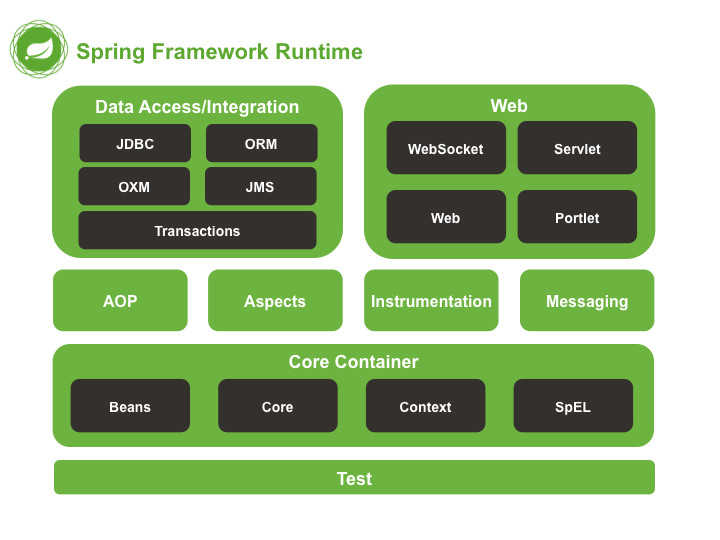

## 什么是 Markdown

简单的说，markdown 是一款文本标记语言。优点如下：

1. 纯文本写作、兼容性强
2. 专注内容而非版面
3. 格式转换方便
4. 可阅读性高
5. 跨平台
6. 免费、免费、免费

---

## 1. 标题

```
# Header 1
## Header 2
### Header 3
#### Header 4
##### Header 5
###### Header 6
```

---

## 2. 文本样式

### 2.1 基本语法

```
*Italics* or _Italics_
**Bold** or __Bold__
***Bold Italics*** or ___Bold Italics___
~~Delete~~
```

效果如下：

_Italics_ or _Italics_

**Bold** or **Bold**

**_Bold Italics_** or **_Bold Italics_**

~~Delete~~

---

### 2.2 非基本语法

#### 2.2.1 字体上标

```
<sup>上标文字</sup>
<sub>下标文字</sub>
```

#### 2.2.2 下划线

```
<u>下划线</u>
```

#### 2.2.3 字体背景高亮

> 部分不支持

```
==高亮==
```

## 3 列表

### 3.1 有序列表

```
1. Item-1
 1.1. Item-1-1
    1.1.1. Item-1-1-1
      1.1.1.1. Item-1-1-1-1
  1.2. Item-1-2
2. Item-2
6. Item-3
```

### 3.2 无序列表

> 符号之后的空格不能少，-、+、\*效果一样，在嵌套列表中可以循环使用。

```
- Item-1
  - Item-1-1
    + Item-1-1-1
      * Item-1-1-1-1
  * Item-1-2
+ Item-2
* Item-3
```

## 4 链接

> Markdown 支持两种风格的链接：内联（Inline）和引用（Reference）。

### 4.1 内联链接

```
[blog](https://www.github.rexlin600.io)
```

### 4.1 引用链接

> 部分不支持

```
[blog]:https://www.github.rexlin600.io
```

[blog]: https://www.github.rexlin600.io "personal blog"

### 4.3 自动创建链接

```
<https://www.github.rexlin600.io>
```

## 5 添加图片

```


```

互联网图片片：


本地图片：



## 6 文字引用

```
> 文字引用，可多级使用
```

> 第一级
>
> > 第二级
> >
> > > 第三级

## 7 转义字符

```
\*lalal\*
```

效果：\*lalal\*

| 符号 | 英文名称   | 中文名称 |
| ---- | ---------- | -------- |
| \    | backslash  | 反斜杠   |
| `    | backtick   | 反引号   |
| *    | asterisk   | 星号     |
| _    | underscore | 下划线   |
| ..   | ..         | ..       |

## 8 代码块引用

如下：

```
code ...
```

## 9 表格

```
| Tables        |      Are      |  Cool |
| ------------- | :-----------: | ----: |
| col 3 is      | right-aligned | $1600 |
| col 2 is      |   centered    |   $12 |
| zebra stripes |   are neat    |    $1 |
```

| Tables        |      Are      |  Cool |
| ------------- | :-----------: | ----: |
| col 3 is      | right-aligned | $1600 |
| col 2 is      |   centered    |   $12 |
| zebra stripes |   are neat    |    $1 |


## 10 分割线

```
* * *

***

*****

- - -

------
```

## 11 添加脚注

> 部分不支持

```
[^1]: This is a footnote
[^label]: A footnote on "label"
[^!DEF]: The definition of a footnote.
```

[^1]: This is a footnote

[^label]: A footnote on "label"

[^!DEF]: The definition of a footnote.

## 12 目录

部分不支持

```
[TOC]
```

[TOC] ss 

## 13 任务列表

```
- [x] [links](), **formatting**, and ~~tags~~ supported
- [x] list syntax required (any unordered or ordered list supported)
- [x] this is a complete item
- [ ] this is an incomplete item
```

## 14 建议

- 英文字母与中文之间需要两边空格（英文与符号之间不空格）
- 高亮英文之间需要两边空格
- 代码符号 ``` 上面需要空一行，结束 ``` 下面需要空一行
- 中文之间和短英文之间使用中文标点
- 一篇文章中只能出现一个 # 号标题
