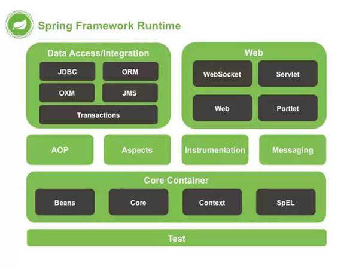
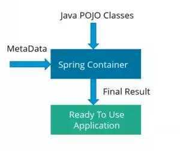
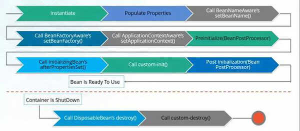
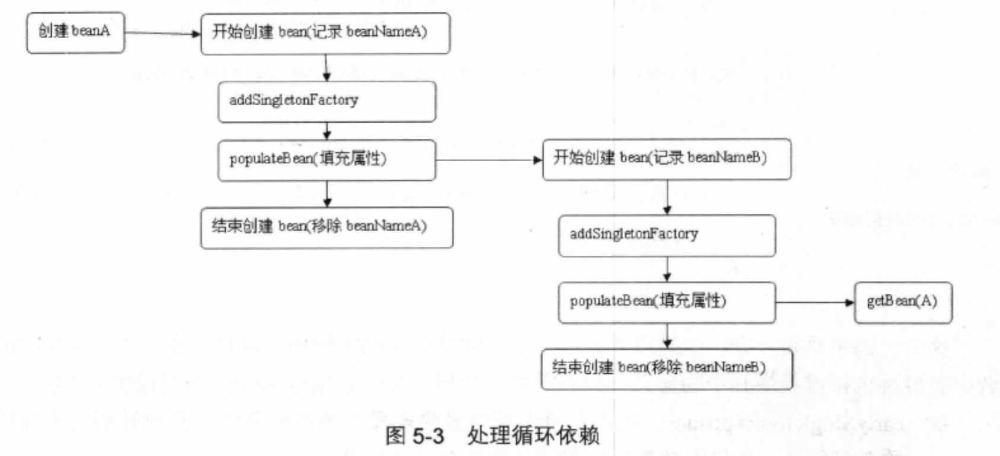
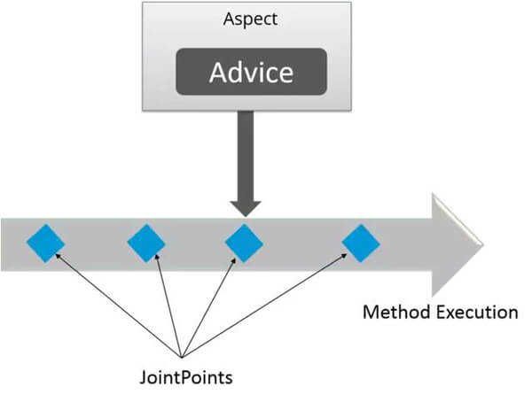
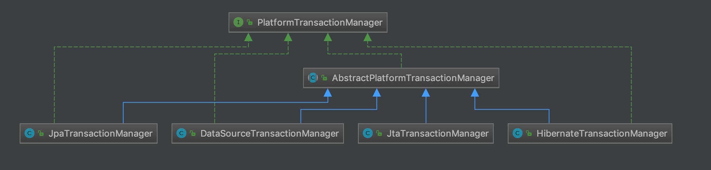

- [1 简介](#1-简介)
- [2 常见问题](#2-常见问题)
  - [2.1 SpringFramework](#21-springframework)
  - [2.2 使用 Spring 框架的好处](#22-使用-spring-框架的好处)
  - [2.3 Spring 中用了哪些设计模式](#23-spring-中用了哪些设计模式)
  - [2.4 Spring IoC](#24-spring-ioc)
    - [2.4.1 什么是Spring IoC容器s](#241-什么是spring-ioc容器s)
    - [2.4.2 什么是依赖注入](#242-什么是依赖注入)
    - [2.4.3 IoC 和 DI 有什么区别](#243-ioc-和-di-有什么区别)
    - [2.4.4 哪些方式可以完成依赖注入](#244-哪些方式可以完成依赖注入)
    - [2.4.5 Spring 提供了几种 IoC 容器](#245-spring-提供了几种-ioc-容器)
    - [2.4.6 列举IoC好处](#246-列举ioc好处)
    - [2.4.7 简述IoC的实现机制](#247-简述ioc的实现机制)
  - [2.5 Spring Bean](#25-spring-bean)
    - [2.5.1 什么是Spring Bean](#251-什么是spring-bean)
    - [2.5.2 Spring Bean有哪些配置方式](#252-spring-bean有哪些配置方式)
    - [2.5.3 支持几种Bean Scope](#253-支持几种bean-scope)
    - [2.5.4 Spring Bean的生命周期](#254-spring-bean的生命周期)
    - [2.5.5 什么是Spring内部Bean](#255-什么是spring内部bean)
    - [2.5.6 什么是Spring装配](#256-什么是spring装配)
    - [2.5.7 什么是延迟加载](#257-什么是延迟加载)
    - [2.5.8 Spring中的单例Bean是线程安全的吗](#258-spring中的单例bean是线程安全的吗)
    - [2.5.9 如何解决Bean的循环依赖问题](#259-如何解决bean的循环依赖问题)
  - [3 Spring注解](#3-spring注解)
    - [3.1 什么是基于注解的容器配置](#31-什么是基于注解的容器配置)
    - [3.2 @Component, @Controller, @Repository, @Service 有何区别？](#32-component-controller-repository-service-有何区别)
- [4 Spring AOP](#4-spring-aop)
  - [4.1 什么是Aspect](#41-什么是aspect)
  - [4.2 什么是JoinPoint](#42-什么是joinpoint)
  - [4.3 什么是PointCut](#43-什么是pointcut)
  - [4.4 JoinPoint和PointCut的区别](#44-joinpoint和pointcut的区别)
  - [4.5 什么是Advice](#45-什么是advice)
  - [4.6 什么是 Target](#46-什么是-target)
  - [4.7 AOP实现方式（静态代理&动态代理）](#47-aop实现方式静态代理动态代理)
    - [4.7.1 静态代理](#471-静态代理)
    - [4.7.2 动态代理](#472-动态代理)
    - [4.7.3 Spring AOP和Aspect AOP区别](#473-spring-aop和aspect-aop区别)
    - [4.7.4 什么是编织（Weaving）](#474-什么是编织weaving)
    - [4.7.5 Spring如何使用AOP切面](#475-spring如何使用aop切面)
- [5 Spring Transaction](#5-spring-transaction)
  - [5.1 基础概念及事务特性](#51-基础概念及事务特性)
  - [5.2 Spring支持的事务管理类型](#52-spring支持的事务管理类型)
  - [5.3 Spring和ORM框架集成](#53-spring和orm框架集成)
  - [5.4 为什么Spring事务中不能切换数据源](#54-为什么spring事务中不能切换数据源)
  - [5.5 @Transactional注解有哪些属性，如何使用？](#55-transactional注解有哪些属性如何使用)
  - [5.6 事务的隔离级别](#56-事务的隔离级别)

### 1 简介

这里整理的是一些 Spring 的面试题，主要针对的是面试场景中常闻到的一些点，主要以`Spring AOP`、`IOC`、`Transaction`等为主（不包含 Spring MVC 的内容）

### 2 常见问题

#### 2.1 SpringFramework

1. 请说下什么是 Spring Framework？

   - 轻量级、松散耦合
   - 分层体系结构，丰富、灵活的组件
   - 可以方便的和其他框架集成（Spring MVC、Mybatis、Hibernate、redis 等），也称为框架的框架
   - 框架图如下：
     

2. Spring 核心容器模块

   即`Core Container`，属于 Spring 框架的核心，包含：

   - `Core`：Spring 核心包
   - `Bean`：核心容器提供 Spring 框架的基本功能，核心框架主要组件是 BeanFactory，工厂模式的实现。BeanFactory 使用 IOC（控制反转）模式将应用程度的配置和依赖性规范与实际的应用程序分开。
   - `Context`：上下文配置文件，例如：JNDI、EJB、电子邮件、国际化、事件机制、校验、调度功能等等
   - `SpEL`：Spring 表达式语言全称为 “Spring Expression Language”，缩写为 “SpEL”。类似于 Struts2 中使用的 OGNL 表达式语言，能在运行时构建复杂表达式、存取对象图属性、对象方法调用等等，并且能与 Spring 功能完美整合，如能用来配置 Bean 定义。

3. 数据访问模块

   该层提供了 Spring 与数据库交互的支持，包含：

   - `JDBC`：Spring 对 JDBC 的封装，提供了对关系数据库的访问
   - `ORM`：提供了对 Hibernate 以及 JPA 的集成支持
   - `OXM`：提供了 XML 文件映射支持
   - `JMS`：java 提供的消息服务
   - `Transactions`：事务支持，包括声明式以及编程事务

4. Web 模块

   该层提供了对 Web 应用程序的支持，包含：

   - `WebMVC`：MVC 框架是一个全功能的构建 Web 应用程序的 MVC 实现。通过策略接口，MVC 框架变成为高度可配置的，MVC 容纳了大量视图技术，其中包括 JSP、Velocity、Tiles、iText 和 POI。
   - `WebFlux`：基于 Reactive 库的响应式 Web 开发框架
   - `WebSocket`：4.0 重大更新就是对 WebSocket 的支持，应用场景有：在线交易、聊天、游戏、协作、数据可视化等等
   - `Portlet`：已被废弃

5. AOP 模块

   该层支持面向切面编程，主要包含：

   - `AOP`：通过配置管理的特性，可以使 Spring 管理的任何对象支持 AOP；不实用 EJB 也可将声明式事务管理集成到应用程序中
   - `Aspects`：与 AspectJ 的集成提供支持
   - `Instrumentation`：检测和类加载器实现提供支持

6. Test 模块

   支持 Junit 和 TestNG 进行测试

#### 2.2 使用 Spring 框架的好处

**优点**

1. 依赖注入，使得构造器和 JavaBean、properties 文件中的依赖关系一目了然
2. 轻量级
3. 面向切面编程，即 AOP
4. 很方便的和其他主流框架集成
5. 模块化
6. 单元测试
7. Web 框架
8. 事务支持、管理
9. 异常处理

**缺点**

1. 调试不直观，需要时间理解
2. JavaEE 过度封装

#### 2.3 Spring 中用了哪些设计模式

1. BeanFactory 中的`工厂模式`
2. AOP 中的`代理模式`
3. 配置文件定义 Bean 中的`单例模式`、`原型模式`
4. 解决代码重复，如：RestTeamplate、JdbcTempalte 的`模板模式`
5. BeanFactory/ApplicationContext 提供的`依赖注入`
6. 丰富的 JSP 标签所体现的`视图帮助`
7. `前端控制器`：DsipatcherServlet 对请求进行分发
8. SpEl 中的`解释器模式`
9. JDBC 中体现的`对象池`
10. 还有其他如：`适配器模式`、`命令模式`、`访问者模式`

#### 2.4 Spring IoC

##### 2.4.1 什么是Spring IoC容器s

Spring 框架的核心就是 IoC 容器。容器创建 Bean 对象并将它们装配奥一起、配置、管理他们的完整生命周期

- Spring 容器使用`依赖注入`来管理组成应用程序的 Bean 对象。
- 容器通过读取提供的`配置元数据` Bean Definition 来接收对象进行实例化，配置和组装的指令。
- 该配置元数据 Bean Definition 可以通过 XML，Java 注解或 Java Config 代码`提供`。

##### 2.4.2 什么是依赖注入

依赖注入的英文缩写是 Dependency Injection ，简称 DI 。依赖注入就是你不需要主动、手动创建对象，但必须描述如何创建他们。



##### 2.4.3 IoC 和 DI 有什么区别

IoC 是一个更加宽泛的概念，而 DI 是具体的概念。在《EXPERT ONE ON ONE J2EE DEVELOPMENT WITHOUT EJB》一书第 6 章第 128 页中说到：`IoC主要的实现方式有两种：依赖查找，依赖注入。`

其实，DI 原来叫 IoC，是因为`Martin Flower`说:

`As a result I think we need a more specific name for this pattern. Inversion of Control is too generic a term, and thus people find it confusing. As a result with a lot of discussion with various IoC advocates we settled on the name Dependency Injection.`

原文地址：[injection](https://martinfowler.com/articles/injection.html)

##### 2.4.4 哪些方式可以完成依赖注入

1. Interface injection
2. Setter injection
3. Constructor injection

Spring 框架中，仅仅使用了`构造函数注入`和`Setter注入`两种方式，实际场景中，后者用的多一些。

| 构造函数注入               | setter 注入                |
| -------------------------- | -------------------------- |
| 没有部分注入               | 有部分注入                 |
| 不会覆盖 setter 属性       | 会覆盖 setter 属性         |
| 任意修改都会创建一个新实例 | 任意修改不会创建一个新实例 |
| 适用于设置很多属性         | 适用于设置少量属性         |

##### 2.4.5 Spring 提供了几种 IoC 容器

1. `BeanFactory`：包含 Bean 集合的工厂类，在客户端要求时实例化 Bean 对象，`低级容器`。
2. `ApplicationContext`：扩展了 BeanFactory 接口，提供了一些额外的功能，`高级容器`。

| BeanFactory                | ApplicationContext       |
| -------------------------- | ------------------------ |
| 它使用懒加载               | 它使用即时加载           |
| 它使用语法显式提供资源对象 | 它自己创建和管理资源对象 |
| 不支持国际化               | 支持国际化               |
| 不支持基于依赖的注解       | 支持基于依赖的注解       |

常用的容器：

1. `BeanFactory`中的`XmlBeanFactory`
2. `ApplicationContext`中的
   1. `ClassPathXmlApplicationContext`
   2. `FileSystemXmlApplicationContext`
   3. `XmlWebApplicationContext`
   4. `ConfigServletWebServerApplicationContext`(SpringBoot，目前最常用的)

##### 2.4.6 列举IoC好处

1. 最小化代码量
2. 低耦合、低侵入
3. 即时实例化、延迟家在Bean对象
4. 易于测试

##### 2.4.7 简述IoC的实现机制

简单来说，就是`工厂模式`和`反射机制`，参考文章：[面试问烂了的IoC](http://www.iocoder.cn/Fight/Interview-poorly-asked-Spring-IOC-process-1/)


#### 2.5 Spring Bean

##### 2.5.1 什么是Spring Bean

* Bean由Spring IoC容器实例化、配置、装载、管理
* Bean是基于用户提供给IoC容器的配置元数据 Bean Definition创建

##### 2.5.2 Spring Bean有哪些配置方式

1. XML文件
2. 注解
3. Java Config：@Bean 和 @Configuration

可以混合使用，一般使用第三种，当然也有使用XML的，比如我在Dubbo中就喜欢用Dubbo而不喜欢配置形式。

##### 2.5.3 支持几种Bean Scope

1. `Singleton`
2. `Prototype`
3. Request
4. Session
5. Application

补充；还有一个Global-session 级别，它是 Portlet 模块独有，目前已经废弃，在 Spring5 中是找不到的。

##### 2.5.4 Spring Bean的生命周期

Spring Bean的初始化流程如下；

1. 实例化 Bean 对象
   * Spring 容器根据配置中的 Bean Definition(定义)中实例化 Bean 对象。
      `Bean Definition 可以通过 XML，Java 注解或 Java Config 代码提供。`
   * Spring 使用依赖注入填充所有属性，如 Bean 中所定义的配置。

2. Aware 相关的属性，注入到 Bean 对象
     * 如果 Bean 实现 BeanNameAware 接口，则工厂通过传递 Bean 的 beanName 来调用 #setBeanName(String name) 方法。
     * 如果 Bean 实现 BeanFactoryAware 接口，工厂通过传递自身的实例来调用 #setBeanFactory(BeanFactory beanFactory) 方法。
3. 调用相应的方法，进一步初始化 Bean 对象
     * (如果存在与 Bean 关联的任何 BeanPostProcessor 们，则调用 #preProcessBeforeInitialization(Object bean, String beanName) 方法。
     * 如果 Bean 实现 InitializingBean 接口，则会调用 #afterPropertiesSet() 方法。
     * 如果为 Bean 指定了 init 方法（例如 <bean /> 的 init-method 属性），那么将调用该方法。
     * 如果存在与 Bean 关联的任何 BeanPostProcessor 们，则将调用 #postProcessAfterInitialization(Object bean, String beanName) 方法。

**Spring Bean 的销毁流程如下：**

* 如果 Bean 实现 DisposableBean 接口，当 spring 容器关闭时，会调用 #destroy() 方法。
* 如果为 bean 指定了 destroy 方法（例如 <bean /> 的 destroy-method 属性），那么将调用该方法。
*
* 整体流程图如下：
* 

整体流程图如下：


##### 2.5.5 什么是Spring内部Bean

只有将Bean斤用作另一个Bean的属性时，才能将Bean声明为内部Bean。并且内部Bean总是匿名的，并且他们总是作为`Prototype`原型。

##### 2.5.6 什么是Spring装配

当Bean在Spring容器中组合在一起时，它被称为`装配`或`bean装配`，Spring 容器需要知道需要什么 Bean 以及容器应该如何使用依赖注入来将 Bean 绑定在一起，同时装配 Bean 。

> 装配，和上文提到的 DI 依赖注入，实际是一个东西。

**自动装配方式**

* no - 这是默认设置，表示没有自动装配。应使用显式 Bean 引用进行装配。
* byName - 它根据 Bean 的名称注入对象依赖项。它匹配并装配其属性与 XML 文件中由相同名称定义的 Bean 。
*【最常用】byType - 它根据类型注入对象依赖项。如果属性的类型与 XML 文件中的一个 Bean 类型匹配，则匹配并装配属性。
* 构造函数 - 它通过调用类的构造函数来注入依赖项。它有大量的参数。
* autodetect - 首先容器尝试通过构造函数使用 autowire 装配，如果不能，则尝试通过 byType 自动装配。

##### 2.5.7 什么是延迟加载

默认情况下，容器会将所有作用域为单例的Bean都创建好，但是有的场景i 啊我们并不需要这样，这时候可以通过给Bean设置`lazy-init=true`，这样该Bean就不是在容器启动后创建而是在获得该Bean时才会取创建加载。

##### 2.5.8 Spring中的单例Bean是线程安全的吗

1. 不是，因为Spring框架并没有对单例Bean做任何多线程封装处理
2. Spring并不关心这个，实际上大多数Bean并没有可变的状态，所以我们从某种程度上来看，它像是线程安全的

##### 2.5.9 如何解决Bean的循环依赖问题

首先需要注意以下两点：

1. 构造器的循环依赖，Spring无法解决
2. Spring值解决了Singletone的循环依赖问题

Spring解决循环以来的方案如下：

* Spring 在创建 bean 的时候并不是等它完全完成，而是在创建过程中将创建中的 bean 的 ObjectFactory 提前曝光（即加入到 singletonFactories 缓存中）。
* 这样，一旦下一个 bean 创建的时候需要依赖 bean ，则直接使用 ObjectFactory 的 getObject() 方法来获取了。

过程阐述：

1. 首先 A 完成初始化第一步并将自己提前曝光出来（通过 ObjectFactory 将自己提前曝光），在初始化的时候，发现自己依赖对象 B，此时就会去尝试 get(B)，这个时候发现 B 还没有被创建出来
2. 然后 B 就走创建流程，在 B 初始化的时候，同样发现自己依赖 C，C 也没有被创建出来
3. 这个时候 C 又开始初始化进程，但是在初始化的过程中发现自己依赖 A，于是尝试 get(A)，这个时候由于 A 已经添加至缓存中（一般都是添加至三级缓存 singletonFactories ），通过 ObjectFactory 提前曝光，所以可以通过 ObjectFactory#getObject() 方法来拿到 A 对象，C 拿到 A 对象后顺利完成初始化，然后将自己添加到一级缓存中
4. 回到 B ，B 也可以拿到 C 对象，完成初始化，A 可以顺利拿到 B 完成初始化。到这里整个链路就已经完成了初始化过程了

* 

#### 3 Spring注解

##### 3.1 什么是基于注解的容器配置

不实用XML方式来描述Bean装配，即Bean Definition。通过在类的方法、字段上使用注解将配置移动到组件本身。如：

1. @Bean
2. @Configuration

##### 3.2 @Component, @Controller, @Repository, @Service 有何区别？

- @Component ：它将 Java 类标记为 Bean 。它是任何 Spring 管理组件的通用构造型。
- @Controller ：它将一个类标记为 Spring Web MVC 控制器。
- @Service ：此注解是组件注解的特化。它不会对 @Component 注解提供任何其他行为。您可以在服务层类中使用 - - - @Service 而不是 @Component ，因为它以更好的方式指定了意图。
- @Repository ：这个注解是具有类似用途和功能的 @Component 注解的特化。它为 DAO 提供了额外的好处。它将 DAO 导入 IoC 容器，并使未经检查的异常有资格转换为 Spring DataAccessException 。

还有@Autowired、@Qualifier等就不一一介绍了

### 4 Spring AOP

Spring AOP一般都是一些概念为主的题目，主要含括以下内容：

* AOP
* Aspect
* JoinPoint
* PointCut
* Advice
* Target
* AOP Proxy
* Weaving

#### 4.1 什么是Aspect

Aspect 由 PointCut 和 Advice 组成。参考文章 [Spring AOP理论](https://segmentfault.com/a/1190000007469968)

* 它既包含了横切逻辑的定义，也包括了连接点的定义。
* Spring AOP 就是负责实施切面的框架，它将切面所定义的横切逻辑编织到切面所指定的连接点中。

AOP 的工作重心在于如何将增强编织目标对象的连接点上, 这里包含两个工作:

* 如何通过 PointCut 和 Advice 定位到特定的 JoinPoint 上。
* 如何在 Advice 中编写切面代码。

**可以简单地认为, 使用 @Aspect 注解的类就是切面**



#### 4.2 什么是JoinPoint

JoinPoint，即切点，程序运行中的一些时间点，甚至说Java中我们所有的方法都可以看作是一个JoinPoint，例如：

* 一个方法的执行
* 一个异常的处理

在Spring AOP中，JpoinPoint总是方法的执行点。

#### 4.3 什么是PointCut

PointCut，匹配JoinPoint的谓词，简单说：`PointCut是匹配JoinPoint的条件`。

- Advice 是和特定的 PointCut 关联的，并且在 PointCut 相匹配的 JoinPoint 中执行。即 Advice => PointCut => JoinPoint 。
- 在 Spring 中, 所有的方法都可以认为是 JoinPoint ，但是我们并不希望在所有的方法上都添加 Advice 。而 PointCut 的作用，就是提供一组规则(使用 AspectJ PointCut expression language 来描述) 来匹配 JoinPoint ，给满足规则的 JoinPoint 添加 Advice 。

#### 4.4 JoinPoint和PointCut的区别

JoinPoint 和 PointCut 本质上就是两个不同纬度上的东西。

* 在 Spring AOP 中，所有的方法执行都是 JoinPoint 。而 PointCut 是一个描述信息，它修饰的是 JoinPoint ，通过 PointCut ，我们就可以确定哪些 JoinPoint 可以被织入 Advice 。
* Advice 是在 JoinPoint 上执行的，而 PointCut 规定了哪些 JoinPoint 可以执行哪些 Advice 。

或者，我们再换一种说法：

1. 首先，Advice 通过 PointCut 查询需要被织入的 JoinPoint 。
2. 然后，Advice 在查询到 JoinPoint 上执行逻辑。

#### 4.5 什么是Advice

Advice ，通知。

- 特定 JoinPoint 处的 Aspect 所采取的动作称为 Advice 。
- Spring AOP 使用一个 Advice 作为拦截器，在 JoinPoint “周围”维护一系列的拦截器。

**有哪些类型的 Advice？**

- Before - 这些类型的 Advice 在 JoinPoint 方法之前执行，并使用 @Before 注解标记进行配置。
- After Returning - 这些类型的 Advice 在连接点方法正常执行后执行，并使用 @AfterReturning 注解标记进行配置。
- After Throwing - 这些类型的 Advice 仅在 JoinPoint 方法通过抛出异常退出并使用 @AfterThrowing 注解标记配置时执行。
- After Finally - 这些类型的 Advice 在连接点方法之后执行，无论方法退出是正常还是异常返回，并使用 @After 注解标记进行配置。
- Around - 这些类型的 Advice 在连接点之前和之后执行，并使用 @Around 注解标记进行配置。

看起来，和拦截器的执行时间，有几分相似。实际上，用于拦截效果的各种实现，大体都是类似的。

#### 4.6 什么是 Target

Target ，织入 Advice 的目标对象。目标对象也被称为 Advised Object 。

- 因为 Spring AOP 使用运行时代理的方式来实现 Aspect ，因此 Advised Object 总是一个代理对象(Proxied Object) 。
- 注意, Advised Object 指的不是原来的对象，而是织入 Advice 后所产生的代理对象。
- Advice + Target Object = Advised Object = Proxy 。

#### 4.7 AOP实现方式（静态代理&动态代理）

AOP实现方式，主要有两大类，一类是`静态代理`、另一类是`动态代理`。

##### 4.7.1 静态代理

指使用AOP框架提供的命令进行编译，从而再变异阶段就可以生成AOP代理类，因此也称为编译时增强。

##### 4.7.2 动态代理

在运行时再内存中临时生成AOP动态代理类，因此也被成为运行时增强，目前Spring中支持两种动态代理库：

1. `JDK动态代理`：JDK 动态代理通过反射来接收被代理的类，并且要求被代理的类必须实现一个接口。JDK动态代理的核心是 InvocationHandler 接口和 Proxy 类。
2. `CGLIB`：如果目标类没有实现接口，那么 Spring AOP 会选择使用 CGLIB 来动态代理目标类。当然，Spring 也支持配置，强制使用 CGLIB 动态代理。CGLIB（Code Generation Library），是一个代码生成的类库，可以在运行时动态的生成某个类的子类，注意，CGLIB 是通过继承的方式做的动态代理，因此如果某个类被标记为 final ，那么它是无法使用 CGLIB 做动态代理的。

还有一种代理是`Javassit`，可参考文章：[Java动态代理之Javassit](https://www.cnblogs.com/duanxz/p/3571217.html)

##### 4.7.3 Spring AOP和Aspect AOP区别

- 代理方式不同
  - Spring采用动态代理
  - Aspect采用静态代理
- PointCut支持力度不同
  - Spring仅支持方法级别的PointCut
  - Aspect提供了完整的AOP支持，还支持属性级别的PointCut

##### 4.7.4 什么是编织（Weaving）

为了创建一个Advice对象而链接一个Aspect和其他应用类型或对象，成为编织（Weaving）

##### 4.7.5 Spring如何使用AOP切面

1. 基于XML方式
2. 基于注解方式

参考文章：[Spring 使用 AOP](https://segmentfault.com/a/1190000007469982)

### 5 Spring Transaction

这里推荐一篇文章：[可能是最漂亮的Spring事务管理详解](https://juejin.im/post/5b00c52ef265da0b95276091)

#### 5.1 基础概念及事务特性

事务是对一系列的数据库操作进行统一的提交活着回滚操作，要么一起成功，要么一起失败（如果中间有一条出现异常）

事务的特性之ACID：


1. `原子性 Atomicity` ：一个事务（transaction）中的所有操作，或者全部完成，或者全部不完成，不会结束在中间某个环节。事务在执行过程中发生错误，会被恢复（Rollback）到事务开始前的状态，就像这个事务从来没有执行过一样。即，事务不可分割、不可约简。
2. `一致性 Consistency` ：在事务开始之前和事务结束以后，数据库的完整性没有被破坏。这表示写入的资料必须完全符合所有的预设约束、触发器)、级联回滚等。
3. `隔离性 Isolation` ：数据库允许多个并发事务同时对其数据进行读写和修改的能力，隔离性可以防止多个事务并发执行时由于交叉执行而导致数据的不一致。事务隔离分为不同级别，包括读未提交（Read uncommitted）、读提交（read committed）、可重复读（repeatable read）和串行化（Serializable）。
4. `持久性 Durability` ：事务处理结束后，对数据的修改就是永久的，即便系统故障也不会丢失。

#### 5.2 Spring支持的事务管理类型

- 声明式事务：通过使用注解或基于 XML 的配置事务，从而事务管理与业务代码分离。
- 编程式事务：通过编码的方式实现事务管理，需要在代码中显式的调用事务的获得、提交、回滚。它为您提供极大的灵活性，但维护起来非常困难。

补充；在SpringBoot愈发流行的时代，一般我们采用声明式事务的场景居多，建议参考文章：[SpringBoot Transaction Annotation](https://www.jianshu.com/p/cddeca2c9245)

#### 5.3 Spring和ORM框架集成

- 一般来说，我们主流使用的ORM框架包挎但不限于：Spring JDBC、Hibernate、Spring JPA、MyBatis 等等

Spring的事务管理一般通过 `org.springframework.transaction.PlatformTransactionManager`进行管理，定义如下：

```
/ PlatformTransactionManager.java

public interface PlatformTransactionManager {

    // 根据事务定义 TransactionDefinition ，获得 TransactionStatus：在 TransactionStatus 中，不仅仅包含事务属性，还包含事务的其它信息，例如是否只读、是否为新创建的事务等等
    // 注意：如果不存在事务则创建，存在则是直接获取当前事务
    TransactionStatus getTransaction(@Nullable TransactionDefinition definition) throws TransactionException;

    // 根据情况，提交事务
    void commit(TransactionStatus status) throws TransactionException;
    
    // 根据情况，回滚事务
    void rollback(TransactionStatus status) throws TransactionException;
    
}
```

不同的数据持久层框架，有对应的`PlatformTransactionManager`的实现类，如下：



如上图，`DataSourceTransactionManager`是一个比较常见的事务管理器，它支持MyBatis、Spring JDBC 等等

#### 5.4 为什么Spring事务中不能切换数据源

因为`使用的数据库连接会和当前线程绑定`，即使我们设置了另外一个数据源，使用的还是当前的数据源连接。

另外多个数据源需要事务的场景，就带来了数据一致性的问题，也就是我们知道的`分布式事务`的问题。这中解决方案比较繁多、也没有特别特别好的方式解决，大多是补偿机制或最终一致性等。

#### 5.5 @Transactional注解有哪些属性，如何使用？

| 属性                   | 类型                               | 描述                                   |
| ---------------------- | ---------------------------------- | -------------------------------------- |
| value                  | String                             | 可选的限定描述符，指定使用的事务管理器 |
| propagation            | enum: Propagation                  | 可选的事务传播行为设置                 |
| isolation              | enum: Isolation                    | 可选的事务隔离级别设置                 |
| readOnly               | boolean                            | 读写或只读事务，默认读写               |
| timeout                | int (in seconds granularity)       | 事务超时时间设置                       |
| rollbackFor            | Class对象数组，必须继承自Throwable | 导致事务回滚的异常类数组               |
| rollbackForClassName   | 类名数组，必须继承自Throwable      | 导致事务回滚的异常类名字数组           |
| noRollbackFor          | Class对象数组，必须继承自Throwable | 不会导致事务回滚的异常类数组           |
| noRollbackForClassName | 类名数组，必须继承自Throwable      | 不会导致事务回滚的异常类名字数组       |

一般情况下，我们使用@Transactional的默认属性即可。

具体用法如下：

- @Transactional 可以作用于接口、接口方法、类以及类方法上。当作用于类上时，该类的所有 public 方法将都具有该类型的事务属性，同时，我们也可以在方法级别使用该标注来覆盖类级别的定义。
- 虽然 @Transactional 注解可以作用于接口、接口方法、类以及类方法上，但是 Spring 建议不要在接口或者接口方法上使用该注解，因为这只有在使用基于接口的代理时它才会生效。另外， @Transactional 注解应该只被应用到 public 方法上，这是由 Spring AOP 的本质决定的。如果你在 protected、private 或者默认可见性的方法上使用 @Transactional 注解，这将被忽略，也不会抛出任何异常。这一点，非常需要注意。

#### 5.6 事务的隔离级别

参考文章 One：[数据库四大特性以及事务隔离级别](https://zhuanlan.zhihu.com/p/25419593)
参考文章 Two：[五分钟搞清楚MySQL事务隔离级别](https://www.jianshu.com/p/4e3edbedb9a8)

| 隔离级别                            | 问题                               |
| ----------------------------------- | ---------------------------------- |
| Read uncommitted 读未提交           | 会出现脏读                         |
| Read committed 读提交               | 解决了脏读，可能导致不可重复读     |
| Repeatable read 重复读（MySQL默认） | 避免不可重复度，可能出现幻读       |
| Serializable 串行化                 | 可避免脏读、不可重复读、幻读的发生 |

上面的数据库事务级别从低到高，隔离级别越高，往往执行效率越低。

> 查看当前事务隔离级别：
> `select @@tx_isolation;`
> 
> 设置事务隔离级别：
> `set [glogal session] transactionisolationlevel 隔离级别名称;`

 ```
 // TransactionDefinition.java

/**
 * 【Spring 独有】使用后端数据库默认的隔离级别
 *
 * MySQL 默认采用的 REPEATABLE_READ隔离级别
 * Oracle 默认采用的 READ_COMMITTED隔离级别
 */
int ISOLATION_DEFAULT = -1;

/**
 * 最低的隔离级别，允许读取尚未提交的数据变更，可能会导致脏读、幻读或不可重复读
 */
int ISOLATION_READ_UNCOMMITTED = Connection.TRANSACTION_READ_UNCOMMITTED;

/**
 * 允许读取并发事务已经提交的数据，可以阻止脏读，但是幻读或不可重复读仍有可能发生
 */
int ISOLATION_READ_COMMITTED = Connection.TRANSACTION_READ_COMMITTED;
/**
 * 对同一字段的多次读取结果都是一致的，除非数据是被本身事务自己所修改，可以阻止脏读和不可重复读，但幻读仍有可能发生。
 */
int ISOLATION_REPEATABLE_READ = Connection.TRANSACTION_REPEATABLE_READ;
/**
 * 最高的隔离级别，完全服从ACID的隔离级别。所有的事务依次逐个执行，这样事务之间就完全不可能产生干扰，也就是说，该级别可以防止脏读、不可重复读以及幻读。
 *
 * 但是这将严重影响程序的性能。通常情况下也不会用到该级别。
 */
int ISOLATION_SERIALIZABLE = Connection.TRANSACTION_SERIALIZABLE;
```

#### 5.7 什么是事务的传播级别

事务的传播行为，是指当前带有事务配置的方法，需要怎样处理事务。事务的传播行为并不是数据库规范中的名词，而是Spring自身定义的，通过事务的传播级别，Spring才知道如何处理事务（创建一个新的事务还是在当前继续使用当前事务）

下面是`TransactionDefinition`接口定义的`三类七种`传播级别

```
// TransactionDefinition.java

// ========== 支持当前事务的情况 ========== 

/**
 * 如果当前存在事务，则使用该事务。
 * 如果当前没有事务，则创建一个新的事务。
 */
int PROPAGATION_REQUIRED = 0;
/**
 * 如果当前存在事务，则使用该事务。
 * 如果当前没有事务，则以非事务的方式继续运行。
 */
int PROPAGATION_SUPPORTS = 1;
/**
 * 如果当前存在事务，则使用该事务。
 * 如果当前没有事务，则抛出异常。
 */
int PROPAGATION_MANDATORY = 2;

// ========== 不支持当前事务的情况 ========== 

/**
 * 创建一个新的事务。
 * 如果当前存在事务，则把当前事务挂起。
 */
int PROPAGATION_REQUIRES_NEW = 3;
/**
 * 以非事务方式运行。
 * 如果当前存在事务，则把当前事务挂起。
 */
int PROPAGATION_NOT_SUPPORTED = 4;
/**
 * 以非事务方式运行。
 * 如果当前存在事务，则抛出异常。
 */
int PROPAGATION_NEVER = 5;

// ========== 其他情况 ========== 

/**
 * Spring特有
 * 如果当前存在事务，则创建一个事务作为当前事务的嵌套事务来运行。
 * 如果当前没有事务，则等价于 {@link TransactionDefinition#PROPAGATION_REQUIRED}
 */
int PROPAGATION_NESTED = 6;
```

#### 5.8 使用Spring事务的优点

1. 通过 PlatformTransactionManager ，为不同的数据层持久框架提供统一的 API ，无需关心到底是原生 JDBC、Spring JDBC、JPA、Hibernate 还是 MyBatis 。
2. 通过使用声明式事务，使业务代码和事务管理的逻辑分离，更加清晰。


