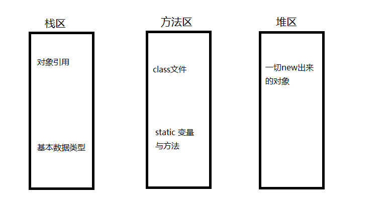
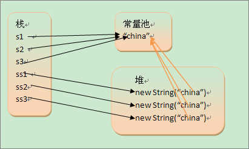

### 高频面试题

#### 1 Integet 128 问题

废话少说，直接上代码（含解释）：

```
public class Test {
    public static void main(String[] args) {

        /**
         * 1. 自动拆装箱功能将 int 数据转为 Integer 对象 </br>
         * 2. 而在 Integer 的源码中，Integer中缓存了 -128-127 的数，所以超过这个范围的值就会 new 一个新的对象返回而不是直接从缓存中获取这个值 </br>
         * 3. == 判断的是对象是否相等，equlas方法 判断的是值是否相等</br>
         * 这样就好解释下面为什么 上面两个都是true，而下面第一个谁false、第二个是true
         */

        Integer a = 100;
        Integer b = 100;
        System.out.println(a == b); // true
        System.out.println(a.equals(b)); // true

        Integer c = 128;
        Integer d = 128;
        System.out.println(c == d); // false
        System.out.println(c.equals(d)); // true

    }
}
```

#### 2 Java 中 New 一个对象关于 heap、stack 的问题

总体上关于存放数据的说明：

| 存放区域   | 描述                                                                                                                                                      |
| ---------- | --------------------------------------------------------------------------------------------------------------------------------------------------------- |
| 寄存器     | 最快的存储区、由编译器根据需求自行分配、程序中无法控制                                                                                                    |
| `栈 stack` | `存放的是局部变量`，`存放基本数类型的变量数据和对象的引用`；但对象本身不存放在栈中、而是存放在堆（new出来的对象）或常亮池（字符串常量对象存放在常量池）中 |
| `堆 heap`  | `成员变量存储在堆中的对象里面`，存放`所有new出来的对象`                                                                                                   |
| 静态域     | 存放静态成员（`static定义`的）                                                                                                                            |
| 常量池     | 存放`字符串常量`和`基本数据类型常量`                                                                                                                      |
| 非RAM存储  | 硬盘等永久存储空间                                                                                                                                        |

下面是关于Java中堆栈、方法区的图解：




参考文章：

1. [Java中存储机制 * 堆栈](https://www.cnblogs.com/zyj-bozhou/p/6723863.html)
2. [推荐：Java堆栈图解](https://blog.csdn.net/lk274857347/article/details/77512555)
3. [Java堆栈](https://blog.csdn.net/shuangzitianyu/article/details/79561511)
4. [Java堆栈内存解释_含数组](https://blog.csdn.net/xiaofei__/article/details/52823076)

#### 3 `String s = new String(“xyz”);`产生几个对象？

```
String s1 = "china";  
String s2 = "china";  
String s3 = "china";  
String ss1 = new String("china");  
String ss2 = new String("china");  
String ss3 = new String("china");  
```



可以看出，在通过 new 产生一个字符串时，会先从常量池中查找是否有了这个对象，如果没有则在常量池中创建这个对象并在堆中创建一个常量池中这个对象的拷贝对象。

答案是：`一个或两个`，如果常量池中没有 xyz，就是两个，反之就是一个。

#### 4 HashMap如何解决哈希冲突

HahsMap底层采用数组+链表的结构存储数据，当每个链表的长度大于8时会转换为红黑树的结构（JDK1.8+）

HashMap用链表 + 红黑树的方式解决哈希冲突。

