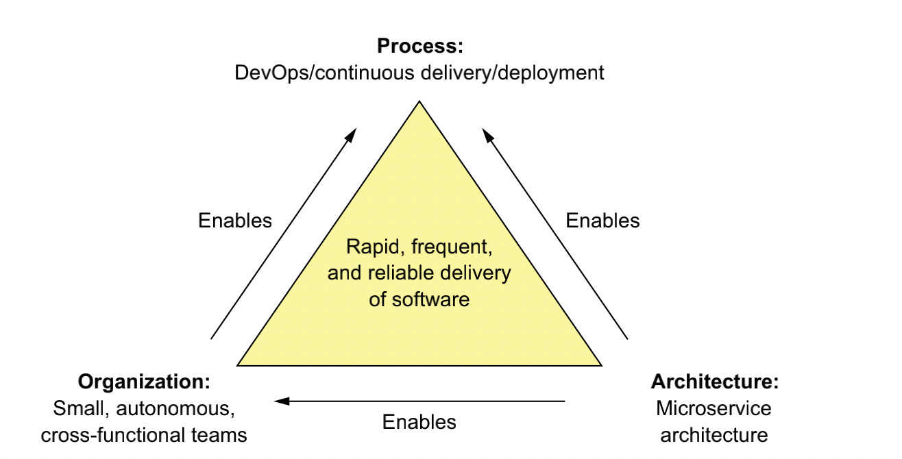

- [1. 了解微服务前](#1-了解微服务前)
- [2. Microservices vs Monolithic Architecture](#2-microservices-vs-monolithic-architecture)
  - [2.1 单体服务](#21-单体服务)
  - [2.2 SOA服务化](#22-soa服务化)
  - [2.3 微服务](#23-微服务)
- [3 微服务定义](#3-微服务定义)
- [4 微服务的利弊](#4-微服务的利弊)
  - [4.1 微服务带来的好处](#41-微服务带来的好处)
  - [4.2 微服务的弊端](#42-微服务的弊端)
  - [4.3 微服务组织模式](#43-微服务组织模式)
  - [4.4 微服务“适配模式”](#44-微服务适配模式)
    - [4.4.1 什么时候合适微服务](#441-什么时候合适微服务)
    - [4.4.2 服务组织、拆分](#442-服务组织拆分)
      - [4.4.2.1 服务分层说明](#4421-服务分层说明)
      - [4.4.2.2 层次额外说明](#4422-层次额外说明)
    - [4.4.3 微服务之服务治理](#443-微服务之服务治理)
      - [4.4.3.1 微服务技术选型参考](#4431-微服务技术选型参考)
  - [5 问题集合及总结](#5-问题集合及总结)

## 1. 了解微服务前

> 在我们学习了解微服务前，我们需要知道我们之前单体服务和微服务之间的对比，包括各自的优缺点从而让我们明确什么时候需要微服务以及我们在学习微服务、运用微服务到生产过程之前需要掌握的基本概念知识。

***

## 2. Microservices vs Monolithic Architecture

> 专业的说法就是`Microservices vs Monolithic Architecture`，下面将逐步描述从单体应用到微服务化的过程。
> 
> 对于微服务的发展我们大致上可以按照这个方向去剖析（j2ee的内容这里就不介绍了）：
> 
> `单体服务` -> `SOA服务化` -> `微服务`

### 2.1 单体服务

单体服务作为我们可能比较常见的服务架构模式，相信大家都很熟悉，但是大家可能平时并没有去关心过相关概念和知识，这里简单描述一下单体服务的模式和相关背景

1. 单体服务一般作为单一性的系统架构，它的所有进程都紧密合并在一起并作为一个服务在运行。
2. 在早期，一般公司的技术架构分为两大类：LAMP和MVC架构。他们的优点是：学习成本低、开发周期短、部署、运维方便、开发成本比较低等等。

当然，早起可能业务体量没有那么大，可能单体服务足以支撑我们的大多数公司的需求。随着业务体量的增加，公司急需在技术上进行更新换代以支撑未来市场的发展，所以单体服务的相关弊病就暴露了出来了：

1. 一个项目可能需要一个庞大的团队进行协作，协作繁杂、管理难度极大；随着项目的复杂度变大，开发人员使用相关工具进行开发的效率也很低，你能想象一个debug调试搞几天吗？
2. 迫切的需要持续集成、持续交付，你能想象一个庞大的项目部署发布需要几个小时甚至几天的吗？
3. 新技术落地难度大、项目难以跟上时代步伐从而导致项目业务发展受限，难以扩展。

### 2.2 SOA服务化

> 基于单体应用诸如：系统太过臃肿、更新、发布耗时耗力；团队协作难度增加、管理难度增加等诸多问题。

服务化（service-oriented architecture）即SOA的软件架构模式诞生了。请注意，服务化并不特指某项技术，以我个人来讲，服务化就是：`可以把服务化看成传统单体应用的本地方法调用改为通过接口方式的远程方法调用`。

那么说到这里，可能有些接触过微服务的朋友就有疑问了，那这个和微服务不差不多吗。答案是肯定的，只不过微服务在SOA软件架构的基础上有了很大的不同。

### 2.3 微服务

> 可以这么说，没有SOA软件设计方法就很难发展到现在以容器服务、DevOps等技术为首的微服务生态圈。
> 
> 最开始我和很多人一样，总是喜欢问微服务究竟是什么？如何用一句话去完整的描述。其实我觉得大家看到这里应该会对微服务是什么都有一些自己的看法和理解了。如果你认同前面这句话，那么恭喜你，说明你在思考，而不是让别人告诉你微服务是什么，后面我将会阐述什么叫微服务。
> 
> 为什么这么说呢，举个不太恰当的例子：在我们完成这个工程的过程中我们需要做很多额外的工作，比如招工人、招管理、准备工具、设计方案、排计划工期、动工、监控工期、关键时间节点把控、质量把控、交付等等。
> 
> 下面这段话是来自维基百科对于微服务的解释：
> 
> 微服务 (Microservices) 是一种`软件架构风格`，它是以专注于`单一责任与功能的`小型功能区块 (Small Building Blocks) 为基础，利用`模组化`的方式`组合出复杂的大型应用程序`，各功能区块使用`与语言无关` (Language-Independent/Language agnostic) 的 `API 集相互通讯`。

相比SOA，或者说相比服务化的软件架构设计方法，我个人觉得微服务在这些方面和服务化有着很大的区别，以下为微服务和SOA的区别：

其中一个很值得注意的点就是服务化采用的多是过于笨重的一套技术栈，比如我们熟知的企业级服务总线ESB（很完备，但是太过笨重）就是从SOA体系中发展而来，是传统中间件技术、XML、WEB服务结合的产物；而微服务则采用轻量级的协议（如上图），小而精。

此外，对于微服务的挑战随之提高：

1. 服务的开发、部署、维护、治理等要求更高
   > 包括服务敏捷开发、CI|CD、容器化、DevOps等等
2. 服务划分维度更宽泛
   > 服务的层级划分、服务模块的拆分颗粒度（以基础服务层为依据的横向拆分、以业务为导向的纵向拆分等）、以及DDD（领域驱动设计）的兴起等（目前国内不是很流行）
3. 技术复杂度陡增、技术版本迭代快
   > 尤其是对架构师的要求更高，这里会涉及很多技术层面的解决方案，诸如大家常见的：服务高可用、高并发、分布式事务、分布式锁、持续集成、持续交付、自动化运维、服务容器化等等常见字眼及分布式系统固有的复杂性等。
4. 管理模式的升级
   > 不同于传统服务开发，微服务开发一般需要遵照一些原则和理论，当然这个不是强制性的，一般是根据各个公司自己的实际情况来组织自己的项目、团队。这个算是我个人的一些看法，相信大家在微服务的接触中会多多少少有相关的一些感悟和见解，欢迎分享、讨论。

***

下面将逐步开始讲微服务相关的只是和概念。当然，这里面有些是业界公认的微服务理论、有些是我自己的一些感悟，希望对大家的微服务之路有启发作用。

***

## 3 微服务定义

> 微服务只是一种软件架构风格，它立足于服务化思想并在服务化思想的基础上更上一层楼。下面将列出几个点阐述什么是微服务。

1. **Highly maintainable and testable** （高度可维护、测试）
2. **Loosely coupled** （松散耦合。我们习惯上也说低耦合、高内聚，接触过spring的都应该知道诸如耦合、解耦等概念）
3. **Independently deployable** （独立部署）
4. **Organized around business capabilities** （围绕业务能力组织）

必须记住的话：`Microservices are not a silver bullet`。

为什么这么说呢，因为随着单体服务不足以支撑相应的业务体量的过程中的产物，下一个技术的风口或许是微服务、也或许是未来有一定的趋势的`service mesh`、甚至是重返单体服务。所以我们不能说微服务一定能解决未来软件发展中的所有问题，只能说就现在而言，微服务作为一种普遍受欢迎的软件架构模式。

> 此外，在`The Art of Scalability (Addison-Wesley, 2015)`这本书提出了一种`高可用的三维模型`，即`scale cube`，如下图：
> 
> 
> 
> 上面这个三维模型表述了软件架构中软件发展中有以下三个大致的方向：
> 
> 1. x轴：服务实例升级为进过负载均衡后的服务集群（集群）
> 2. z轴：服务体量增加、数据量巨大时考虑服务分区（分表）
> 3. y轴：同一个服务实例进一步按功能拆分（分库）

## 4 微服务的利弊

> 前面已经提过有关于单体服务、SOA服务化的利弊，下面将阐述为什么我们选择微服务，它带来的好处或者说它解决了什么样的问题

### 4.1 微服务带来的好处

微服务的好处其实是很容易理解的，只要你接触过单体应用的开发，尤其是某些“臃肿”的政府单体项目。下面列举一些微服务所带来的好处：

- 它支持大型、复杂应用程序的持续交付和部署（个人觉得这是微服务带来的最大好处）
- 服务规模小，维护方便
- 服务可独立部署
- 服务可独立扩展
- 微服务架构使团队能够自主
- 它允许简单的试验和采用新技术
- 具有较好的故障隔离能力

### 4.2 微服务的弊端

相应的，没有任何技术是完美的，有优点自然会有一定的缺点。

- 如何找到合适的一套微服务体系结构是一项巨大的挑战，不管对架构师而言还是普通开发人员而言
- 分布式系统很复杂，这使得开发、测试和部署变得比以往困难数倍，这也相应的增加了部署、测试的难度
- 如何决定是否适合微服务也是一项难题和挑战（这也是很多公司其业务并不需要微服务，甚至服务体量根本没有达到相应的层级，只是盲目的跟风，后面也会讲一下什么时候适合微服务、什么时候不适合）

### 4.3 微服务组织模式

> 前面提到过，我个人认为在微服务的进程中，组织模式的变更在我看来是一项起着关键性作用的一环，我们也是围绕业务能力组织微服务。另一方面微服务模式直接颠覆了我们传统的服务开发模式、也带来了微服务模式下各式各样新的挑战。项目团队初期最为突出的就是四个字：沟通成本。

趣味思考：但是假如你是一个统治者，你站在统治者的角度去看微服务治理的问题你就会想：我要如何让这些服务能能够高效生产给我上贡、如何让这些服务规规矩矩不造反、如何让这些服务的统治者高效的管理并对我忠诚、如何让各个服务在面对问题时能够高效配合、共御外敌等等。

所以，我个人认为，微服务治理从某种程度上讲也是一门艺术，就像一个等边三角形的边长，如何去平衡边长以保证三角形稳定是这门艺术的核心。见下图所示的`Process and organization`：

> PS：OOD中又一个比较有用的理论叫做SRP，即单一职责原则。这个原则在微服务中同样适用而且是大有可用。在OOD中另一个理论是CCP，即公共封装原则，在微服务中同样有这样的理论思想指导，这也许就是我们说面向对象思想的伟大，经久不衰。

**也许你听过这样一句话：`系统设计等同于组织架构`，这就是著名的`康威定律`所提出的思想。**

也就是基于康威的理论，在微服务中我们提倡`跨职能产品组织结构`。举个例子：你的公司有10个产品，同属于一个大型项目，如果每个产品组都有包括：产品、测试、开发人员、组长等。那么需要跨部门沟通时就会方便的多，因为你们小组是一个完整的团队，不存在传统项目常出现的因为一个人员同时负责多个产品线的开发，经常被抽调。这样的化在开发过程中会天然的增加很多沟通成本，而`跨职能产品组织结构`可以有效的解决这个问题，它屏蔽了很大一部分人员的沟通成本，让相关人员更加专注于自己的职能。这也是我前面为什么说微服务“小而精“的原因之一。

解决了`组织问题`，我们还会面临更多的问题，诸如：什么时候适合微服务、服务如何拆分、拆分后采用什么开发模式、如何快速迭代、如何保证各职能部门高效协作等等诸多难题。

### 4.4 微服务“适配模式”

> 就我所知，很多公司近几年盲目跟风微服务。不但没能享受因为微服务带来一些好处，反受其累，增加的无谓的开支、管理上也很混乱。所以，这里总结一下微服务里大家不是常说道的一些话题。

#### 4.4.1 什么时候合适微服务

现在很多公司动不动都会说“我们采用的是微服务架构”！但实际上项目是否适合使用微服务架构还很难说，前期花费大量时间和金钱、精力在微服务上到最后结果发现项目针对的市场反馈并不好，很多时候属于“竹篮打水一场空”。

那么什么时候适合微服务呢？其实没有严格意义上的标准答案，下面说下什么时候比较适合、什么时候不适合。

1. `建议大家在项目初期最好不要使用微服务`。前期应该快速开发、迭代去市场中试错，找到一种符合公司的商业模式、运营模式、开发模式。
2. `人力不足不建议转型微服务`，因为每个人的精力毕竟有限，分布式系统固有的复杂性给开发人员带来了很大的挑战。即使公司有足够的资金和时间、前期就只需要那么几个人去试水，但是市场是不会等人的。
3. `外包更风不建议使用微服务架构体系`，尤其是做外包的兄弟，外包项目一般讲求快、简单，微服务开发也快，但是从全局来看，它并不简单，需要解决很多技术难题，切勿盲目更风。
4. `市场反馈好、未来趋势明朗`时建议可以考虑技术上做升级以支持未来的发展，可以考虑微服务化。

> 额外补充
- 微服务一个原则是`以业务为驱动`，很著名的理论就是DDD（领域驱动设计）。老实说，这套东西都是国外玩剩下的了，我的建议是立足于公司实际，以市场为导向。
- 另一方面，建议在`组织架构上也需要有一定的调整和升级`，目的是为了解决微服务开发过程中难以避免的团队之间协作、沟通的难题。
- 此外，前期应该有良好的“契约模式”，严格意义上讲应该是`消费者驱动契约`。这个模式的意义在于服务的提供者无论在任何时间及场景下都不应该打破契约

#### 4.4.2 服务组织、拆分

分布式系统固有的复杂性在服务的组织、拆分上也带来了一定的难题。什么样的颗粒度是合适的，什么样的服务层次是合理的，这其实并没有标准的解决方案。

* 服务组织可以参考我提到的“组织架构升级改造”的思路进行合理的团队、职能划分
* 服务拆分一般是立足于业务及功能，从两个维度进行拆分
  * `横向拆分`：将公共、独立的服务（不与其他业务资源耦合）拆分出来，例如：短信服务、邮件服务等
  * `纵向拆分`：从业务耦合度出发，具有高耦合度的业务适用于在同一个服务；另外，如果高耦合度的业务需要处理的内容比较多，也可以考虑再进一步细化。
* 此外关于服务拆分并不是说拆分的越细致越好，所谓“事不必用尽，用尽废退”，找到一个符合业务现状、团队技术水平的平衡点才是最合适的。

##### 4.4.2.1 服务分层说明
> 
> 微服务层--聚合层--BFF层（边界API层）--网关路由--视图层
> 
> 事实上，大多数微服务开发只需要按照下面的分层结构即可，不算试图层其实就三层体系。
> 
> 微服务层--聚合层--网关路由--视图层

##### 4.4.2.2 层次额外说明

> 1. 微服务层可以包含：基础支撑服务层、基础服务层、增值服务层
> 2. 聚合层其实是一个非常让开发人员头疼的地方，因为聚合层往往也是服务技术复杂度最高的地方。另外，聚合层其实就是体现上面听到的“scale cube”中服务从z轴演进的一个过程，服务会被拆分成一组相互协作的特定服务。所以服务的功能需要聚合。
> 
>    另外服务聚合有很多种方案，这里给出一篇参考文章： [Reference：聚合器模式](http://www.cnblogs.com/duanxz/p/3514895.html)

#### 4.4.3 微服务之服务治理

其实在我们拆分微服务、组织微服务时我们应该考虑一个问题就是服务应该如何治理，一般来说有下面这些方面需要考虑：

1. 前面提到的服务之间的`契约模式`，这种一般是以接口的形式暴露出来的，不管是HTTP还是RPC，服务之间的契约应该包含：接口名、入参、出参。具体表现形式一般是以文档形式呈现的，不管你是采用`json`（restful api）、`xml`（rpc协议服务描述）或是`idl`（grpc、thirft等跨语言服务调用框架）都可以。
2. 服务的发布与订阅，一般来说，就是我们理解的`注册中心`
3. `服务框架`的选型，比如：Dubbo（rpc协议）、SpringCloud（http）、Thirft（Thrift、gRpc）等等
4. `服务监控、报警`，包括服务相关性能指标的搜集、数据处理、数据展示等
5. `服务兜底方案`，一般可以理解为`服务容错`或者`服务治理`
6. `链路监控`（快速定位故障）

##### 4.4.3.1 微服务技术选型参考

> 下面这个表格就体现了微服务技术栈的技术复杂性，供选型参考的很多，相应的大家的学习成本也是陡增，所以这条路上没有人说我全能搞定，希望大家能够多看、多学、多领悟。
> 尤其是对于所采用的服务化组件，一定要熟悉、了解、吃透。

| 类目                                     | 选型参考                                                     |
| ---------------------------------------- | ------------------------------------------------------------ |
| 服务开发                                 | SpringBoot,Spring,SpringMVC                                  |
| 服务配置与管理                           | Netflix公司的Archaius、阿里的Diamond等                       |
| 服务注册与发现                           | Eureka、Consul、Zookeeper、nacos等                           |
| 服务调用                                 | rest、RPC、gRPC                                              |
| 服务熔断器                               | Hystrix、Envoy、Resilience4j等                               |
| 负载均衡                                 | Ribbon、Nginx、camel等                                       |
| 服务接口调用（客户端调用服务的简化工具） | Feign等                                                      |
| 消息队列                                 | Kafka、RabbitMQ、ActiveMQ、RocketMQ等                        |
| 服务配置中心管理                         | SpringCloudConfig、Chef、Apollo、nacos等                     |
| 服务路由（API网关）                      | Zuul、GateWay、Traefik、Kong等                               |
| 服务监控                                 | Zabbix、Nagios、Metrics、Specatator、Cat等                   |
| 全链路追踪                               | Zipkin、Brave、Dapper、Pinpoint、Skywalking等                |
| 服务部署                                 | Docker、OpenStack、Kubernetes、Rancher等                     |
| 数据流操作开发包                         | SpringCloud Stream(封装与Redis，Rabbit，Kafka等发送接收消息) |
| 事件消息总线                             | SpringCloud Bus                                              |

### 5 问题集合及总结

- 关于分布式和微服务的区别  
   
   答：[Reference：分布式-微服务-集群区别](https://blog.csdn.net/albenxie/article/details/77648014)

- IDL是什么？
    
    答：interface description language

- 总结

1. 单片架构模式将应用程序构造为一个可部署单元。
2. 微服务架构模式将一个系统分解为一组独立的可部署服务，每个服务都有自己的数据库。
3. 对于简单的应用程序来说，单片架构是一个不错的选择，但是对于大型、复杂的应用程序来说，微服务架构通常是一个更好的选择。
4. 微服务架构通过使小型的、自主的团队能够并行工作来加速软件开发的速度。
5. 微服务体系结构不是一个银弹，它有很多缺点，包括复杂性。
6. 微服务体系结构模式语言是一组模式，可帮助您使用微服务体系结构构建应用程序。它帮助您决定是否使用微服务架构，如果您选择微服务架构，模式语言将帮助您有效地应用它。
7. 您需要的不仅仅是微服务架构来加速软件交付。成功的软件开发还需要DevOps和小型自治团队。
8. `不要忘记采用微服务的人性化。为了成功地过渡到微服务架构，您需要考虑员工的情绪。`