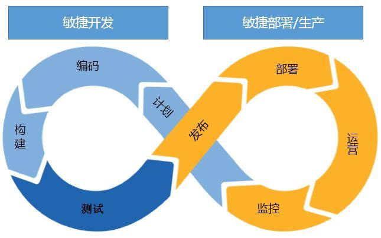
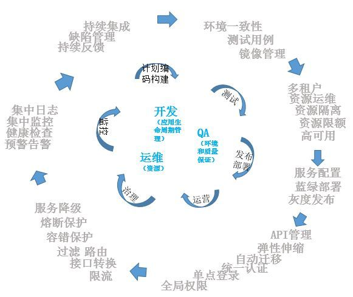

- [1 CI/CD、DevOps](#1-cicddevops)
- [2 概念解释](#2-概念解释)
  - [2.1 CI/CD](#21-cicd)
  - [2.2 DevOps](#22-devops)
- [3 如何落地](#3-如何落地)
  - [3.1 持续集成](#31-持续集成)
  - [3.2 持续交付](#32-持续交付)
  - [3.3 部署发布](#33-部署发布)
  - [3.4 持续监控](#34-持续监控)
  - [3.5 持续反馈](#35-持续反馈)
  - [3.6 持续改进](#36-持续改进)
- [4 开发、运维、QA 之间关系](#4-开发运维qa-之间关系)
- [5 全览](#5-全览)

## 1 CI/CD、DevOps

## 2 概念解释

这里解释一下什么是我们常说的`CI/CD`、`DevOps`等。

### 2.1 CI/CD

1. 持续集成（Continuous integration），简称 CI：它属于开发人员的自动化流程。成功的 CI 意味着应用代码的新更改会定期构建、测试并合并到共享存储库中。该解决方案可以解决在一次开发中有太多应用分支，从而导致相互冲突的问题。简言之，`CI持续集成是一个编码、构建的过程`。

2. 持续交付（持续部署（Continuous Delivery），简称 CD：持续交付通常是指开发人员对应用的更改会自动进行错误测试并上传到存储库（如 GitHub 或容器注册表），然后由运维团队将其部署到实时生产环境中。这旨在解决开发和运维团队之间可见性及沟通较差的问题。因此，持续交付的目的就是确保尽可能减少部署新代码时所需的工作量。

3. 持续部署（Continuous deployment），简称 CD：持续部署（另一种“CD”）指的是自动将开发人员的更改从存储库发布到生产环境，以供客户使用。它主要为了解决因手动流程降低应用交付速度，从而使运维团队超负荷的问题。持续部署以持续交付的优势为根基，实现了管道后续阶段的自动化。

### 2.2 DevOps

从概念上说，DevOps 是一种方法论，是一组过程、方法与系统的统称，用于促进应用开发、应用运维和质量保障（QA）部门之间的沟通、协作与整合。

概念有了，怎么落地？很多公司在实施容器云时实现 CI（Continuous Integration， 持续集成），或者 CI/CD（Continuous Integration/Continuous Delivery or Deployment， 持续集成/持续交付 or 持续部署）就叫 DevOps。我们觉得这只是实现 DevOps 的一部分，但不等于 DevOps。（摘自：[DevOps 不等于 CI，也不等于 CI /CD ](http://www.sohu.com/a/219547745_151779)）

DevOps 要求：开发、测试、运维一体化，从这个层面上讲这给开发人员也带来了很大的压力，因为很多开发人员不仅仅是开发了，还有包括运维的一些职责。同时也要求做到谁开发谁运维从而实现敏捷开发、敏捷部署以及敏捷生产。（见下图）

DevOps 分为下面几个流程：

- 持续集成，需求的不断变动触发持续的编码、构建流程。
- 持续交付，完成测试的业务应用以合适的方式交付到适当的节点。
- 部署发布，将交付的业务应用按照规则部署到生产环境，完成测试后发布。
- 持续监控，时时监控业务应用以及系统平台的运行情况，形成监控报告。
- 持续反馈，是基于监控和业务应用的使用情况，持续的数据分析，持续地提出完善意见。
- 持续改进，基于反馈的意见，启动新的改进计划流程。

要实现 DevOps，我们不仅仅需要开发人员、测试人员、运维人员都要有这样一种意识，同时也要求我们能够利用一些工具来实现我们的 DevOps 目标：

## 3 如何落地

关于 DevOps 如何落地前面提了，不仅仅是通过简单单的一些工具、公司内部宣传就可以玩起来的，更多的还是需要相关人员有这样一种意识并一起王这个方向努力。

### 3.1 持续集成

持续集成阶段，主要考虑流程的自动化、资源选择自动化、代码质量控制自动化、构建自动化等流程。我们可以通过相应的工具来提升对于业务需求的响应能力和敏捷的开发能力。

下面给出一些工具参考：

1. 问题流程跟踪工具：JIRA、`禅道`
2. 代码构建工具：Gradle、`Maven`
3. 自动构建工具：`Jenkins`
4. 代码版本管理工具：SVN、`GIT`
5. 代码质量检测工具：Sonar、`Alibaba P3C`

### 3.2 持续交付

当我们构建好镜像后，需要准备测试环境进行版本测试。如果实现自动化测试的化需要准备自动化、测试用例生成自动化、质量监控自动化、交付自动化。

生产使用的镜像仓库是我们开发测试的一个分水岭，同时也是业务部署运营的中介。所交付出来的是可以部署到生产的业务应用镜像。`每个镜像应该备注说明、配置说明、部署事项、依赖关系等等`。

测试工具推荐：

1. Jemeter
2. 华为云测（压测）

### 3.3 部署发布

部署首先涉及到基础设施资源，资源供给实现自动化。不同的应用可能对资源的要求不一样。（如容器的自动弹性伸缩能力）

业务运营过程中，会涉及到一些定时任务或批处理任务。这些工作可以通过任务调度自动化能力来实现。可以通过自动调度组件来实现，也可以通过脚本来实现。

业务运营中很重要的工作是服务治理。服务治理和服务部署也密切相关。不同的服务架构、不同的服务治理实现方式，都可能会影响到服务部署的方式。服务的路由、熔断、容错、优先级等也需要实现自动化能力。当然这部分大部分组件都已提供了相应的能力。

### 3.4 持续监控

监控是我们为了保证业务正常运行的一种保障手段。持续监控一般从各个层面出发，比如：

1. 基础设施层（Iaas 层）：存储、计算机资源、网络
2. 平台层（容器云）：Docker 引擎、容器编排调度、服务发现、负载均衡
3. 应用层：应用进程、使用资源（存储、计算资源）、网络流量、日志搜集、服务健康检查

简单来说，持续监控就是要做到对整个应用生态`从头到脚`再到`内部器官`的完整监控。

这里推荐持续监控的一些工具或手段：

1. `ELK`（标配）
2. `APM`（市面有很多链路追踪工具）
3. Logtail
4. `Telegraf + InfluxDB + Grafana`

有兴趣可以参考前面写的文章：`服务监控`

### 3.5 持续反馈

持续反馈一般基于持续监控，实现数据分析自动化、告警自动化、反馈自动化等。反馈形式一般是：邮件、短信、报告等。

通常我们的报警会和我们的大数据平台集成从而能够更好的分析、发现并解决问题。

### 3.6 持续改进

基于反馈的信息，继续改进应用服务。实现了业务应用的全生命周期管理。在各个阶段实现自动化，也提升了效率和响应能力。

## 4 开发、运维、QA 之间关系

DevOps 中：

1. 开发专注于业务应用的生命周期管理
2. 运维专注于自动化环境资源的维护
3. QA 专注于自动化业务运行环境的供给和质量跟踪保证。

## 5 全览

DevOps 和容器云是相辅相成的，容器云提供基础设施资源，为 DevOps 的实现提供了资源基础。很便利的实现环境一致性。容器云并不包含 DevOps，所以不是在容器云里实现 DevOps，所以容器云中去做 CI 或 CD 流水线，是不合适的。CI 应该是独立于容器云而存在的，即便不采用容器云，同样可以实现 CI 或 DevOps。

