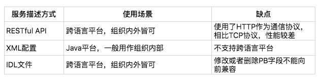

·～·---
layout: post
title: "2. 服务发现与注册"
date: 1997-07-01
categories: Microservices
tags: microservice
excerpt: 了解如何发布和引用微服务、以及服务发现与注册的原理
mathjax: true
---

- [mathjax: true](#mathjax-true)
  - [1. 服务契约](#1-服务契约)
  - [2. 注册中心解决的问题](#2-注册中心解决的问题)
  - [3. 注册中心原理](#3-注册中心原理)
  - [4. 注册中心基本功能](#4-注册中心基本功能)
  - [5. 主流注册中心对比](#5-主流注册中心对比)
  - [6. 主流注册中心CAP说明](#6-主流注册中心cap说明)
  - [7 注册中心如何存储服务](#7-注册中心如何存储服务)
  - [8 注册中心具体工作流程](#8-注册中心具体工作流程)
    - [8.1 服务提供者注册](#81-服务提供者注册)
    - [8.2 提供者如何反注册](#82-提供者如何反注册)
    - [8.3 消费者查询节点信息](#83-消费者查询节点信息)
    - [8.4 消费者订阅服务变更](#84-消费者订阅服务变更)
  - [9 注册与发现的几个问题](#9-注册与发现的几个问题)
  - [10 服务注册中心选型](#10-服务注册中心选型)
    - [10.1 应用内：Eureka](#101-应用内eureka)
    - [10.2 应用外：Consul](#102-应用外consul)
    - [10.3 如何选择](#103-如何选择)
  - [11 注册中心选型涉及的CAP理论](#11-注册中心选型涉及的cap理论)

### 1. 服务契约

在我们了解微服务如何工作以及如何组织之前，我们需要了解服务应该以什么样的方式来进行“契约”。至于“契约”的方式我们通常有下面三种（上文提过）：

1. JSON，`restful`风格服务
2. XML，`RPC`服务
3. IDL，`grpc、thirft`等跨语言服务调用框架

其实很好理解，我们的服务需要通过某种`契约`的方式来让服务的`提供者`以及`消费者`绑定`契约关系`，并且根据这个`契约关系`来描述各自将要`履行的责任`。

我们常用来描述这种`契约关系`的工具也很多，比如：Swagger UI、Word以及一些公司提供的优秀的`API契约平台`。

下面是关于常见服务描述方式的对比：

### 2. 注册中心解决的问题

* 一方面在分布式系统中，我们需要根据`契约`中的某个服务提供者提供的方法，我们需要知道这个服务的地址、出入参数等以保证我们可以正常的调用到相关服务。

* 另一方面，如果我们需要调用的其他服务很多，假如我们通过某个文件来管理所有的服务，这时候随着系统的复杂度提高，这个文件将变得异常庞大，这个管理也带来了更大的问题，尤其是跨部门、跨地区间的协作，他们可能甚至都不知道有彼此的存在。

* 基于此，为了更加方便的管理服务以及服务间的调用关系我们需要有一个比较合适的`平台`来`协作众多的服务`，让他们各自能感知彼此的存在、让他们能够发现彼此提供的服务及服务信息。

* 注册中心提供了`服务的发现和注册`功能，让众多的微服务可以友好的组织起来；也是服务提供者和消费者之间的媒介。

### 3. 注册中心原理

在微服务架构下，我们知道有“服务提供者”、”服务消费者“、“服务注册与发现中心”。下面给出两张图来描述三者之间的关系：

***

1. RPC服务注册中心
   

2. Eureka架构
   

***

### 4. 注册中心基本功能

> 从上面的图例我们可以看出来，服务注册中心至少需要应该具备以下这些功能

1. 服务注册
2. 服务反注册
3. 订阅服务
4. 拉取最新实例列表
5. 服务健康检测（心跳）
6. 服务信息变更
7. 集群部署
8. 白名单

### 5. 主流注册中心对比

| Feature              | Consul                 | Zookeeper             | Etcd      | Euerka          |
| -------------------- | ---------------------- | --------------------- | --------- | --------------- |
| 服务健康检查         | 服务状态，内存，硬盘等 | (弱)长连接，keepalive | 连接心跳  | 可配支持        |
| 多数据中心           | 支持                   | —                    | —        | —              |
| kv存储服务           | 支持                   | 支持                  | 支持      | —              |
| 一致性               | raft                   | paxos                 | raft      | —              |
| cap                  | cp                     | cp                    | cp        | ap              |
| 使用接口(多语言能力) | 支持http和dns          | 客户端                | http/grpc | http（sidecar） |
| watch支持            | 全量/支持long          | polling               | 支持      | 支持            | long polling	支持 long polling/大部分增量 |
| 自身监控             | metrics                | —                    | metrics   | metrics         |
| 安全                 | acl /https             | acl	https支持（弱）   | —        |
| spring cloud集成     | 已支持                 | 已支持                | 已支持    | 已支持          |

### 6. 主流注册中心CAP说明

- 针对`Eureka`注册中心，在注册中心集群上采用的`Replicate`的机制。它会把不同区域的注册中心的服务注册实例信息进行同步，即使某个甚至某几个注册中心节点挂掉了也不会影响服务，因为服务可以从其他地区的注册中心拉取相关服务。从这里可以看出，这个过程并没有强制更新相关实例列表，所以我们讲`Eureka`是基于`CAP`理论中的`AP`。
  

- `Zookeeper`的集群和`Eureka`的集群类似。它由一组Service节点组成，并且这些节点会通过`Paxos协议`选举一个`Leader`，由这个`Leader`执行更新节点等相关操作（`ZAB协议`）并同步给其他Service节点，在这个过过程中，可能会出现因为网络原因导致的`Leader`节点挂掉，但是根据`Paxos协议会选出一个新的节点`，所以ZK在这个过程只能保证最终数据（服务实例列表）的一致性而不能保证服务的可用性，所以我们说ZK是基于`CAP`理论的`CP`。
  

- `Consul`则是有多个`datacenter`，并且每个`datacenter`下都有多个服务实例并基于`raft协议`选举一个`leader`，各个服务实例之间的拷贝保证了服务的一致性，和ZK一样，显然也是基于`CP`的。（这里有期需要值得注意，很多文章说Consul是CA的，严格意义上这是不对的）
  

### 7 注册中心如何存储服务

一般来说，我们的服务信息发布出去一般包含这些信息：

1. 节点信息
2. 服务名称
3. IP地址
4. 端口
5. 服务接口地址
6. 超时时间
7. 最大重试次数
8. 请求结果是否压缩

所以，一般我们的注册中心会提供一个层级关系的数据模型以供我们去描述发布出去的服务。通常来说，服务一般被划分为不同的多个分组，一般来说服务分组有三个层面：

1. 是否业务核心
2. 机房维度
3. 环境维度（线上、测试环境）

另外，注册中心存储的服务信息一般包含三个部分内容：分组、服务名、节点信息（包含节点地址、其他信息），数据一般按照`JSON`格式进行存储。

### 8 注册中心具体工作流程

> 注册中心具体工作主要包含服务提供者注册、反注册；服务消费者查询节点信息、订阅服务变更

#### 8.1 服务提供者注册

1. 检查是否在白名单内，即是否允许注册
2. 要注册的Cluster是否存在，不存在则抛出异常
3. 查看Service的分组是否存在，不存在则抛异常
4. 存入相应的store中

#### 8.2 提供者如何反注册

1. 查看Service分组是否存在
2. 查看Cluster是否存在
3. 删除Service和Cluster下对应的节点信息
4. 更新Cluster的sign值

#### 8.3 消费者查询节点信息

1. 从本地缓存中查找
2. 缓存不存在则从本地快照查找

#### 8.4 消费者订阅服务变更

1. 检查sign值是否一致
2. 不一致则更新本地缓存、更新本地快照
3. 一致则不做任何操作

### 9 注册与发现的几个问题

1. 多注册中心的支持
2. 并行订阅服务
3. 批量反注册
4. 服务信息增量更新

### 10 服务注册中心选型

对于注册中心的选型，当下主流的无非两种：

1. 应用内，通过注册中心配套的SDK，通过SDK与注册中心的交互从而实现服务的发现与注册
2. 应用外，不需要SDK，而是通过其他方式间接实现服务注册与发现

#### 10.1 应用内：Eureka

典型的应用内的服务注册中心就是Eureka，主要由三个组件构成，如下图：

1. Eureka Server：注册中心的服务端，实现了服务的注册、存储和查询功能
2. 服务端的Eureka Client：集成在服务端的注册中心SDK，服务提供者通过调用SDK，实现服务注册、反注册等功能
3. 客户端的Eureka Client：集成客户端的注册中心SDK，服务消费者通过调用SDK，实现服务订阅、服务更新等功能

#### 10.2 应用外：Consul

应用外的服务注册中心目前社区反馈较好的就是Consul，下面是它的架构图：

1. Consul：注册中心的服务端，实现服务注册信息的存储，并提供注册和发现服务
2. Registrator：一个开源的第三方服务管理器项目，它通过监听服务部署的 Docker 实例是否存活，来负责服务提供者的注册和销毁
3. Consul Template：定时从注册中心服务端获取最新的服务提供者节点列表并刷新 LB 配置（比如 Nginx 的 upstream），这样服务消费者就通过访问 Nginx 就可以获取最新的服务提供者信息

#### 10.3 如何选择

这两种服务注册中心的选择方案不同之处在于其应用的场景不同，区别如下：

1. `应用内的解决方案适用于解决同一个技术体系的服务`
2. `应用外的解决方案适用于不同技术体系的业务，如跨语言、平台`

另一方面，对于容器化大行其道的云生产应用而言，SDK的方式不太适合，因为这样会入侵代码，而应用外的解决方案正好能够解决这个问题。

### 11 注册中心选型涉及的CAP理论

为什么这里会提到注册中心选型和CAP理论的关系呢，因为我们在落地注册中心之前除了关心前面提到的`应用内`、`应用外`的问题之外，还需要关心注册中心的`高可用`、以及注册中心服务数据的`一致性`的问题。下面先看看CAP理论的内容（[Reference：CAP理论](https://zh.wikipedia.org/wiki/CAP%E5%AE%9A%E7%90%86)）：

* 一致性（Consistency）（等同于所有节点访问同一份最新的数据副本）
* 可用性（Availability）（每次请求都能获取到非错的响应——但是不保证获取的数据为最新数据）
* 分区容错性（Partition tolerance）（以实际效果而言，分区相当于对通信的时限要求。系统如果不能在时限内达成数据一致性，就意味着发生了分区的情况，必须就当前操作在C和A之间做出选择。）

通过来说，分布式系统实现高可用的手段无外乎下面两种：

1. 集群部署
2. 多IDL部署

在我们的分布式系统中，我们首先要考虑的就是服务的`高可用`，实现方式如上面提到的两种。在这个过程中我们的服务被划分为了多个节点，正常情况下各个节点是没有问题的，一旦出现了网络故障，各个分区被划分成了网络互不相通的区域，数据就不互通了，这时候为了解决`一致性`问题，解决办法就是把数据复制到其他区域内的节点，这样即使出现了分区，也能访问任意区域内节点上的数据，这就是`分区容错性`。

归纳起来说就是：服务节点越多、分区容错性就越高、一致性也就越难保证。

总结起来就是说，对于注册中心的选型，是需要看具体的业务场景的，可以这样简单的理解：

1. Java开发，可以选择Eureka（Eureka提供的sidecar解决方案以支持复杂的业务体系）
2. 云原生、跨语言、复杂体系可以考虑Consul，搭配 Registrator 和 Consul Template 来实现应用外的服务注册与发现