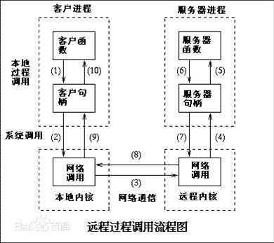
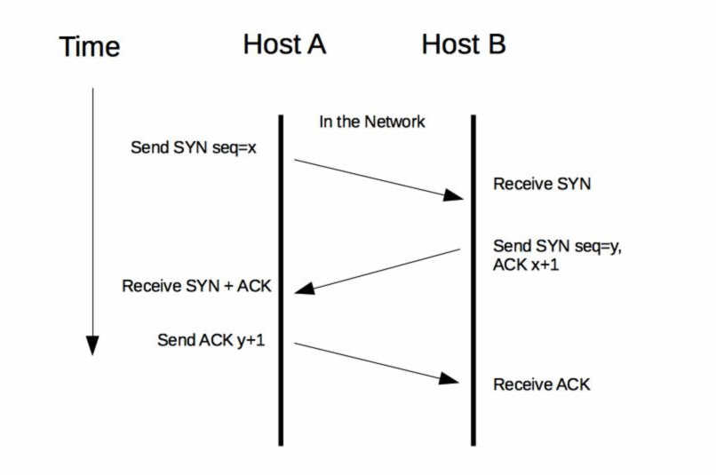
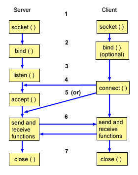

- [1 再次强调RPC](#1-再次强调rpc)
- [2 RPC实现原理](#2-rpc实现原理)
  - [2.1 服务通信问题（通信框架）](#21-服务通信问题通信框架)
    - [2.1.1 HTTP通信](#211-http通信)
    - [2.1.2 Socket通信](#212-socket通信)
    - [2.1.3 服务端处理请求](#213-服务端处理请求)
    - [2.1.4 数据传输协议](#214-数据传输协议)
    - [2.1.5 序列化和反序列化](#215-序列化和反序列化)
- [3 关于Dubbo和SpringCloud性能的看法](#3-关于dubbo和springcloud性能的看法)
- [4 RPC框架分类](#4-rpc框架分类)
- [5 RPC框架如何选型](#5-rpc框架如何选型)

### 1 再次强调RPC

前面我们提到过服务化的概念，我的理解为：`本地方法调用改为接口方式的远程方法调用`，即我们说的`RPC`(Remote Procedure Call)。

* 本地方法调用：同一台机器的同一个进程内部
* 远程方法调用：不同物理机的不同进程内，简称RPC

### 2 RPC实现原理

> 先明确客户端和服务端的概念：
> 
>   客户端：服务消费者
> 
>   服务端：服务提供者

[Reference：gRpc](https://blog.csdn.net/y_xianjun/article/details/81327602)

**RPC调用需要经过下面几个步骤：**

1. 调用客户端句柄；执行传送参数
2. 调用本地系统内核发送网络消息
3. 消息传送到远程主机
4. 服务器句柄得到消息并取得参数
5. 执行远程过程
6. 执行的过程将结果返回服务器句柄
7. 服务器句柄返回结果，调用远程系统内核
8. 消息传回本地主机
9. 客户句柄由内核接收消息
10. 客户接收句柄返回的数据

__句柄：在程序设计中，句柄（handle）是Windows操作系统用来标识被应用程序所创建或使用的对象的整数。其本质相当于带有引用计数的智能指针。当一个应用程序要引用其他系统（如数据库、操作系统）所管理的内存块或对象时，可以使用句柄。__

在这个过程中，我们应该注意以下几个点：

1. 服务端和客户端网络如何连接
2. 服务端如何处理请求
3. 采用什么数据传输协议
4. 如何序列化及反序列化（面试常问的内容）

> 

#### 2.1 服务通信问题（通信框架）

通信框架主要是为`解决客户端和服务端的连接（建立、管理）以及服务端如何处理数据的问题`

> 客户端和服务端之间基于 TCP 协议建立网络连接最常用的途径有两种，分别是基于TCP协议下的HTTP协议以及基于TCP/IP协议簇的Socket通信。

`TCP`（Transmission Control Protocol），即传输控制协议。是一种面向连接、可靠的、基于字节流的传输层通信协议（可参考OSI七层模型中的），由IETF的RFC 793定义。`UDP`是同一层的另一个我们常见的传输协议。

   1. `TCP三次握手`
   2. 位于因特协议簇中，TCP位于IP层之上，应用层之下的中间层
   3. 操作系统将TCP连接抽象为套接字表示的本地端点并作为编程接口给程序使用，也就是我们常说的`套接字通信`

`OSI七层协议模型`，详情可参见 [WikiPedia_OSI](https://zh.wikipedia.org/wiki/OSI%E6%A8%A1%E5%9E%8B)：

   1. 物理层
   2. 数据链路层
   3. 网络层
   4. 传输层
   5. 会话层
   6. 表达层
   7. 应用层

##### 2.1.1 HTTP通信

HTTP通信基于应用层HTTP协议，而HTTP协议又是基于传输层的TCO协议的。这里就不得不提经典的`三次握手`：

而连接建立后，需要经过`四次握手`来断开连接

##### 2.1.2 Socket通信

Socker通信协议是基于TCP/IP协议的封装，建立一次Socket连接至少需要一对套接字，其中一个运行于客户端、称之为ClientSocket；另一个运行于服务器端，称之为ServerSocket。而Socket通信的过程一般分为四个步骤：

1. 服务器监听
2. 客户端请求
3. 连接确认
4. 数据传输

> 对于网络传输，我们可能发现存在掉线、超时等情形，这时候一般可以通过一下手段来处理

1. 心跳检测：某几个周期内没有收到心跳则认为下线了，此时需要重新建立连接
2. 断开重试：断开的情形还是比较多，一般也是等待一段时间间隔后开始重连避免频繁的重连请求过多而把服务端的连接数占满

##### 2.1.3 服务端处理请求

一般来说，处理请求的方式有以下几种 [Reference：NIO BIO AIO](http://www.cnblogs.com/ygj0930/p/6543960.html)：

1. NIO（同步非阻塞方式）
2. BIO（同步阻塞方式）
3. AIO（异步非阻塞方式）

一般来说，对于上面三种处理数据的方式区别大致如下：

1. NIO适用于处理连接数较多并且请求消耗比较轻量的业务场景，比如：即时通信，相对BIO，编程较复杂，是BIO的改进，基于Reactor模型。
2. BIO适合于处理连接数比较小的业务，实现也相对简单、直观、易于理解，如我么熟知的Socket编程。
3. AIO适合于连接数较多并且消耗比较大的场景，比如：IO操作密集型，编程难度较大、也不易于理解。

**我们通常都是采用上面提到的两种方式来解决服务之间的通信问题，需要注意以下两点：**
1. 通常我们在服务提供者的一端基于BIO、NIO、AIO来实现服务端的请求处理。
2. 然后还要解决服务提供者和消费者之间的网络可靠性问题，也就是上提到的解决网络问题

##### 2.1.4 数据传输协议

解决`客户端和服务端的数据传输协议问题`

1. HTTP协议（开发的）
2. Dubbo协议（私有定制的，阿里巴巴开源）

##### 2.1.5 序列化和反序列化

为什么要序列化呢？因为一般在网络传输中我们为了降低带宽占用，通常将数据压缩以减少数据的发送量从而降低网络传输耗时。当然，你也可以增加带宽，只要你足够有钱。

序列化解决的主要问题就是`客户端和服务端之间的数据编码问题`

常用的序列化方案：

1. 文本，如：XML/JSON/YAML
2. 二进制，如：PB/Thrift/HDF/GRIB/netCDF

对于序列化的方案虚啊用标准和参考，我们一般考虑下面这些因素：

1. 是否跨平台、跨语言支持
2. 是否支持复杂的数据结构
3. 序列化压缩比、序列化/反序列化速度

一般来说，一个服务框架是支持多种通信协议的，如下：

| 服务化框架  | 通信协议 | 序列化支持                                |
| ----------- | -------- | ----------------------------------------- |
| Dubbo       | RPC      | Dubbo协议、RMI、Hessian、http、WebService |
| SpringCloud | HTTP     | 基于HTTP的Rest API                        |

### 3 关于Dubbo和SpringCloud性能的看法

1. Dubbo通信性能上优于SpringCloud，大概是后者的3倍左右。因为前者是长连接、性能一般比较可靠，而HTTP是无状态协议、本身就不可靠
2. Dubbo强类型、耦合度高、服务升级容易出现兼容性问题
3. SpringCloud好处理弱类型、耦合度低、采用restful风格一般不会出现服务容性能问题

所以，客观分析，二者各有长处。具体选用哪一套框架其实要根据业务场景来看，不能一概而论。

[Reference：Dubbo和SpringCloud深入对比](https://blog.csdn.net/lzkaifa/article/details/80182410)

### 4 RPC框架分类

大体上分，RPC框架可以分为`与某种语言绑定`、`跨语言平台`的RPC框架。

* 与语言绑定的：
  * Dubbo，仅支持Java
  * Motan，仅支持Java
  * Tars，仅支持C语言
  * SpringCloud，仅支持Java

* 跨语言平台的：
  * gRPC
  * Thrift

### 5 RPC框架如何选型

对于有条件的企业，可以考虑企业自研RPC框架，但是这个过程和耗费的人力都将是巨大的，所以对于中小团队而言建议选用成熟的开源RPC框架、在此基础上进行个性化定制，反而方便、节省人力资源。

那么开源RPC框架如何选择呢？个人建议在初期选择RPC框架时可以考虑以下因素：

1. 语言平台
2. 性能要求
3. 配套组件
4. 社区活跃度
5. 团队技术现状

