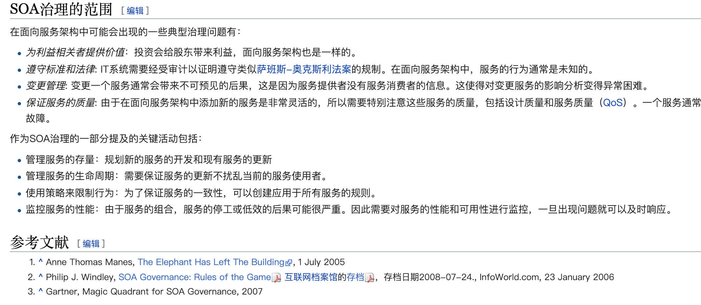

- [1 什么是服务治理](#1-什么是服务治理)
- [2 典型的问题及活动](#2-典型的问题及活动)
- [3 服务治理手段](#3-服务治理手段)
  - [3.1 节点管理](#31-节点管理)
  - [3.2 负载均衡](#32-负载均衡)
  - [3.3 服务路由](#33-服务路由)
  - [3.4 服务容错](#34-服务容错)
- [4 参考](#4-参考)

### 1 什么是服务治理

在`SOA`服务化相关理论指出，服务治理按照`Anne Thomas Manes`的定义是：企业为了确保事情顺利完成而实施的过程，包括`最佳实践`、`架构原则`、`治理规程`、`规律`以及`其他决定性的因素`。

也就是说`服务治理`指的是用来管理`SOA`所采用以及实现的过程。

### 2 典型的问题及活动

> 这里提到的典型问题主要来自维基百科的文章，个人稍微做了些修改，参见文末的参考文章。
> 
> 

个人觉得，无非就是下面这几点：

1. 契约
2. 利益链（投资与回报的关系）
3. 审计（规则与标准的遵守）制度
4. 管理（提供者和消费者的责任、输入输出关系）
5. 质量（整体工程的质量）

上面列举的这几点都比较抽象，精炼一点来说就是解决`如何保证服务提供者的服务正常提供服务、服务消费者正常消费`的问题。

### 3 服务治理手段

> 服务治理手段可以说是多样化的，事实上没有一个标准来告知我们如何如何去进行服务治理，因为这很难办到。比如，不同的公司其经营方式、运营方式、开发方式各不相同，服务治理方式自然也不可能是万能钥匙。
> 
> 下面将列举一些常见的服务治理手段。当然，针对的都是服务本身。以下将对`服务调用异常`提供一些常见的服务治理手段

#### 3.1 节点管理

> 一般来说，`服务调用异常`无外乎`网络故障`、`服务异常`
> 
> `网络故障`：如服务器机房网络故障、宽带欠费、片区断网、设备网络环境差、网络管制等等
> `服务异常`：服务本身BUG、硬件资源消耗殆尽、服务瓶颈等等
> 
> 一般来说，对于服务的治理我们通常都是上述两种大类问题，解决方法一般从两个方向入手

1. 注册中心心跳检测（主动下线服务提供者，最常见的方式）
2. 服务消费者主动注销

#### 3.2 负载均衡

> 在我们实际生产环境中，服务的节点一般不是唯一的，我们一般都是针对服务做了集群以防止在生产环境中服务的调用出现因为某个服务负载过大、某个机器性能较弱等导致整个服务异常的情形。
> 
> 针对服务的负载均衡，一般做法无非`多启服务`、`加机器`、`配置负载均衡策略`等方式来处理。
> 
> 下面将列举常见的服务的负载均衡算法：

1. `轮询`
2. `随机`：均匀的
3. `最少活跃`；调用服务节点时，调用一次+1，返回-1；性能最优
4. `一致性HASH`：指相同参数的请求总是发到同一服务节点。当某一个服务节点出现故时，原本发往该节点的请求，基于虚拟节点机制，平摊到其他节点上，不会引起剧烈变动。

#### 3.3 服务路由

> 在我们的服务中，某个请求最终到哪个服务，我们已经知道了负载均衡算法有一定的作用，但是并不是说这个工作只和它相关。事实上，路由规则也影响了我们的服务请求最终访问的服务节点。

`路由规则`：指条件表达式或正则表达式来限定服务的路有选择。

一般来说，路由规则和我们的业务存在关系。比如，某个功能即将上线，但是这个功能因为种种原因尚未稳定，所以领导要求上到线上环境，只允许公司内部人员可用；在公司员工`试用`期间，我们发现不同地区访问的网络延时差别特别大，这就需要我们考虑同IDC、同区域部署服务。

对于上面两种情形，就涉及到我们常说的`灰度发布`以及 `IP段控制`。一般来说，一般来说，对于路由规则的配置有以下两种方式：

1. `静态配置`：服务消费者本地存放路由规则，服务调用期间不变，只能修改服务消费者本地配置，启动服务生效。
2. `动态配置`：路由规则存放在注册中心，服务消费者定期发起同步，修改注册中心的路由配置，在下一个服务周期后服务消费者会请求配置并同步从而实现动态更新。（注：这里一般还可以结合数据库、缓存来实现灵活的动态路由配置）

#### 3.4 服务容错

服务的调用不可能一次成功，比如在`SpringCloud`中就有大家都遇到过的第一次调用失败/超时的问题，当然，这个问题有一定的解决方案。针对服务运行过程中可能出现的服务调用失败情况，我们一般有这样几种方式来处理此类问题：

1. `FailOver`：失败自动切换，失败后自动从可选择的服务节点列表中选择一个并自动发起重试
2. `FailBack`：失败通知，失败后根据上次请求的状态来决定是否发起重试，如果上次未成功则可以发起一次重试，反之则不发起重试（比如，对于非幂等性请求如果频繁的发起重试可能会加剧服务的访问故障）
3. `FailCache`：失败缓存，失败后缓存请求，等待一段时候发起重试
4. `FailFast`：快速失败，失败后直接返回失败结果

### 4 参考

1. [SOA服务治理](https://zh.wikipedia.org/wiki/SOA%E6%B2%BB%E7%90%86)

