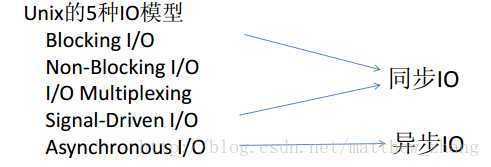
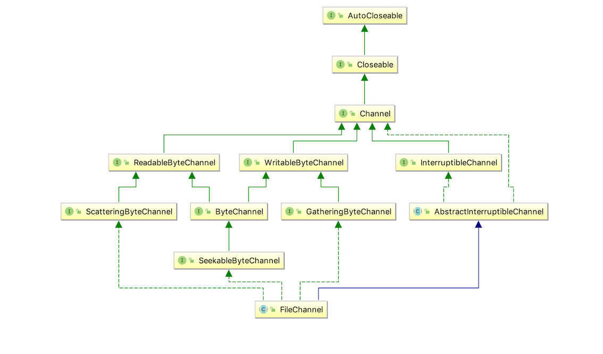
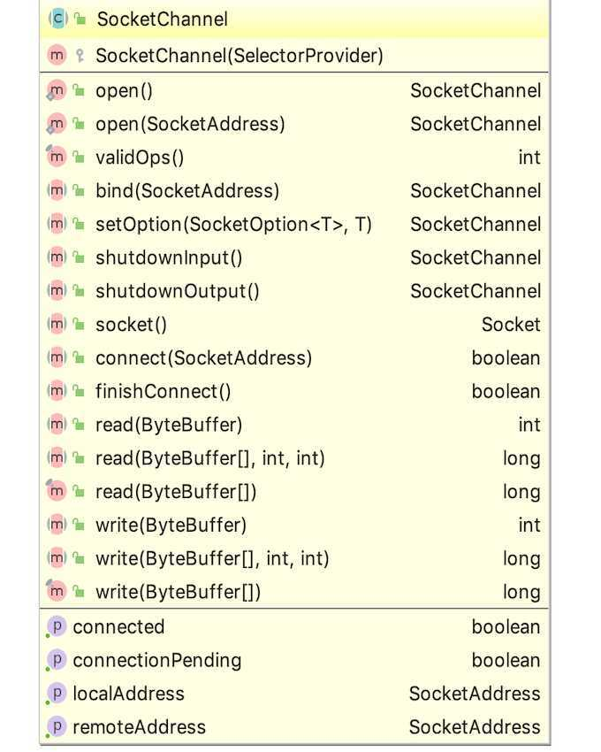
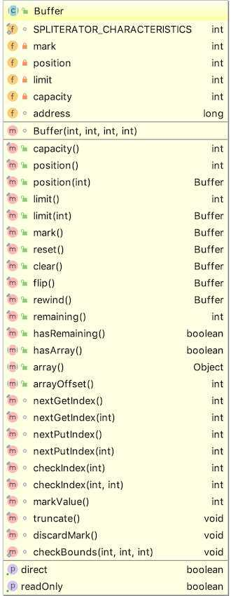

- [1 NIO 历史](#1-nio-历史)
- [2 BIO、NIO、AIO 说明](#2-bionioaio-说明)
  - [2.1 基于 Buffer 与基于 Stream](#21-基于-buffer-与基于-stream)
  - [2.2 阻塞与非阻塞 IO](#22-阻塞与非阻塞-io)
  - [2.3 关于 NIO 和 AIO 的选择](#23-关于-nio-和-aio-的选择)
- [3 NIO 核心组件](#3-nio-核心组件)
  - [3.1 Channel](#31-channel)
    - [3.1.1 FileChannel](#311-filechannel)
    - [3.1.2 SocketChannel](#312-socketchannel)
    - [3.1.3 ServerChannel](#313-serverchannel)
  - [3.2 Buffer](#32-buffer)

### 1 NIO 历史

`Java NIO`是从`Java SE 1.4`开始新增的`非阻塞IO`，简称`NIO`。个人认为，它是对之前的`阻塞IO，即BIO`的`补充`（很多人喜欢说替换）。个人觉得，这两种 `IO API`都有对应的应用场景，所以我个人觉得说替代我个人觉得稍微有点欠妥。

下面是`JAVA IO API`的升级历史变迁：[Enhancements in Java I/O](https://docs.oracle.com/javase/8/docs/technotes/guides/io/enhancements.html#pre)

### 2 BIO、NIO、AIO 说明

下面是`Unix IO`中的 5 种 IO 模型，见下图：



关于`阻塞I/O、非阻塞I/O、异步I/O`的处理过程的描述如下：


关于 `Java 中各种 IO 流所对应的类`：


首先说下关于同步/异步、阻塞/非阻塞的概念。以及这些概念在 Unix 的 IO 模型里的解释：

- `异步I/O` 是指用户程序发起 IO 请求后，不等待数据，同时操作系统内核负责 I/O 操作把数据从内核拷贝到用户程序的缓冲区后通知应用程序。数据拷贝是由操作系统内核完成，用户程序从一开始就没有等待数据，发起请求后不参与任何 IO 操作，等内核通知完成。

- `同步I/O`就是非异步 IO 的情况，也就是用户程序要参与把数据拷贝到程序缓冲区（例如 java 的 InputStream 读字节流过程）。

- `同步IO里的非阻塞`是指用户程序发起 IO 操作请求后不等待数据，而是调用会立即返回一个标志信息告知条件不满足，数据未准备好，从而用户请求程序继续执行其它任务。执行完其它任务，用户程序会主动轮询查看 IO 操作条件是否满足，如果满足，则用户程序亲自参与拷贝数据动作。

关于`BIO`和`NIO`的区别，示例如下：


可以从上图中看出，BIO 和 NIO 的区别：

1. BIO 是基于流（Stream）的，而 NIO 是基于缓冲区（Buffer）的
2. BIO 是阻塞 IO，而 NIO 是非阻塞 IO
3. BIO 是基于单线程的模型，而 NIO 是基于选择器（Selector）线程模型

上面的说法可能有些抽象，但是确实相对而言比较准确的描述了。这里给出一些参考文章：

- [BIO 与 NIO、AIO 的区别](https://blog.csdn.net/skiof007/article/details/52873421)
- [AIO 与 NIO 的区别](https://my.oschina.net/hosee/blog/615269)
- [强烈推荐站点：Java NIO vs .IO](http://tutorials.jenkov.com/java-nio/nio-vs-io.html)

#### 2.1 基于 Buffer 与基于 Stream

- `Stream`：是应用程序中一组有序的，具有起点和终点的字节数据的传输手段，顺序的从一个 Stream 进行数据的读取。Java 中的流一般用于处理`字节`、`字符`数据
- `Buffer`：用于创建一个专门存放`二进制数据`的缓存区。而 Buffer 则一般是处理文本数据，它可以从任意位置读取数据，从而大大提升了灵活度。

#### 2.2 阻塞与非阻塞 IO

`Java 的 IO 流操作`都是`阻塞的 IO 操作`，所谓阻塞，当一个线程执行读或写 IO 操作时，该线程会被阻塞，直到有一些数据被读取，或者数据完全写入。

而`非阻塞的IO操作`，如`NIO`。其实从前面的关于`BIO`和`NIO`的对比图中我们可以看出来：

1. 当一个线程执行从 Channel 执行读取 IO 操作时，有数据则读取并返回，无数据则直接返回而不会阻塞线程
2. 同样的，当一个线程执行从 Channel 执行写入操作时，不需要等待完全写入就可以去执行其他操作，也就是说线程可以将非阻塞 IO 的空闲时间用于其他 Channel 上执行 IO 操作
3. 其实通过上面的徒也可以看出有一个很重要的组件`Selector`就是实现上面我们说一个线程实现非阻塞 IO 操作的核心

#### 2.3 关于 NIO 和 AIO 的选择

因为在`Netty 4.1`的版本中，并没有针对 AIO 的实现，至于原因其实也就一句话：`用户不关系底层具体实现方式，只关心哪个用起来更舒服、更快`。

可以参考下这篇文章 [匠心零度](https://juejin.im/entry/5a8ed33b6fb9a0634c26801c)

### 3 NIO 核心组件

> 上面介绍了关于 Java 中 IO 以及 NIO 的概念、长处等，接下来将揭开 NIO 的神秘面纱。

#### 3.1 Channel

在 Java NIO 中，所有的 IO 操作都是基于 Channel 的，数据的读取、写入都要经过 Channel。如下图：


同时，我们应该会注意到一个细节：所有的`data`在传输处理过程中都会经过`Buffer`、然后再到`Channel`。而针对 Buffer 的种类可以罗列如下：

- ByteBuffer
- IntBuffer
- CharBuffer
- LongBuffer
- DoubleBuffer
- FloatBuffer
- ShortBuffer

要说`Channel`和`Stream`的区别，大致上可以总结如下：

1. Channel 式双向的（可读可写，它相当于一个管道，实际读取写入的还是到 Buffer），而 Stream 一般是单向的（要么只能读、要么只能写）
2. Channel 可以非阻塞的进行 IO 操作，而 Stream 则是阻塞 IO 操作
3. Channel 必须配合 Buffer 使用

在 Java 中，`Channel`的接口定义非常简单，如下：

```
public interface Channel extends Closeable {

    /**
     * 判断此通道是否处于打开状态。
     */
    public boolean isOpen();

    /**
     * 关闭此通道。
     */
    public void close() throws IOException;

}
```

可以看到，`Channel接口`定义了一个`判断通道状态的方法`和一个`关闭通道的方法`。而且`Channel`的实现类非常多，主要有下面几个：

1. `FileChannel` ：从文件中，读写数据。
2. `DatagramChannel` ：通过 UDP 读写数据。
3. `SocketChannel` ：一个客户端用来发起 TCP 的 Channel 。
4. `ServerSocketChannel` ：一个服务端用来监听新进来的连接的 TCP 的 Channel 。对于每一个新进来的连接，都会创建一个对应的 SocketChannel 。

可以参考原文（上面给出过这个大神的教程地址，这里再发一次）：[Java NIO](http://tutorials.jenkov.com/java-nio/channels.html)

我们一般不关心 UDP 读写数据，下面将注意说下另外三种 Channel 的实现类，下面首先看下这三种实现类的类继承关系：

`Filechannel` 的继承关系：



`SocketChannel`的继承关系：


##### 3.1.1 FileChannel

`Java NIO FileChannel`是连接到文件的通道。使用文件通道，您可以从文件中读取数据，并将数据写入文件。`Java NIO FileChannel类`是`NIO`的替代方法，可以使用`标准Java IO API`读取文件。

`FileChannel`不能设置为非阻塞模式。它始终以阻塞模式运行。

然后就是 FileChannel 的相关 API 如下：


##### 3.1.2 SocketChannel

`Java NIO SocketChannel` 是连接到 `TCP 网络套接字`的通道。它是 `Java NIO`相当于`Java Networking`的套接字。有两种方法 `SocketChannel`可以创建：

1. 您打开 SocketChannel 并连接到互联网上的某个服务器。
2. 一个 SocketChannel 当传入连接到达一个可以创建 ServerSocketChannel。

简单示例（打开一个 SocketChannel 连接）如下所示：

```
SocketChannel socketChannel = SocketChannel.open();
socketChannel.connect(new InetSocketAddress("http://jenkov.com", 80));
```

和`FileChannel`不同的是，`SocketChannel`可以设置为`Non-Blocking Mode`(非阻塞模式)，这就意味着你调用 `connect()`，`read()`并`write()`在`异步模式`。

关于非阻塞模式和选择器，这里有段话可以参考：
`The non-blocking mode of SocketChannel's works much better with Selector's. By registering one or more SocketChannel's with a Selector, you can ask the Selector for channels that are ready for reading, writing etc.`

意思就是说：`SocketChannel 的非阻塞模式`比`选择器模式`效率高些。因为选择器模式需要由一个或多个`SocketChannel`来注册，每次的读写都需要查询选择器是否有空闲的`Channel`。

下面是`SocketChannel`的 API：



##### 3.1.3 ServerChannel

`Java NIO ServerSocketChannel`是一个可以侦听传入 TCP 连接的通道，就像`ServerSocket`在标准 Java 网络中一样。该`ServerSocketChannel`课程位于`java.nio.channels`包中。

下面是一个简单的示例程序：

```
ServerSocketChannel serverSocketChannel = ServerSocketChannel.open();

serverSocketChannel.socket().bind(new InetSocketAddress(9999));

while(true){
    SocketChannel socketChannel =
            serverSocketChannel.accept();

    //do something with socketChannel...
}
```

`ServerChannel`也是可以设置为`非阻塞模式`，在非阻塞模式下，`accept()方法`立即返回，如果没有到达传入连接，则可以返回 null。因此，您必须检查返回的 `SocketChannel` 是否为 null，如下面的示例：

```
ServerSocketChannel serverSocketChannel = ServerSocketChannel.open();

serverSocketChannel.socket().bind(new InetSocketAddress(9999));
serverSocketChannel.configureBlocking(false);

while(true){
    SocketChannel socketChannel =
            serverSocketChannel.accept();

    if(socketChannel != null){
        //do something with socketChannel...
        }
}
```

#### 3.2 Buffer

这里说的`Buffer`是指与`NIO通道`交互时使用`Java NIO缓冲区`。它在实际应用中的体现就是数据从通道读入缓冲区，并从缓冲区写入通道。

前面已经提到过 Buffer 的一些主要类型，这里再重复一次，其实 `Buffer`可以理解为`暂存一组特定类型数据的封装`：

- ByteBuffer
  - MappedByteBuffer
- IntBuffer
- CharBuffer
- LongBuffer
- DoubleBuffer
- FloatBuffer
- ShortBuffer

下面可以看下 buffer 的基本属性和方法：



可以看出`Buffer`有四个重要的基本属性：`mark`（标记）、`position`（指针位置）、`limit`（上限）、`capacity`（容量，初始化赋值并且永远不能变更）。

- capacity 属性，容量，Buffer 能容纳的数据元素的最大值。这一容量在 Buffer 创建时被赋值，并且永远不能被修改。

另外，前面说过`Channel`是双向的，所以相应的`Buffer`被设计为可读可写，拥有`读模式`和`写模式`，如下：


从图中，我们可以看到，两种模式下，position 和 limit 属性分别代表不同的含义，解释如下：

- position 属性，位置，初始值为 0 。
  - 写模式下，每往 Buffer 中写入一个值，position 就自动加 1 ，代表下一次的写入位置。
  - 读模式下，每从 Buffer 中读取一个值，position 就自动加 1 ，代表下一次的读取位置。( 和写模式类似 )
- limit 属性，上限。
  - 写模式下，代表最大能写入的数据上限位置，这个时候 limit 等于 capacity 。
  - 读模式下，在 Buffer 完成所有数据写入后，通过调用 #flip() 方法，切换到读模式。此时，limit 等于 Buffer 中实际的数据大小。因为 Buffer 不一定被写满，所以不能使用 capacity 作为实际的数据大小。
- mark 属性，标记，通过 #mark() 方法，记录当前 position ；通过 reset() 方法，恢复 position 为标记。
  - 写模式下，标记上一次写位置。
  - 读模式下，标记上一次读位置。

可以看出，四个属性遵循这样的关系：`mark <= position <= limit <= capacity`

而在`Netty`中的`ByteBuf`被设计为：`0 <= readerIndex <= writerIndex <= capacity`，通过 readerIndex 和 writerIndex 两个属性，避免出现读模式和写模式的切换。

缓冲区本质上是一个可以写入数据的内存块，然后可以再次读取。此内存块包含在 `NIO Buffer`对象中，该对象提供了一组方法，可以更轻松地使用内存块。

一般来说，使用缓冲区主要是以下四个步骤：

1. 将数据写入缓冲区
2. 调用`buffer.flip()`方法
3. 从缓冲区读取数据
4. 调用`buffer.clear()` 或 `buffer.compact()`Buffer`

关于具体的`Buffer`的 API 使用这里就不赘述了。
值得注意的是，我们在创建一个`Buffer`时，可以选择是使用`基于堆内内存`还是`基于堆外内存`，关于 `Direct Buffer`（堆内内存） 和 `Non-Direct Buffer`（堆外内存） 的区别：

- `Direct Buffer`:

  - 所分配的内存不在 JVM 堆上, 不受 GC 的管理.(但是 Direct Buffer 的 Java 对象是由 GC 管理的, 因此当发生 GC, 对象被回收时, Direct Buffer 也会被释放)

  - 因为 Direct Buffer 不在 JVM 堆上分配, 因此 Direct Buffer 对应用程序的内存占用的影响就不那么明显(实际上还是占用了这么多内存, 但是 JVM 不好统计到非 JVM 管理的内存.)

  - 申请和释放 Direct Buffer 的开销比较大. 因此正确的使用 Direct Buffer 的方式是在初始化时申请一个 Buffer, 然后不断复用此 buffer, 在程序结束后才释放此 buffer.

  - 使用 Direct Buffer 时, 当进行一些底层的系统 IO 操作时, 效率会比较高, 因为此时 JVM 不需要拷贝 buffer 中的内存到中间临时缓冲区中.

- `Non-Direct Buffer`:

  - 直接在 JVM 堆上进行内存的分配, 本质上是 byte[] 数组的封装.

  - 因为 Non-Direct Buffer 在 JVM 堆中, 因此当进行操作系统底层 IO 操作中时, 会将此 buffer 的内存复制到中间临时缓冲区中. 因此 Non-Direct Buffer 的效率就较低.

---

关于`读操作`和`写操作`的理解，注意视角的区别：

> `读操作`：数据从`外部`输入到`某个存储介质`，如外部数据写入到内存中。这个过程称之为`读操作`（操作系统视角）；反过来，相当于`向XX写入数据`（外部文件/网络视角）。
>
> `写操作`：数据从`某个存储介质`输出到`外部`，如内存数据写出到文件中。这个过程称之为`写操作`（操作系统视角）；反过来，相当于`从XX读取数据`（外部文件/网络视角）。
>
> 此外，通常我们说的 NIO 的读操作，就是从 Channel 读取数据到 Buffer（即外部数据到存储介质）；同样的，写操作就是将 BUffer 的数据写出到 Channel 中（存储介质数据到外部）

总之，读操作和写操作都是想对的，一般来说，我们都是根据`存储介质`为主要参考点。

