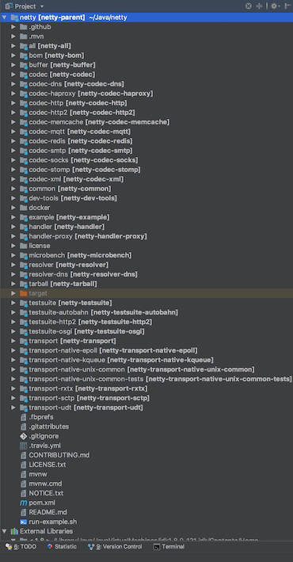
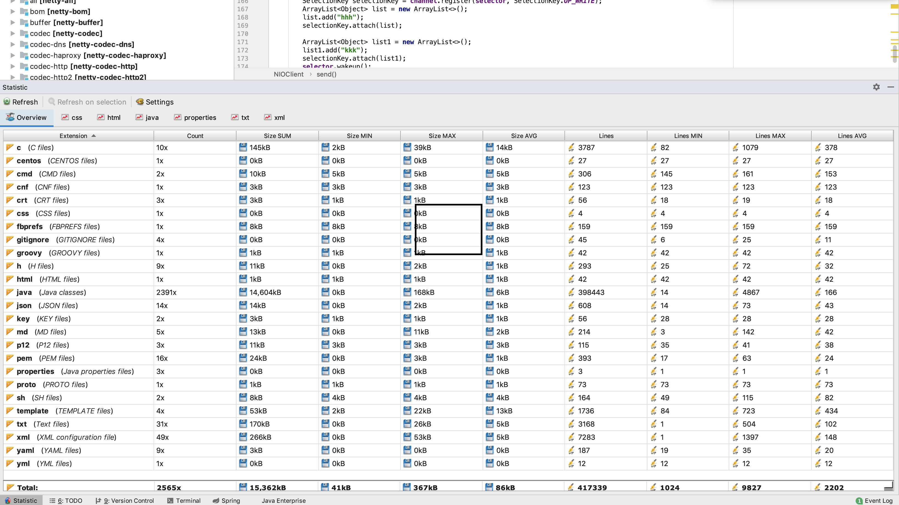
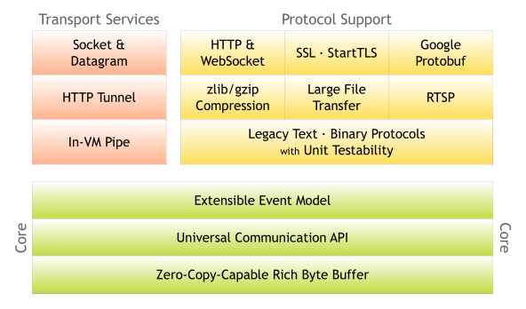

- [1 项目结构图](#1-项目结构图)
- [2 架构](#2-架构)
- [3 项目依赖](#3-项目依赖)

### 1 项目结构图

当我们从 Netty 拉取下 Netty 时，可能会比较的懵逼，因为项目报结构比较多！如下：

下面可以看下它的代码统计；

可以看出，各种不同类型的文件占比。

此外，还有一种方式，就是使用`Shell`脚本：`find . -name "*.java"|xargs cat|grep -v -e ^$ -e ^\s*\/\/.*$|wc -l`来统计

### 2 架构

下面是 Netty 官方的架构图：

1. Core ：核心部分，是底层的网络通用抽象和部分实现。
   - Extensible Event Model ：可拓展的事件模型。Netty 是基于事件模型的网络应用框架。
   - Universal Communication API ：通用的通信 API 层。Netty 定义了一套抽象的通用通信层的 API 。
   - Zero-Copy-Capable Rich Byte Buffer ：支持零拷贝特性的 Byte Buffer 实现。
2. · Services ：传输( 通信 )服务，具体的网络传输的定义与实现。
   - Socket & Datagram ：TCP 和 UDP 的传输实现。
   - HTTP Tunnel ：HTTP 通道的传输实现。
   - In-VM Piple ：JVM 内部的传输实现。理解起来有点怪，后续看具体代码，会易懂。
3. Protocol Support ：协议支持。Netty 对于一些通用协议的编解码实现。例如：HTTP、Redis、DNS 等等。

### 3 项目依赖