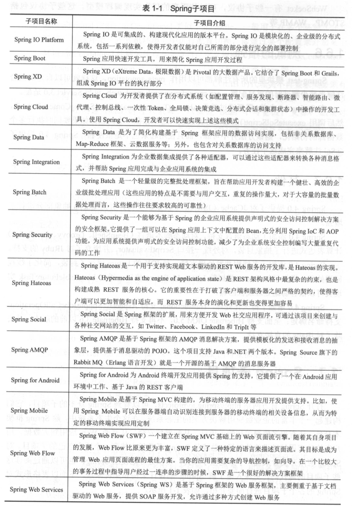
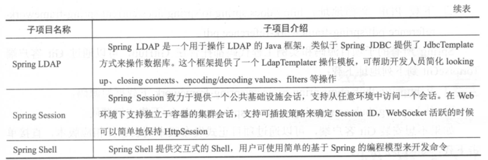

## Spring 概述

Spring 的相关历史这里就不赘述了，推荐大家可以看下`readme.md`中提到的 📚。这里主要吹一波 Spring 框架的好处。

### Spring 的优点

1. 方便解耦、简化开发（包括实例的控制、诸多 Java EE API 使用的封装等）
2. AOP 编程支持
3. 声明式事务支持
4. 方便程序测试
5. 方便集成其他优秀框架
6. 源码设计优秀、值得学习、研究

### Spring 体系结构

下图是 [Spring 框架的模块结构设计](https://docs.spring.io/spring/docs/4.3.22.RELEASE/spring-framework-reference/htmlsingle/#overview-modules)：


从 Spring 的体系结构上我们可以清楚的看到 Spring 的模块设计：

1. `Core Container`：核心容器，包括 spring-beans、spring-core、spring-context、spring-context-support 以及 spring-expression。

   > spring-core、spring-beans 提供了框架的基本支持，包括 AOP 和 DI 等特征。`BeanFactory`提供了工厂模式的复杂实现，它消除了对编程单例的需求，并允许您从实际的程序逻辑中分离出依赖关系的配置和规范。
   >
   > spring-context 建立在 core、beans 模块的基础上，是一个访问框架式的方式。Context 模块从 Beans 模块继承其功能并添加了诸如：国际化、事件传播、资源加载以及通过 Servlet 容器透明的创建上下文的支持。Context 模块还支持 Java EE 功能，例如 EJB，JMX 和基本远程处理。该 ApplicationContext 接口是语境模块的焦点。 spring-context-support 支持将常见的第三方库集成到 Spring 应用程序上下文中，用于缓存（EhCache，Guava，JCache），邮件（JavaMail），调度（CommonJ，Quartz）和模板引擎（FreeMarker，JasperReports，Velocity）。
   >
   > spring-expression 是 JSP 2.1 规范中指定的统一表达式语言（统一 EL）的扩展。该语言支持设置和获取属性值，属性赋值，方法调用，访问数组，集合和索引器的内容，逻辑和算术运算符，命名变量以及从 Spring 的 IoC 容器中按名称检索对象。

2. `AOP` 、`Aspects`、`Instumentation`：通俗的讲就是面向切面编程。AOP 提供了如方法拦截器、切入点以便我们对程序功能的解耦。

   > spring-aspects 模块提供与 AspectJ 的集成
   >
   > spring-instrument 模块提供了在某些应用程序服务器中使用的类检测支持和类加载器实现。该 spring-instrument-tomcat 模块包含 Spring 的 Tomcat 检测代理。

3. `Messging`：Spring 框架 4 包括 spring-messaging 从关键抽象模块 Spring 集成项目，例如 Message，MessageChannel，MessageHandler，和其他人作为基于消息的应用奠定了基础。该模块还包括一组用于将消息映射到方法的注释，类似于基于 Spring MVC 注释的编程模型。

4. `Data Access/Integration`：数据访问/集成层由 JDBC，ORM，OXM，JMS 和交易模块。

   > spring-JDBC 提供了对 jdbc 访问的封装；
   > spring-tx 支持声明式的数据库访问编程和管理；
   > spring-orm 为市面上流行的对象关系映射 API 提供了集成，包括 JPA， JDO 和 Hibernate，使用该 spring-orm 模块，您可以将所有这些 O / R 映射框架与 Spring 提供的所有其他功能结合使用，例如前面提到的简单声明式事务管理功能；
   > spring-oxm 模块提供了一个抽象层，支持对象/ XML 映射实现，如 JAXB，Castor，XMLBeans，JiBX 和 XStream。
   > 所述 spring-jms 模块（Java 消息服务）包含用于生成和使用消息的功能。从 Spring Framework 4.1 开始，它提供了与 spring-messaging 模块的

5. `Web`：网络层由的 spring-web，spring-webmvc，spring-websocket，和 spring-webmvc-portlet 模块。

   > spring-web 提供了对 web 程序的集成支持，例如多部分文件上载功能以及使用 Servlet 侦听器和面向 Web 的应用程序上下文初始化 IoC 容器。它还包含一个 HTTP 客户端以及 Spring 的远程支持的 Web 相关部分。
   > spring-webmvc 包含用于 Web 应用程序的 Spring 的模型 - 视图 - 控制器（MVC）和 REST Web 服务实现。
   > spring-webmvc-portlet 模块（也称为 Web-Portlet 模块）提供了在 Portlet 环境中使用的 MVC 实现，并镜像了基于 Servlet 的 spring-webmvc 模块的功能。

6. `Test`：spring-test 模块支持使用 JUnit 或 TestNG 对 Spring 组件进行单元测试和 集成测试。它提供了 Spring 的一致加载 ApplicationContext 和这些上下文的缓存。它还提供了可用于独立测试代码的模拟对象。

### Spring的个别规格

- Servlet API（JSR 340）
- WebSocket API（JSR 356）
- 并发实用程序（JSR 236）
- JSON绑定API（JSR 367）
- Bean验证（JSR 303）
- JPA（JSR 338）
- JMS（JSR 914）
- 依赖注入（JSR 330）
- Common Annotations（JSR 250）

从Spring Framework 5.0开始，Spring至少需要Java EE级别（如Servlet 3.1、JPA2.1+）。 同时在Java EE 8级别提供与新API的开箱即用集成（例如，Servlet 4.0，JSON绑定API）在运行时遇到。这使Spring与Tomcat 8和9，WebSphere 9和JBoss EAP 7完全兼容。

`Framework 5开始，WebFlux应用程序甚至不直接使用Servlet API，并且可以在不是Servlet容器的服务器（例如Netty）上运行。`

### Spring的设计原则

- 提供各个层面的选择。Spring允许您尽可能晚地推迟设计决策。例如，您可以通过配置切换持久性提供程序，而无需更改代码。许多其他基础架构问题以及与第三方API的集成也是如此。

- 适应不同的观点。Spring拥抱灵活性，并不认为应该如何做。它以不同的视角支持广泛的应用需求。

- 保持强大的向后兼容性。Spring的演变经过精心设计，可以在版本之间进行一些重大改变。Spring支持精心挑选的JDK版本和第三方库，以便于维护依赖于Spring的应用程序和库。

- 关心API设计。Spring团队花了很多心思和时间来制作直观的API，这些API在很多版本和多年中都有用。

- 为代码质量设定高标准。Spring Framework强调有意义，最新且准确的Javadoc。它是极少数项目之一，可以声称干净的代码结构，包之间没有循环依赖。

### 问题和反馈

这个没什么好说的：`StackOverflow`

### Spring 4.X

这里不再叠字描述 Spring4.X 新增的功能以及版本的依赖。简单来说，Spring4.0 基于 Java6，全面支持 Java8，所以推荐使用 Java8。

**Spring4 带来的好处：**

> Java8 新特性

1. Lambda 表达式
2. Java8 的日期和时间 API
3. 重复注解支持（目前支持@Scheduled、@PropertySource）
4. Optianl

> 核心容器增强

1. 范型依赖注入
2. Map 依赖注入
3. @Lazy 延迟依赖注入
4. List 注入
5. @Conditional 注解
6. Cglib 代理增强

> 其他

1. 支持 Groovy 定义 Bean
2. Servlet 增强，基于 Servlet3.1
3. 支持 WebSocket
4. 测试增强
5. JSR-107 注解支持，JCache
6. 动态语言支持
7. 多线程并发支持（对 JDK 的 Future 进行了封装）
8. 持久化增强处理

### Spring 的子项目

> Spring 的子项目众多，感兴趣的可以去 https://spring.io/projects 查看，这里给出一个截图（图片来自《精通 Spring4.x 企业应用开发实战》）：




### Spring 的学习

获取 Spring 推荐从官网下载，这里推荐参考 Spring 官方的文档并`clone`源码及`example`来学习。

**特别提醒：建议大家还是`fork`项目到自己的仓库，以方便自己可以任意的提交并修改。**

| 名称     | 限制               |
| -------- | ------------------ |
| 学习工具 | IDEA、Eclipse、STS |
| JDK版本  | 1.8+               |
| 系统版本 | Windows/MacOS      |
| Maven    | 3.x+               |

**下载 Spring 项目：**

> 这里提一下 Spring5.X 新特性参考：[Spring5.X 新特性](https://www.jianshu.com/p/cebc3cf0bec0)。可以根据自己的喜好选择想要学习的版本。当然，本系列后续文章主要以`Spring4.x`以及`Spring5.x`为主，因为目前而言4.x和5.x用的应该是最广泛的。

```
// 4.3.x版本
git clone -b 4.3.x https://github.com/spring-projects/spring-framework.git

// 5.0.x版本
git clone -b 5.0.x https://github.com/spring-projects/spring-framework.git
```

如果你没有安装`git`或者不会使用`git`，请参考 `Development/git`相关系列文章或`baidu`、`google`。

**下载 Spring 实例项目：**

> 我们学习 Spring 源码自然是离不开官网提供的一些实例代码的支持的，这样可以加速我们的学习，方便我们理解。

```
// master
git clone https://github.com/spring-projects/spring-petclinic.git
git checkout 1.5.x

// 使用方式
cd spring-petclinic
./mvnw package
java -jar target/*.jar
```

然后，我们可以访问： http://localhost:8080/ 即可快乐进行学习。
