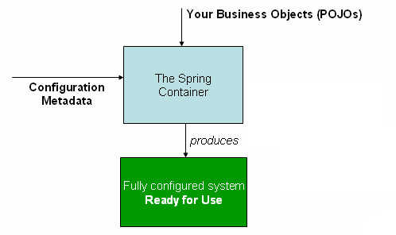

- [1 什么是 IoC 容器](#1-什么是-ioc-容器)
  - [1.1 如何访问 Spring IoC 容器？](#11-如何访问-spring-ioc-容器)
  - [1.2 Beanfacotry](#12-beanfacotry)
- [2 容器](#2-容器)
  - [1.1 配置元数据](#11-配置元数据)
  - [1.2 实例化容器](#12-实例化容器)
  - [1.3 使用容器](#13-使用容器)
- [3 Bean](#3-bean)

### 1 什么是 IoC 容器

> 当前比较知名的 IoC 容器有：Pico Container、Avalon 、Spring、JBoss、HiveMind、EJB 等。

> 前提：比如，我们实例化一个对象 A，这个对象依赖了 B、B 依赖了 C。
>
> 分析：我们在实例化 A 前就必须先去实例化 B；同理，实例化 B 之前我们又必须去实例化 B 所依赖的 C
>
> 通俗解释：那么 IoC 给我们带来的改变就是我们在实例化 A 时，不需要去主动的实例化 B、C 等，IoC 容器会帮助我们实例化 B、C 并注入到 A 中，这就是我们讲的`控制反转`或者说`依赖注入`

上述例子中描述的对象，我们在 Spring 中交由 IoC 容器实例化、组装、管理的称之为`bean`，而`bean`之间的依赖关系反映在容器使用的配置元数据中；反之，没有由 Spring 容器管理的对象，只是一个应用程序中的诸多对象之一。

Spring 框架中的`IoC`（控制反转，`Inversion of Control`）容器也被称为`DI`（依赖注入，`Dependency Injection`），还有一种方式叫`Dl`（依赖查找，`Dependency Lookup`）。

IoC 是一个过程，通过这个过程，对象定义他们的依赖关系，即他们所使用的其他对象，只能通过构造函数参数、工厂方法的参数、或者在构造器或从工厂方法返回后在对象实例上设置的参数。然后容器在创建这些 bean 时注入这些依赖项，这个过程基本是相反的，所以称之为控制反转（IoC）：`bean本身通过使用类的直接构造或诸如服务定位器模式之类的机制来控制其依赖关系的实例化或位置`。

**问题：既然 IoC 时控制反转，那么是哪些方面被反转了呢？**

> 回答：`获得依赖对象的过程被反转了`。控制被反转之后，获得依赖对象的过程由自身管理变为了由 IOC 容器主动注入。于是，他给“控制反转”取了一个更合适的名字叫做“依赖注入（Dependency Injection）”。他的这个答案，实际上给出了实现 IOC 的方法：注入。`所谓依赖注入，就是由 IOC 容器在运行期间，动态地将某种依赖关系注入到对象之中`。

**_划重点：依赖注入(DI)和控制反转(IOC)是从不同的角度的描述的同一件事情，就是指通过引入 IOC 容器，利用依赖关系注入的方式，实现对象之间的解耦。_**

参考文章：[依赖注入参考文章](https://www.martinfowler.com/articles/injection.html)

#### 1.1 如何访问 Spring IoC 容器？

- Beanfacotry：位于`org.springframework.beans.factory`包中，开发者借助于配置文件能够实现对 JavaBean 的配置和管理
- ApplicationContext：位于`org.springframework.context`包中，它继承于 BeanFactory，除了具有 Beanfacotry 的功能外，还添加了其他支持 J2EE 开发的功能，`也是Spring推荐使用的接口`

#### 1.2 Beanfacotry


### 2 容器

> 下面是容器的几个要点：

- 上面提到过`org.springframework.context.ApplicationContext`代表 Spring IoC 容器，负责实例化，配置和组装上述 bean。

- 容器通过读取配置元数据获取需要实例化的对象、配置以及要组装的对象的指令

- 配置元数据可以以`XML` 、`Java注解`、`Java代码`等形式存在，目前比较流行的是使用`Java注解`的方式（方便、简洁）

> 基于注释的配置：Spring 2.5 引入了对基于注释的配置元数据的支持。
>
> 基于 Java 的配置：从 Spring 3.0 开始，Spring JavaConfig 项目提供的许多功能成为核心 Spring Framework 的一部分。因此，您可以使用 Java 而不是 XML 文件在应用程序类外部定义 bean。要使用这些新功能，请参阅@Configuration，@Bean，@Import 和@DependsOn 注释。

- 允许表达组成应用程序的对象以及这些对象之间丰富的相互依赖性

**您的应用程序类与配置元数据相结合，以便在 ApplicationContext 创建和初始化之后，您拥有一个完全配置且可执行的系统或应用程序，如下图：**



#### 1.1 配置元数据

> 配置元数据即我们作为开发人员需要告诉 Spring 容器要如何实例化、配置、组装我们需要的对象

这里给出一个官方提供的基于 XML 的方式的配置元数据的基本结构：

```
<?xml version="1.0" encoding="UTF-8"?>
<beans xmlns="http://www.springframework.org/schema/beans"
    xmlns:xsi="http://www.w3.org/2001/XMLSchema-instance"
    xsi:schemaLocation="http://www.springframework.org/schema/beans
        http://www.springframework.org/schema/beans/spring-beans.xsd">

    <!-- id用来标识一个独立的bean；class属性定义bean的类型并使用完全限定的类名 -->
    <bean id="..." class="...">
        <!-- collaborators and configuration for this bean go here -->
    </bean>

    <bean id="..." class="...">
        <!-- collaborators and configuration for this bean go here -->
    </bean>

    <!-- more bean definitions go here -->

</beans>
```

#### 1.2 实例化容器

Spring IoC 容器允许通过`ClassPathXmlApplicationContext`加载外部资源加载配置元数据`CLASSPATH`，如下示例：

```
ApplicationContext context = new ClassPathXmlApplicationContext("services.xml", "daos.xml");
```

在配置文件中，不建议使用`相对路径`，原因是这样做会对当前应用程序之外的文件创建依赖关系，在运行解析过程中可能或导致选择到不同的、不正确的目录。

#### 1.3 使用容器

`ApplicationContext`是高级工厂的接口，能够维护不同 bean 及其依赖项的注册表。可以通过`T getBean(String name, Class<T> requiredType)`索 Bean 的实例。

**使用方式：**

```
// create and configure beans
ApplicationContext context = new ClassPathXmlApplicationContext("services.xml", "daos.xml");

// retrieve configured instance
PetStoreService service = context.getBean("petStore", PetStoreService.class);

// use configured instance
List<String> userList = service.getUsernameList();
```

**更加灵活的方式：**

```
enericApplicationContext context = new GenericApplicationContext();
new XmlBeanDefinitionReader(context).loadBeanDefinitions("services.xml", "daos.xml");
context.refresh();
```

补充：关于使用 Groovy 的方式这里就不介绍了，有兴趣的可以参考官方文档。

### 3 Bean

Spring IoC 容器管理一个或多个 Bean，而由 Spring IoC 容器管理的这些 Bean 都是由我们提供给容器的配置元数据创建的，例如：XML\<bean\/\>定义的形式。

在容器本身内，这些 bean 定义表示为`BeanDefinition`对象，其中包含（以及其他）一下元数据：

- 包限定的类名
- Bean 行为配置元素（范围、声明周期回调）
- 引用 bean 执行其工作所需的其他 bean（**_这些引用也被称为协作者或依赖项_**）
- 要在新创建的对象中设置其他配置设置（如管理数据库连接池的 Bean 所使用的连接数、池的大小限制等）
