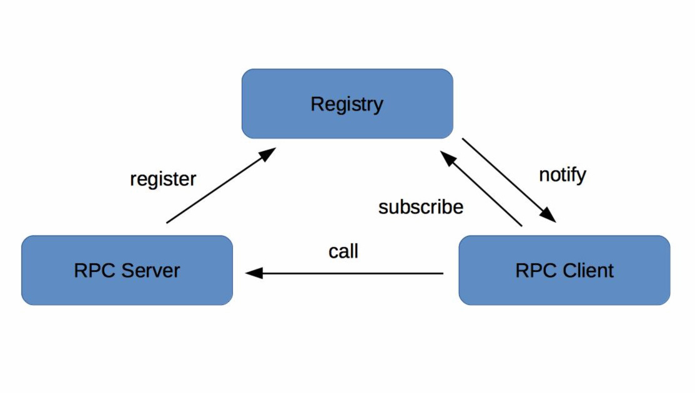
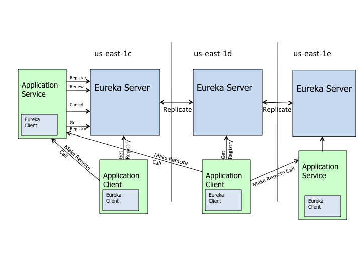

### Why Need？

试想在分布式系统中，我们需要去调用某一个“契约”中的某个服务提供者提供的方法，我们需要知道这个服务的地址、出入参数等以保证我们可以正常的调用到相关服务。如果没有这样的一层“契约”，那么我们又该如何知道应该调用什么服务、从哪儿调用呢？

另一方面，如果我们需要调用的其他服务很多，假如我们通过某个文件来管理所有的服务，这时候随着系统的复杂度提高，这个文件将变得异常庞大，这个管理也带来了更大的问题，尤其是跨部门、跨地区间的协作。

基于此，为了更加方便的管理服务以及服务间的调用关系我们需要有一个比较合适的“平台”来协作众多的服务，这就是：注册中心。

### 注册中心原理

在微服务架构下，我们知道有“服务提供者”、”服务消费者“、“服务注册与发现中心”。下面给出两张图来描述三者之间的关系：

1. RPC服务注册中心

2. Eureka架构

