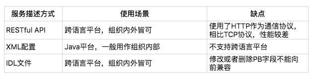

- [1. 服务契约](#1-服务契约)
- [2. 注册中心解决的问题](#2-注册中心解决的问题)
- [3. 注册中心原理](#3-注册中心原理)
- [4. 注册中心基本功能](#4-注册中心基本功能)
- [5. 主流注册中心对比](#5-主流注册中心对比)
- [6. 主流注册中心CAP说明](#6-主流注册中心cap说明)

### 1. 服务契约

在我们了解微服务如何工作以及如何组织之前，我们需要了解服务应该以什么样的方式来进行“契约”。至于“契约”的方式我们通常有下面三种（上文提过）：

1. JSON，`restful`风格服务
2. XML，`RPC`服务
3. IDL，`grpc、thirft`等跨语言服务调用框架

其实很好理解，我们的服务需要通过某种`契约`的方式来让服务的`提供者`以及`消费者`绑定`契约关系`，并且根据这个`契约关系`来描述各自将要`履行的责任`。

我们常用来描述这种`契约关系`的工具也很多，比如：Swagger UI、Word以及一些公司提供的优秀的`API契约平台`。

下面是关于常见服务描述方式的对比：

### 2. 注册中心解决的问题

* 一方面在分布式系统中，我们需要根据`契约`中的某个服务提供者提供的方法，我们需要知道这个服务的地址、出入参数等以保证我们可以正常的调用到相关服务。

* 另一方面，如果我们需要调用的其他服务很多，假如我们通过某个文件来管理所有的服务，这时候随着系统的复杂度提高，这个文件将变得异常庞大，这个管理也带来了更大的问题，尤其是跨部门、跨地区间的协作，他们可能甚至都不知道有彼此的存在。

* 基于此，为了更加方便的管理服务以及服务间的调用关系我们需要有一个比较合适的`平台`来`协作众多的服务`，让他们各自能感知彼此的存在、让他们能够发现彼此提供的服务及服务信息。

* 注册中心提供了`服务的发现和注册`功能，让众多的微服务可以友好的组织起来；也是服务提供者和消费者之间的媒介。

### 3. 注册中心原理

在微服务架构下，我们知道有“服务提供者”、”服务消费者“、“服务注册与发现中心”。下面给出两张图来描述三者之间的关系：

***

1. RPC服务注册中心
   

2. Eureka架构
   

***

### 4. 注册中心基本功能

> 从上面的图例我们可以看出来，服务注册中心至少需要应该具备以下这些功能

1. 服务注册
2. 服务主动/被动注销
3. 订阅服务
4. 拉取最新实例列表
5. 服务健康检测（心跳）
6. 服务信息变更
7. 集群部署
8. 白名单

### 5. 主流注册中心对比

| Feature              | Consul                 | Zookeeper             | Etcd      | Euerka          |
| -------------------- | ---------------------- | --------------------- | --------- | --------------- |
| 服务健康检查         | 服务状态，内存，硬盘等 | (弱)长连接，keepalive | 连接心跳  | 可配支持        |
| 多数据中心           | 支持                   | —                    | —        | —              |
| kv存储服务           | 支持                   | 支持                  | 支持      | —              |
| 一致性               | raft                   | paxos                 | raft      | —              |
| cap                  | ca                     | cp                    | cp        | ap              |
| 使用接口(多语言能力) | 支持http和dns          | 客户端                | http/grpc | http（sidecar） |
| watch支持            | 全量/支持long          | polling               | 支持      | 支持            | long polling	支持 long polling/大部分增量 |
| 自身监控             | metrics                | —                    | metrics   | metrics         |
| 安全                 | acl /https             | acl	https支持（弱）   | —        |
| spring cloud集成     | 已支持                 | 已支持                | 已支持    | 已支持          |

### 6. 主流注册中心CAP说明

- 针对`Eureka`注册中心，在注册中心集群上采用的`Replicate`的机制。它会把不同区域的注册中心的服务注册实例信息进行同步，即使某个甚至某几个注册中心节点挂掉了也不会影响服务，因为服务可以从其他地区的注册中心拉取相关服务。从这里可以看出，这个过程并没有强制更新相关实例列表，所以我们讲`Eureka`是基于`CAP`理论中的`AP`。
  

- `Zookeeper`的集群和`Eureka`的集群类似。它由一组Service节点组成，并且这些节点会通过`Paxos协议`选举一个`Leader`，由这个`Leader`执行更新节点等相关操作（`ZAB协议`）并同步给其他Service节点，在这个过过程中，可能会出现因为网络原因导致的`Leader`节点挂掉，但是根据`Paxos协议会选出一个新的节点`，所以ZK在这个过程只能保证最终数据（服务实例列表）的一致性而不能保证服务的可用性，所以我们说ZK是基于`CAP`理论的`CP`。
  

- `Consul`则是有多个`datacenter`，并且每个`datacenter`下都有多个服务实例并基于`raft协议`选举一个`leader`，各个服务实例之间的拷贝保证了服务的一致性，和ZK一样，显然也是基于`CP`的。
  
