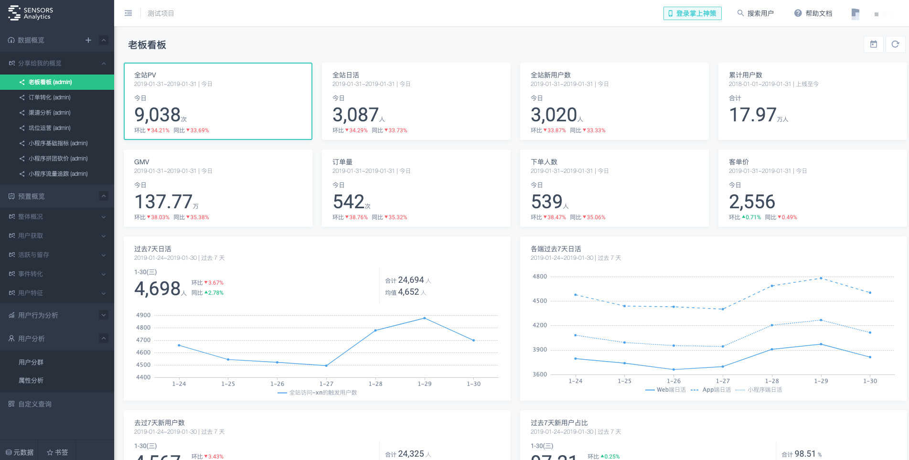

- [1 服务监控](#1-服务监控)
  - [1.1 监控对象](#11-监控对象)
  - [1.2 监控指标](#12-监控指标)
  - [1.3 监控维度](#13-监控维度)
- [2 监控系统原理](#2-监控系统原理)
  - [2.1 数据采集](#21-数据采集)
  - [2.2 数据传输及协议](#22-数据传输及协议)
  - [2.3 数据处理](#23-数据处理)
  - [2.4 数据展示](#24-数据展示)
- [3 服务追踪](#3-服务追踪)
  - [3.1 服务追踪的作用](#31-服务追踪的作用)
  - [3.2 服务追踪的原理](#32-服务追踪的原理)
  - [3.3 服务跟踪系统实现](#33-服务跟踪系统实现)
    - [3.3.1 数据采集](#331-数据采集)
    - [3.3.2 数据处理层](#332-数据处理层)
    - [3.3.3 数据展示层](#333-数据展示层)
- [4 服务监控和服务追踪的对比](#4-服务监控和服务追踪的对比)
- [5 关于数据埋点](#5-关于数据埋点)

### 1 服务监控

我们把单体服务向服务化的改进过程中，如果出现了一个问题，我们如何去找到这个问题的源头在哪儿呢？又如何把这个问题直观的呈现在上级面前？如何让不懂技术的同事能够明白是什么原因？如何让我们人在千里之外也能快速的从有限的资料、数据面前排查问题呢？

所以我们需要知道服务之间调用的情况、需要知道服务调用在哪一步出现了问题从而快速对问题定位并作出响应。

因此，我们需要明确：

1. 被监控的对象
2. 被监控的具体内容
3. 监控的维度
4. 如何将监控的问题暴露并得以解决

#### 1.1 监控对象

对于我们的微服务系统，一般来讲，监控需要从很多层面去考虑，综合来说，至少需要监控这些层次（由上到下）：

1. 业务本身监控，如提供给外部的基础功能是否正常
2. 依赖监控（接口），相当于某个基础功能所依赖的其他功能监控
3. 资源监控，如某个功能所关联的资源，一般我们着重于关心用户的资源，如数据库、缓存等内容的监控
4. 基础性能指标监控，如服务器的CPU利用率、内存占用、带宽、I/O读写等等

#### 1.2 监控指标

对于监控的指标过于繁多，这里就不一一举例了，大致上我们对于分布式系统一般关心以下几个点：

1. PV，即访问量
2. UV，独立访客量
3. QPS，即Query Per Second，每秒的响应请求书
4. TPS，吞吐量
5. 并发数，指系统可以同时承载的正常使用系统的用户数
6. 响应时间，每次用户请求，服务器的响应时间
7. 错误率，微服务一般要求服务的可用率在99.99%+，但是这里指的错误率一般指某个时间段调用失败次数占总次数的比率

#### 1.3 监控维度

1. 全局维度：从服务的整体出发监控对象的请求量、平均耗时、错误率等
2. 机房维度：监控机房个机器的额服务指标数据偏差是否很大，从而进行相应的优化
3. 单机维度
4. 时间维度：不同时间段，服务的各项指标都或多或少有些区别，此时需要根据时间上来做一些分析以便在未来针对性的优化，如：加减机器
5. 核心维度：核心业务一般是要隔离的，所以监控上也是分开监控的

### 2 监控系统原理

一般来说，监控系统的作用就是采集信息并通过某些手段、措施以人能理解的方式感知这些数据背后的意义。

因此，监控系统的原理无外乎这几点：

* 数据搜集、采集
* 数据传输、存储
* 数据加工、分析、处理
* 数据展示

#### 2.1 数据采集

**采集方式：**

数据采集方式一般分为`主动上报`和`被动收集`。前者一般都是在代码中加入相应逻辑，在程序处理过程中主动发送数据；后者一般是从日志文件中去挖掘、解析并把相应的数据信息上报。

**采样率：**
一般来说，监控系统类似于领导隔三差五的抽查，这就是采样率。采样率越高越能反映实际情况，相应的对系统的性能影响也越大。比较好的做法就是动态采样率，在负载高是减少采样率，负载低时加大采样率。

#### 2.2 数据传输及协议

1. 数据传输一般都是`UDP`传输或者经由`AMQP`传输。
2. 一般传输数据的格式为`文本格式协议`或`二进制协议`

#### 2.3 数据处理

数据处理就是对采集的数据进行再加工并聚合数据、存储数据。

**数据聚合：**

1. 接口维度聚合，这种方式可以知道每个接口在各个时间段的请求情况，如：峰值、响应等
2. 机器维度聚合，方便分析各个区域、负载情况等

**存储数据：**

1. 索引数据库，如ES
2. 时序数据库，如OpenTSDB

#### 2.4 数据展示

数据展示一般把处理后的数据经过可视化的形式展示给用户从而让用户能够据此分析、更直观的看出系统的运行情况。

关于数据的展示方式这里就不多赘述了，反正就是怎么方便统计、怎么好看、怎么容易理解、`怎么让领导满意`怎么来。

### 3 服务追踪

这里不得不提`APM (Application Performance Management)` 即应用性能管理，属于IT运维管理（ITOM)范畴。所以对于跟踪系统的设计，跟踪系统应该有这样的特性：

1. 低消耗
2. 应用级别的透明
3. 可延展

在维基百科上，对于`APM`的解释为：将IT指标转换为商业意义指标的翻译器。这里提供一篇分布式跟踪系统的参考 [Dapper](https://bigbully.github.io/Dapper-translation/)，此外比较出名的还有`Zipkin`、`鹰眼`、`MTrace`、`CAT`、`pinpoint`、`Skywalking`等等。

为什么把这个和服务监控写一起呢，前面提到过我们在开发过程中需要确认某次调用的整个过程，这就涉及服务的追踪，我们通常指链路追踪，它可以帮我们快速定位在哪个环节出现了问题从而帮助我们快速解决问题。

#### 3.1 服务追踪的作用

1. 优化系统的瓶颈
2. 优化链路调用
3. 生成网络拓扑
4. 透明传输数据
5. 快速定位问题

上面提到的几点都很好理解，其实就是根据服务调用链的时间来针对性的优化。

#### 3.2 服务追踪的原理

链路追踪中，一般有这三个关键参数：traceId、spanId、annotation，见下图（图片来自 [MeiTuan](https://tech.meituan.com/)）：

`traceId`：标识某一次具体的请求ID，在请求调用网络的第一层生成一个全局唯一的traceId，并且会随着每一层的调用不断向下传递从而将整个调用链路串联起来

`spanId`：用于标识一次调用在分布式请求中的位置，类似于目录结构树。比如第一层为0，第二层为0.1、0.2甚至还有0.3，第三层以此类推。

`annotation`：用于业务自定义埋点数据。

总结：

1. `traeId`用于`串联一次请求在系统中经过的所有路径`
2. `spanId`用于`区分不同服务间的调用关系`
3. `annotation`用于业务自定义一些`埋点数据`

#### 3.3 服务跟踪系统实现

对于服务跟踪实现，在了解了上面的远离之后其实也很明了了，无非就是：`数据采集`、`数据处理`、`数据展示`这样一个过程。

额外提一点：值得注意的是在这个过程中，我们对于`埋点`这一条有时候格外的看重，为什么呢？因为可能你的领导并不是一个懂技术的人，他对于视图展示上的东西就能够很直观的知道你或者你的团队做了哪些工作。所以，前期一定要多想一下要做哪些埋点。

##### 3.3.1 数据采集

数据采集层的作用就是在系统的各个不同模块中进行埋点，采集数据并上报给数据处理层进行处理。见下图（图片来源：美团技术团队）：

以上过程可以分为四个阶段（以一次请求为例）：

1. CS（Client Send）阶段：客户端发起请求，并生成带哦用的上下文
2. SR（Server Recieve）阶段：服务端接收请求，并生成上下文
3. SS（Server Send）阶段：服务端返回请求并上报数据，一般包含这些信息：traceId、spanId、appKey、method、start、duration等
4. CR（Client Recieve）阶段：客户端接收服务端返回结果并上报数据

##### 3.3.2 数据处理层

数据处理层的作用就是将上报的数据进行实时处理并存储在本地以供查询、审阅用。大体上对于数据的处理分为对实时性要求高的进行`实时计算处理`以及对实时要求低的进行`离线计算处理`。

- `实时数据处理`：一般使用`Storm`或者`Spark Streaming`来对链路数据进行实时聚合加工，存储一般使用`HBase`，使用traceId作为`RowKey`，能够天然的把整条调用链聚合在一起。
- `离线计算处理`：一般使用`MapReduce`或者`Spark`批处理程序来对链路数据进行离线计算，存储一般使用`Hive`

##### 3.3.3 数据展示层

数据展示层就是将处理后的链路信息以图形化的方式展示给客户。一般有多种表现形式，如：

1. 调用链路图，如`Zipkin`
2. 调用拓扑图，如`Pinpoint`（全局视野），个人比较喜欢的一款。

### 4 服务监控和服务追踪的对比

服务监控和服务追踪都需要以下几点（相同点）：

1. 数据采集
2. 数据处理
3. 数据展示

不同点：

1. 监控一般是和业务、服务本身绑定的相关信息，一般针对单个服务或单个服务的业务数据
2. 追踪则是针对请求的整个调用链及埋点数据，和业务无关

关于埋点数据的采集，这里给出一个做的比较好的公司推荐：[神策数据](https://www.sensorsdata.cn/manual/)，下面给出官网的一个DEMO截图：

### 5 关于数据埋点

> 以下内容仅供参考

1. [Reference：前端埋点和后端埋点，哪个更科学？](http://www.woshipm.com/data-analysis/665420.html)
