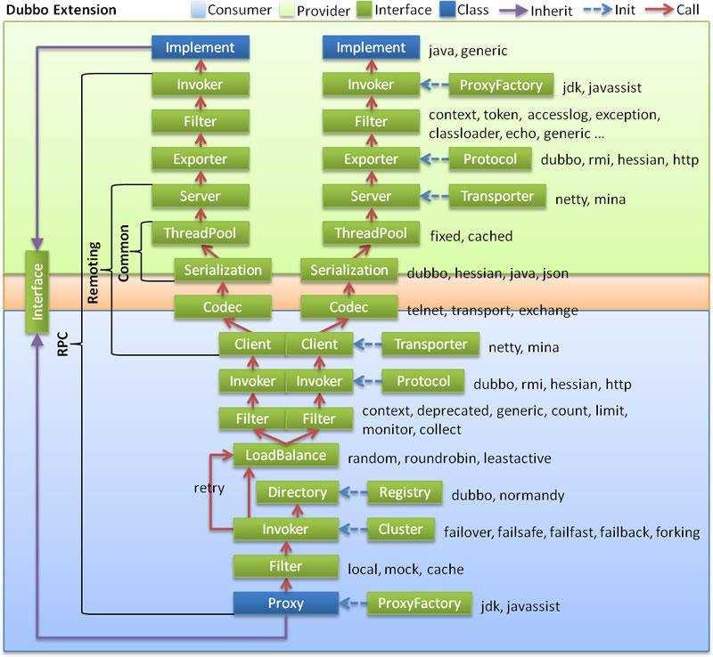

- [1 什么是服务组件](#1-什么是服务组件)
- [2 服务组件](#2-服务组件)
  - [2.1 服务描述](#21-服务描述)
  - [2.2 服务发现与注册](#22-服务发现与注册)
  - [2.3 服务调用](#23-服务调用)
  - [2.4 服务监控](#24-服务监控)
  - [2.5 服务治理](#25-服务治理)
- [3 一次完整的服务调用（dubbo）](#3-一次完整的服务调用dubbo)

### 1 什么是服务组件

服务组件是微服务体系中不可或缺的部分，这些各式各样的组件慢慢形成了一套完备的微服务框架体系。

根据我们前面介绍的组件内容，我们大概知道有这些基本组件：

1. 服务描述
2. 服务发现与注册
3. 服务调用
4. 服务监控
5. 服务追踪
6. 服务治理

### 2 服务组件

> 这里就不详细描述各个组件的核心代码及其详细实现方式，主要介绍组件所起到的作用，Dubbo官网：[Apache Dubbo](http://dubbo.apache.org/en-us/)

#### 2.1 服务描述

服务发布与引用常见的三种方式：`RESTful API`、`XML配置`以及`IDL文件`。

* Dubbo主要采用的是`XML配置`。
* SpringCloud则主要采用的是`Restful API`的形式。

#### 2.2 服务发现与注册

前面已经提过服务发现与注册应该具有的基本功能，这里就不赘述了。

* Dubbo一般采用的注册中心是`Zookeeper`，其通过自身`Dubbo`协议的方式对服务申明了配置项`<dubbo:registy address="xxx" />`将会被解析为`dubbo://xxx`的URL格式，然后基于扩展点自适应的机制，通过前面的协议头标志，就会调用 DubboProtocol 的 refer() 方法，得到服务 demoService 引用，完成服务引用过程。
* SpringCloud采用`Eureka`组件来支持服务发现与注册，而Eureka是一个纯正的Servlet应用，所以在性能上必然会有一些瓶颈。

#### 2.3 服务调用

前面的文章提到过关于服务调用需要解决四个问题：

1. 服务如何建立连接
2. 通过什么协议传递数据
3. 数据如何进行序列化
4. 服务端采用什么方式处理数据

举例：在Dubbo中，一般我们采用`Netty框架`来建立服务的请求连接，通过`Dubbo`协议进行序列化，并通过`Dubbo`等方式进行数据传输。

在SpringCloud中，服务调用我们采用HTTP协议，并通过`Feign`组件进行服务调用。`Feign`是一个声明式、模版化的HTTP客户端，我们只需要加上相应的注解即可轻松的实现服务调用。

数据传输格式：

1. Dubbo
2. Hessian
3. RMI
4. HTTP
5. WebService
6. Thirft

数据序列化方式：

1. Dubbo
2. Hession 2.0
3. JSON
4. Kyro
5. Java
6. FST

#### 2.4 服务监控

服务监控主要关心四个重点：数据采集、数据传输、数据处理、数据展示。

在Dubbo中，在服务调用过程中都会经过Filter拦截从而完成特定的功能，类似监控数据的埋点一般就是在Filter里面进行处理的。

这里给一个 [MonitorFilter](https://github.com/apache/incubator-dubbo/blob/7a48fac84b14ac6a21c1bdfc5958705dd8dda84d/dubbo-monitor/dubbo-monitor-api/src/main/java/org/apache/dubbo/monitor/support/MonitorFilter.java) 供参考。

#### 2.5 服务治理

前面说了，服务治理包括：节点管理、负载均衡、容错管理、服务路由等方面。

事实上，在SpringCloud中，类似`Eureka`、`Ribbon`、`Hystrix`、`Zuul`等组件就是服务治理的很好体现。

### 3 一次完整的服务调用（dubbo）

下面是dubbo框架的一次完整的服务调用流程及其过程描述：

1. 首先通过Proxy层封装好的透明化接口代理，发起调用
2. 然后通过Registry层封装好的服务发现功能，获取所有可用的服务提供者节点列表
3. 再根据Cluster层的负载均衡算法从可用的服务节点列表中选取一个节点并发起调用，如果失败则根据Cluster层提供的服务容错手段进行处理
4. 同时进过Filter的拦截，进行相应的权限控制、统计处理等
5. 最后在Protocol层，封装程对应的Dubbo RPC请求，发给服务端节点

在这个过程中，服务调用框架包含通信协议框架`Transporter`、通信协议`Codec`以及序列化`Serialization`等。