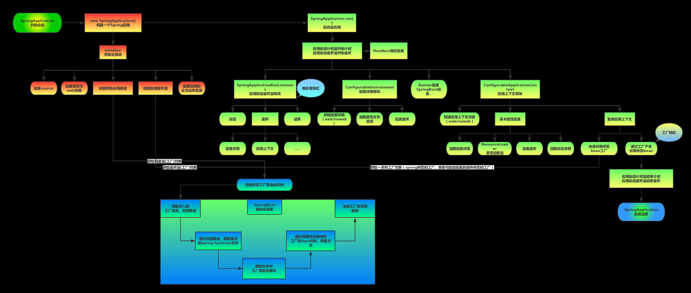

- [1. SpringBoot 概念及核心](#1-springboot-概念及核心)
  - [1.1 SpringBoot 是什么，优点、缺点？](#11-springboot-是什么优点缺点)
  - [1.2 SpringBoot 提供了哪些核心功能](#12-springboot-提供了哪些核心功能)
  - [1.3 Spring、SpringBoot、SpringMVC 区别](#13-springspringbootspringmvc-区别)
  - [1.4 SpringBoot 中的 starter 是什么](#14-springboot-中的-starter-是什么)
  - [1.5 SpringBoot 启动原理](#15-springboot-启动原理)

### 1. SpringBoot 概念及核心

#### 1.1 SpringBoot 是什么，优点、缺点？

SpringBoot 是 Spring 的子项目，为 Spring 提供 Boot（引导）功能。

**优点：**

1. 配置更简单
2. 编码更简单
3. 部署更简单
4. 监控更简单

**缺点：**

1. 自身的 acturator 所提供的【监控功能】，也需要与现有的监控对接。

#### 1.2 SpringBoot 提供了哪些核心功能

1. 独立运行 jar 包
2. 内嵌 Servlet 容器
3. 丰富的 Stater、精简配置
4. 自动配置 Bean（并非全部）
5. 准生产级别的应用监控
6. 无代码生成和 XML 配置

#### 1.3 Spring、SpringBoot、SpringMVC 区别

Spring 的完整名字，应该是 Spring Framework 。它提供了多个模块，Spring IoC、Spring AOP、Spring MVC 等等。所以，Spring MVC 是 Spring Framework 众多模块中的一个。

而 Spring Boot 是构造在 Spring Framework 之上的 Boot 启动器，旨在更容易的配置一个 Spring 项目。

#### 1.4 SpringBoot 中的 starter 是什么

starter 主要用来简化依赖的，类似一个 SDK 包。Spring Boot Starter 就是为了解决这个依赖问题而诞生的。Starter POM 是一组方便的依赖描述符，您可以将其包含在应用程序中。您可以获得所需的所有 Spring 和相关技术的一站式服务，无需通过示例代码搜索和复制粘贴依赖。

常用 Starter：

- spring-boot-starter-web ：提供 Spring MVC + 内嵌的 Tomcat 。
- spring-boot-starter-data-jpa ：提供 Spring JPA + Hibernate 。
- spring-boot-starter-data-redis ：提供 Redis 。
- mybatis-spring-boot-starter ：提供 MyBatis 。

#### 1.5 SpringBoot 启动原理

