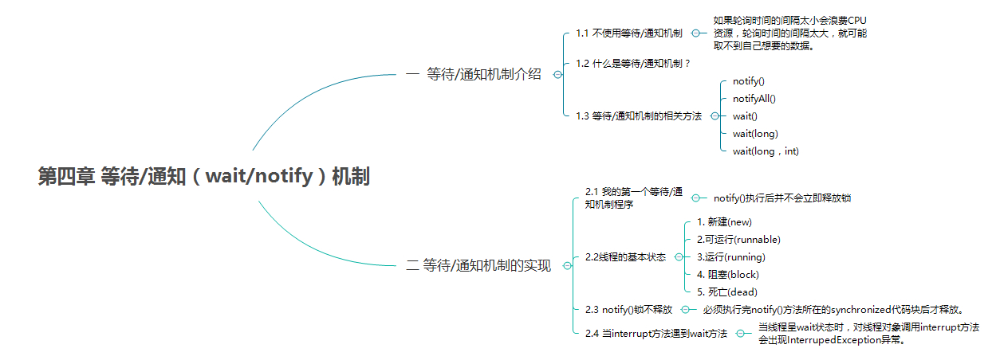
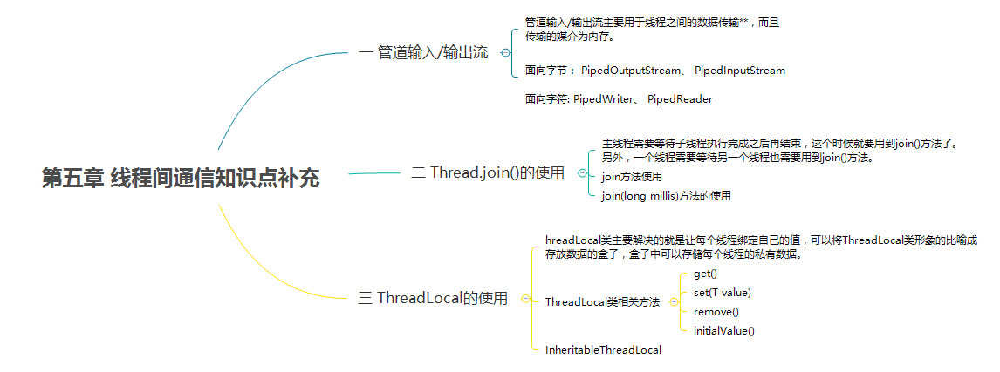
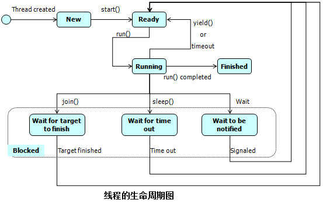
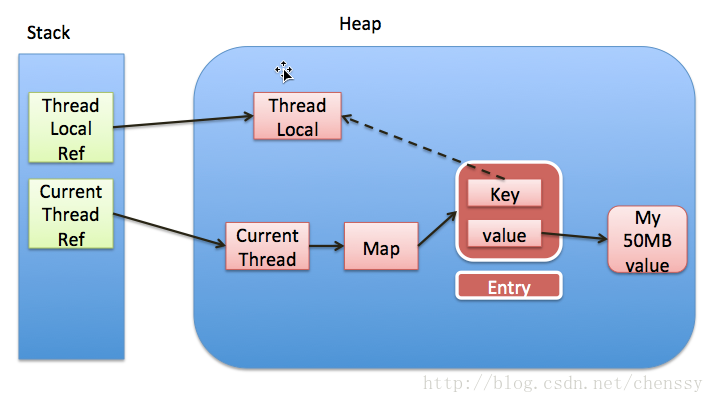
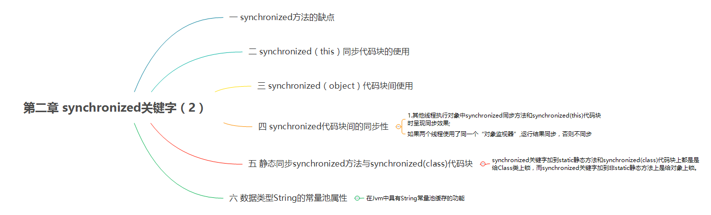

- [1 Java 线程](#1-java-线程)
  - [1.1 简述线程、进程、程序间的关系](#11-简述线程进程程序间的关系)
  - [1.2 线程优缺点](#12-线程优缺点)
  - [1.3 守护线程](#13-守护线程)
  - [1.4 什么时多线程上下文切换](#14-什么时多线程上下文切换)
  - [1.5 Java 中的调度算法时什么](#15-java-中的调度算法时什么)
  - [1.6 什么是线程饥饿](#16-什么是线程饥饿)
  - [1.7 你对线程优先级的理解](#17-你对线程优先级的理解)
  - [1.8 线程的生命周期](#18-线程的生命周期)
  - [1.9 如何结束一个一直运行的线程](#19-如何结束一个一直运行的线程)
  - [1.10 一个线程如果出现了运行时异常会怎样 * 简易回答](#110-一个线程如果出现了运行时异常会怎样--简易回答)
  - [1.11 创建线程的方式及实现 ✨✨✨](#111-创建线程的方式及实现-)
  - [1.11 创建线程池的方式 ✨✨✨](#111-创建线程池的方式-)
    - [1.11.1 线程池参数介绍](#1111-线程池参数介绍)
    - [1.11.2 Executor、ExecutorService、AbstractExecutorService、ThreadPoolExecutor关系](#1112-executorexecutorserviceabstractexecutorservicethreadpoolexecutor关系)
    - [1.11.3 线程池的状态流转](#1113-线程池的状态流转)
  - [1.12 阿里巴巴推荐创建线程池方式](#112-阿里巴巴推荐创建线程池方式)
    - [1.12.1 通过ThreadPoolExecutor的方式创建线程池](#1121-通过threadpoolexecutor的方式创建线程池)
      - [1.12.1.1 多线程开发优化、良好实践](#11211-多线程开发优化良好实践)
  - [1.13 start和run方法的区别](#113-start和run方法的区别)
  - [1.14 当一个线程运行时发生异常会怎样 * 如何规避](#114-当一个线程运行时发生异常会怎样--如何规避)
  - [1.15 如何使用wait + notify实现通知机制](#115-如何使用wait--notify实现通知机制)
  - [1.16 Thread类的 sleep 方法和对象的 wait 方法都可以让线程暂停执行，区别是什么？](#116-thread类的-sleep-方法和对象的-wait-方法都可以让线程暂停执行区别是什么)
  - [1.17 线程同步及线程调度的相关方法](#117-线程同步及线程调度的相关方法)
  - [1.18 notify和notifyAll有什么区别](#118-notify和notifyall有什么区别)
  - [1.19 为什么wait、notify、notifyAll和三个方法不在Thread中](#119-为什么waitnotifynotifyall和三个方法不在thread中)
  - [1.20 为什么wait和notify要在同步块中调用](#120-为什么wait和notify要在同步块中调用)
  - [1.21 为什么应该在循环中检查等待条件](#121-为什么应该在循环中检查等待条件)
  - [1.22 sleep、join、yield 方法有什么区别？](#122-sleepjoinyield-方法有什么区别)
  - [1.23 线程的sleep方法和yield方法有什么区别✨✨](#123-线程的sleep方法和yield方法有什么区别)
  - [1.24 为什么sleep和yields方法是静态的](#124-为什么sleep和yields方法是静态的)
  - [1.25 sleep(0)有什么用处](#125-sleep0有什么用处)
  - [1.26 如何确保 main 方法所在的线程是 Java 程序最后结束的线程？](#126-如何确保-main-方法所在的线程是-java-程序最后结束的线程)
  - [1.27 interrupt、interrupted 和 isInterrupted 方法的区别✨✨✨](#127-interruptinterrupted-和-isinterrupted-方法的区别)
  - [1.28 什么是线程安全](#128-什么是线程安全)
  - [1.29 单例模式的线程安全性](#129-单例模式的线程安全性)
  - [1.30 多线程同步和互斥方式有哪些✨](#130-多线程同步和互斥方式有哪些)
  - [1.31 如何在两个线程间共享数据](#131-如何在两个线程间共享数据)
  - [1.32 如何检测一个线程是否拥有锁](#132-如何检测一个线程是否拥有锁)
  - [1.33 十个线程和两个线程的同步代码，哪个更容易写？](#133-十个线程和两个线程的同步代码哪个更容易写)
  - [1.34 什么是TreadLocal、InheritableThreadLocal变量✨✨✨✨✨](#134-什么是treadlocalinheritablethreadlocal变量)
  - [1.35 子线程如何获得父线程的ThreadLocal](#135-子线程如何获得父线程的threadlocal)
  - [1.36 多线程环境下，如何保证SimpleDateFormat的安全](#136-多线程环境下如何保证simpledateformat的安全)
  - [1.37 如何在Java中获取线程堆栈信息](#137-如何在java中获取线程堆栈信息)
  - [1.38 介绍一下Java Timer类](#138-介绍一下java-timer类)
  - [1.39 并发编程和并行编程的区别](#139-并发编程和并行编程的区别)
  - [1.40 同步和异步有何区别，分别在什么情况下使用？](#140-同步和异步有何区别分别在什么情况下使用)
- [2 Java锁](#2-java锁)
  - [2.1 synchronized的原理是什么](#21-synchronized的原理是什么)

### 1 Java 线程

> Java 并发相关问题是一个比较大的栏目，首先需要了解的是 Java 多线程相关的问题


> 此外还需要详细了解 wait/notify 机制以明白并发编程中对于线程的等待、通知等问题



> 另外的话，需要知道线程间的通信以及并发编程中的一些问题




#### 1.1 简述线程、进程、程序间的关系

- 程序：存储再磁盘或其他存储介质中，包含指令和数据的文件。程序是`静态的代码`
- 进程：是程序的一次执行过程，是系统运行程序的最小基本单位。一个进程执行过程中会经过`创建`、`运行`、`消亡`，它在计算机中一个指令一个指令的运行，同时，每个线程会占用一定的 CPU 时间、内存、文件、输入输出设备的使用权等等。
- 线程：一个进程可以包含多个线程。和进程最大的区别在于进程之间是独立的，而同一个进程中的线程则不一定，可能会相互影响。

#### 1.2 线程优缺点

**优点：**

1. 使用多线程可以将占据时间长的任务放到后台去处理，如媒体文件下载
2. 发挥多核处理器优势

**缺点：**

1. 大量线程降低代码可读性
2. 更多线程需要更多的内存空间
3. 需要注意线程安全问题，提高了编程难度

#### 1.3 守护线程

Java 中有两种线程：`用户线程`以及`守护线程`

- 任何线程都可以设置为守护线程，通过`setDaemon(boolean on)`设置，true 为设置为守护线程，反之为用户线程
- `setDaemon(boolean on)`必须再`start()`方法前调用，否则运行时会抛出 `IllegalThreadStateException` 异常

守护线程，`Daemon`是为其他线程提供服务的，如果全部的用户线程已经执行完成，`Daemon`没有可服务的线程，JVM 关闭。

JVM 的垃圾回收器是一个守护线程，当所有线程以及关闭时，不会再产生垃圾，守护线程就没事情做了，当 JVM 上只剩下 GC（垃圾回收）时，JVM 会自动关闭。

> 程序运行完毕，JVM 会等待`非守护线程`执行完成后关闭，不会等待守护线程

守护线程有一个应用场景，就是当主线程结束时，结束其余的子线程（守护线程）自动关闭，就免去了还要继续关闭子线程的麻烦。不过博主推荐，如果真有这种场景，还是用中断的方式实现比较合理。洗面给出一篇参考文章：

[守护线程](https://blog.csdn.net/u013256816/article/details/50392298)

值得注意的是：`即使你声明的线程是守护线程，放到线程池执行的时候会强制转为用户线程`

#### 1.4 什么时多线程上下文切换

多线程会共同使用一组计算机上的 CPU，而线程数大于给程序分配的 CPU 数量时，为了让各个线程都有执行的机会们就需要轮转使用 CPU。

- 上下文切换是存储和恢复 CPU 状态的过程，它使得线程执行能够从中断点恢复执行。上下文切换是多任务操作系统和多线程环境的基本特征。

简言之；`不同的线程切换使用CPU发生的切换数据等，就是上下文切换`。

#### 1.5 Java 中的调度算法时什么

线程调度算法有两种模型：`分时调度模型`以及`抢占式调度模型`

- 分时调度模型是指让所有的线程轮流获得 CPU 的使用权,并且平均分配每个线程占用的 CPU 的时间片这个也比较好理解。
- Java 虚拟机采用抢占式调度模型，是指优先让可运行池中优先级高的线程占用 CPU ，如果可运行池中的线程优先级相同，那么就随机选择一个线程，使其占用 CPU 。处于运行状态的线程会一直运行，直至它不得不放弃 CPU 。（一般不建议使用，防止线程饥饿）

#### 1.6 什么是线程饥饿

线程饥饿：`一个或多个线程因为种种原因无法获得所需要的资源，导致一直无法执行的状态。`

导致线程饥饿的原因：

1. 高优先级线程吞噬所有低优先级线程的 CPU 时间
2. 线程被永久堵塞在一个等待进入同步块的状态，因为其他线程总是能在它之前持续地对该同步块进行访问
3. 线程在等待一个本身也处于永久等待完成的对象(比如调用这个对象的 wait 方法)，因为其他线程总是被持续地获得唤醒。

#### 1.7 你对线程优先级的理解

依赖于线程调度算法，一般是高优先级线程在运行时比低优先级线程拥有优先权。

- 线程优先级是一个 int 变量，1 代表最低优先级，10 代表最高
- 线程优先级最高不一定总是先比低优先级线程执行、
- Java 的线程调度会委托给操作系统处理，所以与具体的操作系统优先级有关（如非特别需要，一般无需设置线程优先级）

#### 1.8 线程的生命周期

线程的生命周期有五个状态，如下：

1. `new`：创建一个 Thread 实例，如：`Thread thread = new Tread();`，这里可能涉及到创建线程的方式，后面会介绍。

2. `runnable`：当线程被创建，其他线程（如：main 线程）调用该对象的 start()方法，该状态的线程位于可运行的线程池中，等待被线程调度选中，获取 CPU 的使用权。

3. `running`：线程获得 CPU 资源正在执行任务，此时除非线程自动放弃 CPU 资源或者有更高的优先级线程进入，否者线程将一直运行到结束。

4. `dead`：当线程执行完毕或被其他线程杀死，线程就进入了死亡状态，这时线程不可能再进入就绪状态等待执行。

5. `blocked`：由于某种原因导致正在运行的线程让出 CPU 并暂停自己的执行，即进入阻塞状态。直到线程进入 running 状态，才有机会再次获得 CPU 资源，赚到 running 状态。

**阻塞的状态有以下状态：**

- 调用`sleep()`方法，可使线程进入睡眠模式
- 调用`wait()`方法
- 被另一个线程所阻塞，调用`suspend()`方法；调用`resume()`方法可以恢复

**下面是线程的生命周期图：**



#### 1.9 如何结束一个一直运行的线程

1. 使用退出标志，可参考下面文章的例子
   > 在这种方式中，一般我们是引入共享变量，因为该变量可以被多个执行相同任务的线程用来作为是否中断的信号，通知中断线程的执行。
2. 使用`interrupt`方法，并结合`isInterrupt`方法一起使用：不要使用 stop()方法，而是使用 Thread 提供的 interrupt()方法，`因为该方法虽然不会中断一个正在运行的线程，但是它可以使一个被阻塞的线程抛出一个中断异常，从而使线程提前结束阻塞状态，退出堵塞代码`（请细细体会这句话的含义）。
   > 如果一个线程由于等待某些事件的发生而被阻塞，又该怎样停止该线程呢？这种情况经常会发生，比如当一个线程由于需要等候键盘输入而被阻塞，或者调用 Thread#join() 方法，或者 Thread#sleep(...) 方法，在网络中调用 ServerSocket#accept() 方法，或者调用了 DatagramSocket#receive() 方法时，都有可能导致线程阻塞，使线程处于处于不可运行状态时。即使主程序中将该线程的共享变量设置为 true ，但该线程此时根本无法检查循环标志，当然也就无法立即中断。

这里我们给出的建议是，不要使用 Thread#stop()· 方法，而是使用 Thread 提供的#interrupt()` 方法，因为该方法虽然不会中断一个正在运行的线程，但是它可以使一个被阻塞的线程抛出一个中断异常，从而使线程提前结束阻塞状态，退出堵塞代码。

参考文章：[如何安全的结束一个正在运行的线程](https://www.cnblogs.com/baiqiantao/p/5654263.html)

#### 1.10 一个线程如果出现了运行时异常会怎样 * 简易回答

如果这个线程没有被捕获的话，这个线程就停止执行了（如果这个线程持有某个对象的监视器，相对应的该监视器也被释放了）

#### 1.11 创建线程的方式及实现 ✨✨✨

大体来说，创建线程主要有三种方式：

1.  继承 Thread 类
2.  通过是实现 Runnable 接口
3.  通过 Callable 和 Future 创建线程
    > a. 创建 Callable 接口的实现类，并实现 call()方法；
    >
    > b. 创建 Callable 实现类的实例，使用 FutureTask 类来包装 Callable 对象，该 FutureTask 对象封装了该 Callback 对象的 call()方法的返回值；
    >
    > c. 使用 FutureTask 对象作为 Thread 对象的 target 创建并启动新线程；
    >
    > d. 调用 FutureTask 对象的 get()方法来获得子线程执行结束后的返回值

下面是三种创建线程方式的对比：

| 创建方式                                           | 优点                                                         | 缺点                                                             |
| -------------------------------------------------- | ------------------------------------------------------------ | ---------------------------------------------------------------- |
| 继承Thread类                                       | 编写简单、访问当前线程直接调用`this`即可                     | 无法继承其他父类                                                 |
| 实现Runnable接口、通过 Callable 和 Future 创建线程 | 可继承及其他类、多线程可共享同一个`target`对象、可使用线程池 | 编程稍微复杂些、访问当前线程必须使用`Thread.currentThread()`方法 |
|                                                    |

参考文章：[创建线程的四种方式](https://blog.csdn.net/u012973218/article/details/51280044)

#### 1.11 创建线程池的方式 ✨✨✨

下面是JDK1.7中java.util.concurrent.Executor线程池体系的介绍：

- `java.util.concurrent.Executor` : 负责线程的使用与调度的根接口 
   - |–`ExecutorService`：Executor的子接口，线程池的主要接口 
      - |–`ThreadPoolExecutor`：ExecutorService的实现类 
      - |–`ScheduledExecutorService`：ExecutorService的子接口，负责线程的调度 
         - |–`ScheduledThreadPoolExecutor`：既继承了ThreadPoolExecutor，同时实现了ScheduledExecutorService

注意；在实际使用过程中，我们可能不太需要自己手动的去new一个线程，juc的工具类Executors为我们提供了方法用以创建线程池；在阿里巴巴的规范中不推荐使用上述方式而是采用 `ThreadpoolExecutor` 的方式来创建线程池，这样可以更加明确线程池的运行规则、规避资源耗尽的风险。

| 线程池种类              | 描述                                                     |
| ----------------------- | -------------------------------------------------------- |
| newFixedthreadpool      | 创建固定大小的线程池                                     |
| newCachedThreadPool     | 创建缓存线程池，线程池数量不固定、根据需求自动的更改数量 |
| newSingleThreadExecutor | 创建单个线程池                                           |
| newScheduledThreadPool  | 创建固定大小的线程池、可以延迟或定时的执行任务           |

> 注意：
> 1. 默认情况下，线程池中并没有线程，而是等待有任务到来时采取创建线程并执行任务，除非调用`prestartAllCoreThreads()`或`prestartCoreThread()`来预创建线程
>   
> 2. 此外，如果线程池中的数量达到核心池大小后，就会把到达的任务放在缓存队列中

##### 1.11.1 线程池参数介绍

1. `corePoolSize`：核心池大小
2. `maximumPoolSize`：线程池最大线程数，表示能在线程池中创建多少个线程
3. `keepAliveTime`：表示线程没有任务执行时最多保持多久时间会终止。默认情况下，只有当线程池中的线程数大于corePoolSize时，keepAliveTime才会起作用，直到线程池中的线程数不大于corePoolSize，即当线程池中的线程数大于corePoolSize时，如果一个线程空闲的时间达到keepAliveTime，则会终止，直到线程池中的线程数不超过corePoolSize。但是如果调用了allowCoreThreadTimeOut(boolean)方法，在线程池中的线程数不大于corePoolSize时，keepAliveTime参数也会起作用，直到线程池中的线程数为0
4. `unit`：参数`keepAliveTime`的时间单位，有七种取值，如下：
   ```
    TimeUnit.DAYS;               //天
    TimeUnit.HOURS;             //小时
    TimeUnit.MINUTES;           //分钟
    TimeUnit.SECONDS;           //秒
    TimeUnit.MILLISECONDS;      //毫秒
    TimeUnit.MICROSECONDS;      //微妙
    TimeUnit.NANOSECONDS;       //纳秒
   ``` 
5. `workQueue`；阻塞队列，用来存储等待执行的任务，一般有以下几种选择
   ```
    ArrayBlockingQueue;
    LinkedBlockingQueue;
    SynchronousQueue;
   ```
6. `threadFactory`：线程工厂，用于创建线程
7. `handler`：表示当拒绝处理任务时的策略，有以下四种取值：
   
    1. `ThreadPoolExecutor.AbortPolicy`；丢弃任务并抛出RejectedExecutionException异常。 
    2. `ThreadPoolExecutor.DiscardPolicy`：也是丢弃任务，但是不抛出异常。 
    3. `ThreadPoolExecutor.DiscardOldestPolicy`：丢弃队列最前面的任务，然后重新尝试执行任务（重复此过程）
    4. `ThreadPoolExecutor.CallerRunsPolicy`：由调用线程处理该任务 
   
##### 1.11.2 Executor、ExecutorService、AbstractExecutorService、ThreadPoolExecutor关系

1. Exector是一个顶层接口
   ```
    public interface Executor {
        void execute(Runnable command);
    }
   ```
2.  ExecutorService又是继承了Executor接口，我们看一下Executor接口的实现： 
   ```
    public interface ExecutorService extends Executor {
    
        void shutdown();
        boolean isShutdown();
        boolean isTerminated();
        boolean awaitTermination(long timeout, TimeUnit unit)
            throws InterruptedException;
        <T> Future<T> submit(Callable<T> task);
        <T> Future<T> submit(Runnable task, T result);
        Future<?> submit(Runnable task);
        <T> List<Future<T>> invokeAll(Collection<? extends Callable<T>> tasks)
            throws InterruptedException;
        <T> List<Future<T>> invokeAll(Collection<? extends Callable<T>> tasks,
                                    long timeout, TimeUnit unit) throws InterruptedException;
        <T> T invokeAny(Collection<? extends Callable<T>> tasks)
            throws InterruptedException, ExecutionException;
        <T> T invokeAny(Collection<? extends Callable<T>> tasks,
                        long timeout, TimeUnit unit)
            throws InterruptedException, ExecutionException, TimeoutException;
    }
   ```  
3. AbstractExecutorService是一个抽象类，它实现了ExecutorService接口
    ```
    public abstract class AbstractExecutorService implements ExecutorService {
 
        protected <T> RunnableFuture<T> newTaskFor(Runnable runnable, T value) { };
        protected <T> RunnableFuture<T> newTaskFor(Callable<T> callable) { };
        public Future<?> submit(Runnable task) {};
        public <T> Future<T> submit(Runnable task, T result) { };
        public <T> Future<T> submit(Callable<T> task) { };
        private <T> T doInvokeAny(Collection<? extends Callable<T>> tasks,
                                boolean timed, long nanos)
            throws InterruptedException, ExecutionException, TimeoutException {
        };
        public <T> T invokeAny(Collection<? extends Callable<T>> tasks)
            throws InterruptedException, ExecutionException {
        };
        public <T> T invokeAny(Collection<? extends Callable<T>> tasks,
                            long timeout, TimeUnit unit)
            throws InterruptedException, ExecutionException, TimeoutException {
        };
        public <T> List<Future<T>> invokeAll(Collection<? extends Callable<T>> tasks)
            throws InterruptedException {
        };
        public <T> List<Future<T>> invokeAll(Collection<? extends Callable<T>> tasks,
                                            long timeout, TimeUnit unit)
            throws InterruptedException {
        };
    }
    ```

4. ThreadPoolExecutor则是继承了AbstractExecutorService
   ```
   public class ThreadPoolExecutor extends AbstractExecutorService {
        .....
        public ThreadPoolExecutor(int corePoolSize,int maximumPoolSize,long keepAliveTime,TimeUnit unit,
                BlockingQueue<Runnable> workQueue);
    
        public ThreadPoolExecutor(int corePoolSize,int maximumPoolSize,long keepAliveTime,TimeUnit unit,
                BlockingQueue<Runnable> workQueue,ThreadFactory threadFactory);
    
        public ThreadPoolExecutor(int corePoolSize,int maximumPoolSize,long keepAliveTime,TimeUnit unit,
                BlockingQueue<Runnable> workQueue,RejectedExecutionHandler handler);
    
        public ThreadPoolExecutor(int corePoolSize,int maximumPoolSize,long keepAliveTime,TimeUnit unit,
            BlockingQueue<Runnable> workQueue,ThreadFactory threadFactory,RejectedExecutionHandler handler);
        ...
    }
   ```

实际上，ThreadPoolExector类中有诸如：`execute()`、`submit()`、`shutdown()`、`shudownNow()`。而`execute()`方法实际上是Executor中声明的方法，在ThreadPoolExector中有了具体的实现，这个方法可以向线程池提交一个任务并交由线程池去执行。

`submit()`方法是ExecutorService中声明的方法，在AbstractExecutorService中就有了具体的实现，在ThreadPoolExecutor中并没有对其进行重写，这个方法也是用来向线程池提交任务，但是它和`execute()`方法不同，它能够返回任务执行的结果。而`submit()`方法实际上还是通过`execute()`方法并且利用`Future`来获取任务执行结果。

##### 1.11.3 线程池的状态流转

1. 线程池状态

在ThreadPoolExecutor中定义了一个`volatile`变量，另外定义了鸡哥static final变量表示线程池的各个状态：

```
volatile int runState; // 保证线程之间的可见性，表示当前线程池的状态
static final int RUNNING    = 0; // 创建线程池，初始化时，线程池处于这个running状态
static final int SHUTDOWN   = 1; // 调用shutdown()方法，则线程池处于shutdown状态，此时线程池不能够接受新的任务，他会等待所有任务执行完毕
static final int STOP       = 2; // 同上，不同点在于它会去尝试终止正在执行的任务
static final int TERMINATED = 3; // 当线程处于shutdown或stop状态，并且所有工作线程已经销毁、任务缓存队列已经清空或执行结束后，线程池被设置为terminated状态
```

2. 任务的执行

先看下ThreadPoolExecutor中的一些比较重要的的成员变量：
```
private final BlockingQueue<Runnable> workQueue;              //任务缓存队列，用来存放等待执行的任务
private final ReentrantLock mainLock = new ReentrantLock();   //线程池的主要状态锁，对线程池状态（比如线程池大小
                                                              //、runState等）的改变都要使用这个锁
private final HashSet<Worker> workers = new HashSet<Worker>();  //用来存放工作集
 
private volatile long  keepAliveTime;    //线程存活时间   
private volatile boolean allowCoreThreadTimeOut;   //是否允许为核心线程设置存活时间
private volatile int   corePoolSize;     //核心池的大小（即线程池中的线程数目大于这个参数时，提交的任务会被放进任务缓存队列）
private volatile int   maximumPoolSize;   //线程池最大能容忍的线程数，一般是作为corePoolSize不够用时的补救措施，例如核心池10个但是最大允许14个，在核心池线程数量不够用时就可以通过maximumPoolSize来暂时增加线程数来处理任务。
 
private volatile int   poolSize;       //线程池中当前的线程数
 
private volatile RejectedExecutionHandler handler; //任务拒绝策略
 
private volatile ThreadFactory threadFactory;   //线程工厂，用来创建线程
 
private int largestPoolSize;   //用来记录线程池中曾经出现过的最大线程数
 
private long completedTaskCount;   //用来记录已经执行完毕的任务个数
```

下面是关于任务提交后处理的核心方法`execute()`：

```
// execute
public void execute(Runnable command) {
    if (command == null)
        throw new NullPointerException();
    if (poolSize >= corePoolSize || !addIfUnderCorePoolSize(command)) {
        if (runState == RUNNING && workQueue.offer(command)) {
            if (runState != RUNNING || poolSize == 0)
                ensureQueuedTaskHandled(command);
        }
        else if (!addIfUnderMaximumPoolSize(command))
            reject(command); // is shutdown or saturated
    }
}

// addIfUnderCorePoolSize
private boolean addIfUnderCorePoolSize(Runnable firstTask) {
    Thread t = null;
    final ReentrantLock mainLock = this.mainLock;
    mainLock.lock();
    try {
        if (poolSize < corePoolSize && runState == RUNNING)
            t = addThread(firstTask);        //创建线程去执行firstTask任务   
        } finally {
        mainLock.unlock();
    }
    if (t == null)
        return false;
    t.start();
    return true;
}

// addThread
private Thread addThread(Runnable firstTask) {
    Worker w = new Worker(firstTask);
    Thread t = threadFactory.newThread(w);  //创建一个线程，执行任务   
    if (t != null) {
        w.thread = t;            //将创建的线程的引用赋值为w的成员变量       
        workers.add(w);
        int nt = ++poolSize;     //当前线程数加1       
        if (nt > largestPoolSize)
            largestPoolSize = nt;
    }
    return t;
}

// Worker
private final class Worker implements Runnable {
    private final ReentrantLock runLock = new ReentrantLock();
    private Runnable firstTask;
    volatile long completedTasks;
    Thread thread;
    Worker(Runnable firstTask) {
        this.firstTask = firstTask;
    }
    boolean isActive() {
        return runLock.isLocked();
    }
    void interruptIfIdle() {
        final ReentrantLock runLock = this.runLock;
        if (runLock.tryLock()) {
            try {
        if (thread != Thread.currentThread())
        thread.interrupt();
            } finally {
                runLock.unlock();
            }
        }
    }
    void interruptNow() {
        thread.interrupt();
    }
 
    private void runTask(Runnable task) {
        final ReentrantLock runLock = this.runLock;
        runLock.lock();
        try {
            if (runState < STOP &&
                Thread.interrupted() &&
                runState >= STOP)
            boolean ran = false;
            beforeExecute(thread, task);   //beforeExecute方法是ThreadPoolExecutor类的一个方法，没有具体实现，用户可以根据
            //自己需要重载这个方法和后面的afterExecute方法来进行一些统计信息，比如某个任务的执行时间等           
            try {
                task.run();
                ran = true;
                afterExecute(task, null);
                ++completedTasks;
            } catch (RuntimeException ex) {
                if (!ran)
                    afterExecute(task, ex);
                throw ex;
            }
        } finally {
            runLock.unlock();
        }
    }
 
    public void run() {
        try {
            Runnable task = firstTask;
            firstTask = null;
            while (task != null || (task = getTask()) != null) {
                runTask(task);
                task = null;
            }
        } finally {
            workerDone(this);   //当任务队列中没有任务时，进行清理工作       
        }
    }
}

// getTask
Runnable getTask() {
    for (;;) {
        try {
            int state = runState;
            if (state > SHUTDOWN)
                return null;
            Runnable r;
            if (state == SHUTDOWN)  // Help drain queue
                r = workQueue.poll();
            else if (poolSize > corePoolSize || allowCoreThreadTimeOut) //如果线程数大于核心池大小或者允许为核心池线程设置空闲时间，
                //则通过poll取任务，若等待一定的时间取不到任务，则返回null
                r = workQueue.poll(keepAliveTime, TimeUnit.NANOSECONDS);
            else
                r = workQueue.take();
            if (r != null)
                return r;
            if (workerCanExit()) {    //如果没取到任务，即r为null，则判断当前的worker是否可以退出
                if (runState >= SHUTDOWN) // Wake up others
                    interruptIdleWorkers();   //中断处于空闲状态的worker
                return null;
            }
            // Else retry
        } catch (InterruptedException ie) {
            // On interruption, re-check runState
        }
    }
}

// workerCanExit
private boolean workerCanExit() {
    final ReentrantLock mainLock = this.mainLock;
    mainLock.lock();
    boolean canExit;
    //如果runState大于等于STOP，或者任务缓存队列为空了
    //或者  允许为核心池线程设置空闲存活时间并且线程池中的线程数目大于1
    try {
        canExit = runState >= STOP ||
            workQueue.isEmpty() ||
            (allowCoreThreadTimeOut &&
             poolSize > Math.max(1, corePoolSize));
    } finally {
        mainLock.unlock();
    }
    return canExit;
}

// interruptIdleWorkers
void interruptIdleWorkers() {
    final ReentrantLock mainLock = this.mainLock;
    mainLock.lock();
    try {
        for (Worker w : workers)  //实际上调用的是worker的interruptIfIdle()方法
            w.interruptIfIdle();
    } finally {
        mainLock.unlock();
    }
}

// interruptIfIdle
void interruptIfIdle() {
    final ReentrantLock runLock = this.runLock;
    if (runLock.tryLock()) {    //注意这里，是调用tryLock()来获取锁的，因为如果当前worker正在执行任务，锁已经被获取了，是无法获取到锁的
                                //如果成功获取了锁，说明当前worker处于空闲状态
        try {
    if (thread != Thread.currentThread())  
    thread.interrupt();
        } finally {
            runLock.unlock();
        }
    }
}
```

到这里，大部分朋友应该对任务提交给线程池之后到被执行的整个过程有了一个基本的了解，下面总结一下：

　　1）首先，要清楚corePoolSize和maximumPoolSize的含义；

　　2）其次，要知道Worker是用来起到什么作用的；

　　3）要知道任务提交给线程池之后的处理策略，这里总结一下主要有4点：

如果当前线程池中的线程数目小于corePoolSize，则每来一个任务，就会创建一个线程去执行这个任务；
如果当前线程池中的线程数目>=corePoolSize，则每来一个任务，会尝试将其添加到任务缓存队列当中，若添加成功，则该任务会等待空闲线程将其取出去执行；若添加失败（一般来说是任务缓存队列已满），则会尝试创建新的线程去执行这个任务；
如果当前线程池中的线程数目达到maximumPoolSize，则会采取任务拒绝策略进行处理；
如果线程池中的线程数量大于 corePoolSize时，如果某线程空闲时间超过keepAliveTime，线程将被终止，直至线程池中的线程数目不大于corePoolSize；如果允许为核心池中的线程设置存活时间，那么核心池中的线程空闲时间超过keepAliveTime，线程也会被终止。

3. 线程池中的线程初始化

前面提到过，默认情况下，线程池中是没有线程的。

也提到了线程池中线程的初始化主要通过下面两个方法进行初始化

* prestartCoreThread()
* prestartAllCoreThread()

需要注意的是，上面两个方法传入的都是`null`，最后执行线程会阻塞在`getTask`方法中的`r = workQueue.take();`，即等待任务队列中有任务。

前面讲了创建线程的方式，实际上用的最多的，我们一般是基于线程池的方式来创建线程，这里就不得不提关于创建线程池的一些知识点了，这里推荐阿里巴巴关于线程池使用的一些建议：

4. 任务缓存队列即排队策略

上面我提到了缓存队列`BlockingQueue<Runnable>`，也就是我们的`workQueue`（存放等待执行的任务）。

这里大概介绍下上面提到的三种缓存队列类型及用法：

| 队列类型            | 描述                                                         | 必须项                                                  |
| ------------------- | ------------------------------------------------------------ | ------------------------------------------------------- |
| ArrayBlockingQueue  | 基于数组的先进先出队列                                       | 创建时必须指定大小                                      |
| LinkedBlockingQueue | 基于链表的先进先出队列                                       | 如果创建时未指定此队列大小，则默认为`Integer.MAX_VALUE` |
| synchronousQueue    | 特殊队列，不会保存提交的任务，而是直接新建一个线程来执行任务 | 无                                                      |

5. 任务拒绝策略

当我们的`corePoolSize`已满并且经由补救措施的`maximumPoolSize`提供的线程数也无法满足要求，同时我们的`缓存队列`已满。如果还有任务到来时就会采取`任务拒绝策略`，如下：

| 拒绝模式                               | 描述                                                     |
| -------------------------------------- | -------------------------------------------------------- |
| ThreadPoolExecutor.AbortPolicy         | 丢弃任务并抛出RejectedExecutionException异常             |
| ThreadPoolExecutor.DiscardPolicy       | 也是丢弃任务，但是不抛出异常                             |
| ThreadPoolExecutor.DiscardOldestPolicy | 丢弃队列最前面的任务，然后重新尝试执行任务（重复此过程） |
| ThreadPoolExecutor.CallerRunsPolicy    | 由调用线程处理该任务                                     |

6. 线程池的关闭

ThreadPoolExector提供了两个方法，用于线程池的关闭，分别是1`shutdown`、`shutdownNow`，二者的区别前面提过，如下：

| 关闭线程池方法 | 描述                                                                                       |
| -------------- | ------------------------------------------------------------------------------------------ |
| shutdown       | 不会立即终止线程池，而是等待所有任务缓存队列中的任务都执行完成后才终止，但不再接受新的任务 |
| shutdownNow    | 立即终止线程池，并且会尝试打断正在执行的任务、清空任务缓存队列、返回尚未执行的任务         |

7. 线程池的容量调整

ThreadPoolExecutor提供了两个方法调整线程池的大小，如下：

| 调整线程池容量方法 | 描述                               |
| ------------------ | ---------------------------------- |
| setCorePoolSize    | 设置线程池大小                     |
| setMaximumPoolsize | 设置线程池最大能创建的线程数目大小 |

当上述参数由小变大时，ThreadPoolExecutor进行线程赋值，还可能立即创建新的线程来执行任务。

```
import java.util.concurrent.*;

public class Test {
    public static void main(String[] args) {
        ThreadPoolExecutor executor = new ThreadPoolExecutor(5, 10, 200, TimeUnit.MILLISECONDS,
                new ArrayBlockingQueue<Runnable>(5));

        for (int i = 0; i < 15; i++) {
            MyTask myTask = new MyTask(i);
            executor.execute(myTask);
            System.out.println("线程池中线程数目：" + executor.getPoolSize() + "，队列中等待执行的任务数目：" + executor.getQueue().size()
                    + "，已执行玩别的任务数目：" + executor.getCompletedTaskCount());
        }
        executor.shutdown();
    }
}

class MyTask implements Runnable {
    private int taskNum;

    public MyTask(int num) {
        this.taskNum = num;
    }

    @Override
    public void run() {
        System.out.println("正在执行task " + taskNum);
        try {
            Thread.currentThread().sleep(4000);
        } catch (InterruptedException e) {
            e.printStackTrace();
        }
        System.out.println("task " + taskNum + "执行完毕");
    }
}
```

**参考文章：**

1. [线程池体系介绍及阿里巴巴推荐创建线程方式](https://www.cnblogs.com/ccfdod/p/6414665.html?utm_source=itdadao&utm_medium=referral)
2. [线程池创建方式、拒绝策略](https://www.cnblogs.com/sessionbest/articles/8689220.html)

#### 1.12 阿里巴巴推荐创建线程池方式

##### 1.12.1 通过ThreadPoolExecutor的方式创建线程池

线程池不允许使用Executors去创建，而是通过ThreadPoolExecutor的方式，这样的处理方式让写的同学更加明确线程池的运行规则，规避资源耗尽的风险。

说明：Executors各个方法的弊端：

 1. newFixedThreadPool和newSingleThreadExecutor：主要问题是堆积的请求处理队列可能会耗费非常大的内存，甚至OOM。

 2. newCachedThreadPool和newScheduledThreadPool：主要问题是线程数最大数是Integer.MAX_VALUE，可能会创建数量非常多的线程，甚至OOM。

```
// Positive example 1：
    //org.apache.commons.lang3.concurrent.BasicThreadFactory
    ScheduledExecutorService executorService = new ScheduledThreadPoolExecutor(1,
        new BasicThreadFactory.Builder().namingPattern("example-schedule-pool-%d").daemon(true).build());

// Positive example 2：
    ThreadFactory namedThreadFactory = new ThreadFactoryBuilder()
        .setNameFormat("demo-pool-%d").build();

    //Common Thread Pool
    ExecutorService pool = new ThreadPoolExecutor(5, 200,
        0L, TimeUnit.MILLISECONDS,
        new LinkedBlockingQueue<Runnable>(1024), namedThreadFactory, new ThreadPoolExecutor.AbortPolicy());

    pool.execute(()-> System.out.println(Thread.currentThread().getName()));
    pool.shutdown();//gracefully shutdown

// Positive example 3：
    <bean id="userThreadPool"
        class="org.springframework.scheduling.concurrent.ThreadPoolTaskExecutor">
        <property name="corePoolSize" value="10" />
        <property name="maxPoolSize" value="100" />
        <property name="queueCapacity" value="2000" />

    <property name="threadFactory" value= threadFactory />
        <property name="rejectedExecutionHandler">
            <ref local="rejectedExecutionHandler" />
        </property>
    </bean>
    //in code
    userThreadPool.execute(thread);
```
###### 1.12.1.1 多线程开发优化、良好实践
大致上，在多线程、并发编程中，我们一般写法遵循下面的规范即可：

- 线程池层面
  - 使用`带线程名称`的ThreadFactory来创建线程池以`方便线程追踪`
  - 合理设置线程池相关参数，如：`设置最小核心线程数`、`设置最大线程池数`、`设置额外线程存活时间`、`选择合适的线程池队列`、`选择合适的拒绝策略`、`选择合适的线程池`
- 并发层面
  - 最小化同步范围，如`使用同步块`
  - 优先使用`volatile`而不是`synchronized`
  - `使用更高层次的并发工具`而不是wait、notify方法来实现线程通信（如：CountDownLatch, Semaphore, CyclicBarrier 和 Exchanger 这些同步类简化了编码操作，而用 wait 和 notify 很难实现对复杂控制流的控制。）
  - 优先使用并发容器而不是同步容器（如：ConcurrentHashMap）


```
     // 创建带线程名称的Threadfactory
    ThreadFactory namedThreadFactory = new ThreadFactoryBuilder()
        .setNameFormat("demo-pool-%d").build();

    // 创建线程池，使用上面的Threadfactory 
    ExecutorService singleThreadPool = new ThreadPoolExecutor(1, 1,
        0L, TimeUnit.MILLISECONDS,
        new LinkedBlockingQueue<Runnable>(1024), namedThreadFactory, new ThreadPoolExecutor.AbortPolicy());

    // 线程池执行任务
    singleThreadPool.execute(()-> System.out.println(Thread.currentThread().getName()));

    // 关闭线程池
    singleThreadPool.shutdown();

    public class TimerTaskThread extends Thread {
        public TimerTaskThread() {
            super.setName("TimerTaskThread");
            // do something
        }
    }
 ```

#### 1.13 start和run方法的区别

- 调用start方法时，将创建新的线程，并执行run方法中的代码
- 调用run方法只会将其作为一个普通方法

#### 1.14 当一个线程运行时发生异常会怎样 * 如何规避

前面我们提过：如果异常没有被捕获到该线程将会停止执行，并且其所持有的对象的监视器也会被立即释放。

在Thread中有一个`UncaughtExceptionHandler`是用于处理未捕获异常造成的线程突然中断情况的的一个内嵌接口。

注意：单线程的程序发生一个未捕获的异常时我们可以采用`try-catch`的方式进行异常捕获处理，但是在多线程环境中，线程抛出的异常就不能用这个方式，这个问题会导致如下问题：

1. 无法回收一些资源
2. 没有关闭当前的连接

这些问题都会造成我们服务的压力逐步加大，甚至拖垮服务。

当一个未捕获异常将造成线程终端的时候JVM会使用`getUncaughtExceptionHandler()`方法来查询线程的`UncaughtExceptionHandler`并将线程和异常作为异常参数传递给`handler`的`uncaughtException(exception)` 方法进行处理

参考文章：[JAVA多线程之UncaughtExceptionHandler——处理非正常的线程中止](https://blog.csdn.net/u013256816/article/details/50417822)


#### 1.15 如何使用wait + notify实现通知机制

1. 首先，wait、notify 方法是针对对象的，调用任意对象的 wait 方法都将导致线程阻塞，阻塞的同时也将释放该对象的锁，相应地，调用任意对象的 notify 方法则将随机解除该对象阻塞的线程，但它需要重新获取改对象的锁，直到获取成功才能往下执行。
2. 其次，wait、notify 方法必须在 `synchronized` 块或方法中被调用，并且要保证同步块或方法的锁对象与调用 wait、notify 方法的对象是同一个，如此一来在调用 wait 之前当前线程就已经成功获取某对象的锁，执行 wait 阻塞后当前线程就将之前获取的对象锁释放。

参考文章：[wait/notify通知机制解析](https://juejin.im/entry/5a2bb783f265da43163cff74)

当然，除了wait、notify机制之外，我们还可以使用如下方式：

- Condition
- CountDownLatch
- Queue
- Future
- ...

参考文章：[线程间的协作方式](https://blog.csdn.net/zhoucheng05_13/article/details/78311179)


#### 1.16 Thread类的 sleep 方法和对象的 wait 方法都可以让线程暂停执行，区别是什么？

| 方法名称 | 作用/区别                                                                                                                                                                     |
| -------- | ----------------------------------------------------------------------------------------------------------------------------------------------------------------------------- |
| sleep    | 暂停线程，让出cpu时间给其他线程，但是依然保持对象的锁、休眠时间结束自动恢复（进入就绪状态）                                                                                   |
| wait     | 是Object类的方法、对象会放弃当前持有的锁并进入对象的等待池，只有调用对象的notify方法或nptifyAll方法才可以唤醒等待池中的对象，当这个对象重新获得对象的锁时就可以进入就绪状态了 |

#### 1.17 线程同步及线程调度的相关方法

| 方法      | 描述                                                                                                                                      |
| --------- | ----------------------------------------------------------------------------------------------------------------------------------------- |
| wait      | 使一个线程处于等待（阻塞）状态，并且释放所持有的对象的锁。                                                                                |
| sleep     | 使一个正在运行的线程处于睡眠状态，是一个静态方法，调用此方法要处理 InterruptedException 异常。                                            |
| notify    | 唤醒一个处于等待状态的线程，当然在调用此方法的时候，并不能确切的唤醒某一个等待状态的线程，而是由 JVM 确定唤醒哪个线程，而且与优先级无关。 |
| notifyAll | 唤醒所有处于等待状态的线程，该方法并不是将对象的锁给所有线程，而是让它们竞争，只有获得锁的线程才能进入就绪状态。                          |

#### 1.18 notify和notifyAll有什么区别

当一个线程进入wait之后，就必须等待其他线程notify/notifyAll

- 使用notifyAll可以唤醒全部处于wait状态的线程，使其重新计入锁的争夺队列中，而notify只能唤醒一个
- 如果没把握，建议 notifyAll ，防止 notify 因为信号丢失而造成程序错误。

参考文章：[wait和notify的坑](https://www.jianshu.com/p/91d95bb5a4bd)

wait和notify的坑主要有以下几个；

- 通知丢失
- 假唤醒

#### 1.19 为什么wait、notify、notifyAll和三个方法不在Thread中

因为Java的锁都是对象级别的而不是线程级的，所以没个对象都有锁并且通过线程来获得这个对象的锁。

因此，将wait、notify、notifyAll都定义在Object中的要点我们可以总结如下：

- 定义在Object中
- 基于对象

#### 1.20 为什么wait和notify要在同步块中调用

- Java强制要求，如果不这样做，会抛出`IllegalMonitorStateException`异常
- 避免wait和notify产生竞态条件

#### 1.21 为什么应该在循环中检查等待条件

处于等待状态的线程可能会收到错误警报和伪唤醒，如果不在循环中检查等待条件，程序就会在没有满足结束条件的情况下退出。

所以，我们不能写 if (condition) 而应该是 while (condition) ，特别是 CAS 竞争的时候。示例代码如下：

```
// The standard idiom for using the wait method
synchronized (obj) {
    while (condition does not hold) {
        obj.wait(); // (Releases lock, and reacquires on wakeup)
    }
    ... // Perform action appropriate to condition
}
```

参考文章：[wait 必须放在 while 循环里面的原因探析](https://blog.csdn.net/qq_35181209/article/details/77362297)

#### 1.22 sleep、join、yield 方法有什么区别？

| 方法名称 | 作用                                                                                                                                                                                                                                                                  |
| -------- | --------------------------------------------------------------------------------------------------------------------------------------------------------------------------------------------------------------------------------------------------------------------- |
| sleep    | 1. 让当前线程休眠`x`毫秒（暂停执行）、休眠操作受系统计时器和调度程序精准和准确性的影响</br> 2. 让其他线程（包含低优先级、同优先级、高优先级线程）有机会执行，但它不会释放当前对象的锁 </br> 3. 如果有`synchronized`同步块，其他代码仍然不能访问共享数据，除非它释放锁 |
| yield    | 1. 和sleep类似，但是它没有时间参数（所以执行yield方法的线程重新回到`可执行状态`后马上执行了） </br> 2. 不会释放锁 </br> 3. `和sleep不同的是yield方法只会让同优先级和高优先级的线程获得机会`                                                                           |
| join     | 1. Thread的非静态方法、字面意思是`将一个线程加入到另一个线程的尾部` </br> 2. 更加直观的解释：`让一个线程 B “加入”到另外一个线程 A 的尾部。在线程 A 执行完毕之前，线程 B 不能工作`                                                                                   |

#### 1.23 线程的sleep方法和yield方法有什么区别✨✨

> 首先来讲，我们可以知道实际场景中，我们基本不会使用yield方法，因为这个方法看上去`作用不大`，目前我接触到的使用场景为0（小弟才疏学浅）。😂

- `sleep` 方法给其他线程运行机会时不考虑线程的优先级，因此会给低优先级的线程以运行的机会；`yield` 方法只会给相同优先级或更高优先级的线程以运行的机会。
- 线程执行 `sleep` 方法后转入阻塞（blocked）状态；而执行 `yield` 方法后转入就绪（ready）状态。
- `sleep` 方法声明抛出 InterruptedException 异常，而 `yield` 方法没有声明任何异常。
- `sleep` 方法比 `yield` 方法（跟操作系统 CPU 调度相关）具有更好的可移植性。

#### 1.24 为什么sleep和yields方法是静态的

Thread 类的 `sleep` 和 `yield` 方法，它们可以`在当前正在执行的线程`中工作、`在其他处于等待状态的线程`上调用这些方法是没有意义的。

另一方面，也是警示开发人员这些方法在其他非运行线程调用是没有意义的。

#### 1.25 sleep(0)有什么用处

从代码层面去理解：`让线程挂起 0 毫秒`，看上去好像毫无意义。但实际上，正因为这个`挂起`动作，让我们的线程暂时的`退位让贤`了一下。

从系统的层面讲，这个`让位`动作相当于暂时放弃CPU时间，让其他线程有机会执行。

参考文章：[sleep(0)的妙用](https://blog.csdn.net/qiaoquan3/article/details/56281092)


#### 1.26 如何确保 main 方法所在的线程是 Java 程序最后结束的线程？

其实就是前面提高过的`join`方法

#### 1.27 interrupt、interrupted 和 isInterrupted 方法的区别✨✨✨

| 方法名称        | 作用                                             | 补充                                                                                                                                                                                                                                               |
| --------------- | ------------------------------------------------ | -------------------------------------------------------------------------------------------------------------------------------------------------------------------------------------------------------------------------------------------------- |
| `interrupt`     | 中断线程                                         | 线程中断仅仅是置线程的中断状态位，不会停止线程。需要用户自己去监视线程的状态为并做处理。支持线程中断的方法（也就是线程中断后会抛出 InterruptedException 的方法）就是在监视线程的中断状态，一旦线程的中断状态被置为“中断状态”，就会抛出中断异常。 |
| `interrupted`   | 静态方法，查询当前线程的中断状态，并且清除原状态 | 如果一个线程被中断了，第一次调用 #interrupted() 方法则返回 true ，第二次和后面的就返回 false 了。                                                                                                                                                  |
| `isInterrupted` | 查询指定线程的中断状态，不会清除原状态           | 无                                                                                                                                                                                                                                                 |

#### 1.28 什么是线程安全

线程安全指在多线程环境下，某个函数、库在被调用过程中能够正确处理多个线程之间的共享变量、使得程序正常完成。

附带说明：

- Servlet不是线程安全的，多线程单实例
- Struts是线程安全的，多实例多线程（new 出来的实例）
- SpringMVC不是线程安全的，多线程单实例

#### 1.29 单例模式的线程安全性

> 单实例的多线程安全其实就是讲：在多线程环境下，实例只会被创建一个

常见的单例模式及其写法如下；

1. 饿汉式模式（静态常量）
   ```
    public class Singleton {

        /* 
         * 优点：这种写法比较简单，就是在类装载的时候就完成实例化。避免了线程同步问题。
         * 缺点：在类装载的时候就完成实例化，没有达到Lazy Loading的效果。如果从始至终从未使用过这个实例，则会造成内存的浪费。
         **/
        private final static Singleton INSTANCE = new Singleton();

        private Singleton(){}

        public static Singleton getInstance(){
            return INSTANCE;
        }
    }
    ```
2. 饿汉式（静态代码块）
   ```
    public class Singleton {

        // 优缺点同上
        private static Singleton instance;

        static {
            instance = new Singleton();
        }

        private Singleton() {}

        public static Singleton getInstance() {
            return instance;
        }
    }
   ```
3. 懒汉式模式(线程不安全)
   ```
    public class Singleton {

        // 这种写法起到了Lazy Loading的效果，但是只能在单线程下使用。如果在多线程下，一个线程进入了if (singleton == null)判断语句块，还未来得及往下执行，另一个线程也通过了这个判断语句，这时便会产生多个实例。所以在多线程环境下不可使用这种方式。
        private static Singleton singleton;

        private Singleton() {}

        public static Singleton getInstance() {
            if (singleton == null) {
                singleton = new Singleton();
            }
            return singleton;
        }
    }
    ```
4. 懒汉式（线程安全、同步方法）
   ```
    public class Singleton {

        /*
         * 解决上面第三种实现方式的线程不安全问题，做个线程同步就可以了，于是就对getInstance()方法进行了线程同步。
         * 缺点：效率太低了，每个线程在想获得类的实例时候，执行getInstance()方法都要进行同步。而其实这个方法只执行一次实例化代码就够了，后面的想获得该类实例，直接return就行了。方法进行同步效率太低要改进。
         **/
        private static Singleton singleton;

        private Singleton() {}

        public static synchronized Singleton getInstance() {
            if (singleton == null) {
                singleton = new Singleton();
            }
            return singleton;
        }
    }
    ```
5. 懒汉式（线程安全、同步方法块）
   ```
    public class Singleton {

        /*
         * 由于上面一种懒汉式实现方式同步效率太低，所以摒弃同步方法，改为同步产生实例化的的代码块。但是这种同步并不能起到线程同步的作用。跟第3种实现方式遇到的情形一致，假如一个线程进入了if (singleton == null)判断语句块，还未来得及往下执行，另一个线程也通过了这个判断语句，这时便会产生多个实例。
         **/
        private static Singleton singleton;

        private Singleton() {}

        public static Singleton getInstance() {
            if (singleton == null) {
                synchronized (Singleton.class) {
                    singleton = new Singleton();
                }
            }
            return singleton;
        }
    }
   ```
6. 双检查锁模式
   ```
    public class Singleton {

        // 优点：线程安全；延迟加载；效率较高
        private static volatile Singleton singleton;

        private Singleton() {}

        public static Singleton getInstance() {
            if (singleton == null) {
                synchronized (Singleton.class) {
                    if (singleton == null) {
                        singleton = new Singleton();
                    }
                }
            }
            return singleton;
        }
    }
   ```
7. 静态内部类模式
   ```
    public class Singleton {

        // 优点：避免了线程不安全，延迟加载，效率高。
        private Singleton() {}

        private static class SingletonInstance {
            private static final Singleton INSTANCE = new Singleton();
        }

        public static Singleton getInstance() {
            return SingletonInstance.INSTANCE;
        }
    }
   ```
8. 枚举模式
   ```
    public enum Singleton {
        INSTANCE;
        public void whateverMethod() {
            // do other things...
        }
    }
    ```

**适用场合：**

1. 需要频繁的进行创建和销毁的对象；
2. 创建对象时耗时过多或耗费资源过多，但又经常用到的对象；
3. 工具类对象；
4. 频繁访问数据库或文件的对象。

#### 1.30 多线程同步和互斥方式有哪些✨

**概念：**

`线程同步`：多线程同步是指线程之间的一种制约关系，一个线程依赖于另一个线程的执行；换言之：A线程依赖于B线程，如果A没有接收到B的消息、那么线程A应该等待知道B线程返回消息唤醒A线程。

`线程互斥`：互斥针对的是我们多线程环境下对于同一个系统资源，多线程对其竞争时，格单线程访问它时的排它性。

**方法：**

| 类别     | 方法                                                                                        |
| -------- | ------------------------------------------------------------------------------------------- |
| 线程同步 | 1. 内核模式：事件、信号量、互斥量 </br> 2. 用户模式：原子操作（例如单一的全局变量）、临界区 |
| 线程互斥 | 1. 共享变量的安全访问，互斥操作（锁）</br> 2. 线程互斥可以看成一种特殊的线程同步            |

#### 1.31 如何在两个线程间共享数据

两个线程间`共享变量`，即可实现数据共享。

此外，共享变量要求变量本身是线程安全的（比如我们用volatile修饰的变量）；此外在对这个变量又复合操作时，也要求复合操作是线程安全的。

#### 1.32 如何检测一个线程是否拥有锁

在Thread类中提供了一个静态方法用于`检测一个线程是否用于某个具体对象的锁`，如下：

```
// Thread.java

public static native boolean holdsLock(Object obj);
```

#### 1.33 十个线程和两个线程的同步代码，哪个更容易写？

1. 线程数量和同步代码没有直接关系
2. 线程数的多少和同步策略有关系，所以越多的线程意味着更加复杂的同步技术，如：`锁分离`。

#### 1.34 什么是TreadLocal、InheritableThreadLocal变量✨✨✨✨✨

**ThreadLocal：**
ThreadLocal非常重要，是Java中的一种特殊变量。

从线程同步（线程同步机制是多个线程共享同一个变量）的思路出发，`ThreadLocal提供了一种解决线程间数据传递的非常好的一种思路：为每一个线程创建一份本地变量副本`，但是ThreadLocal并不是解决共享变量的问题（牢记）；

另一方面来讲，每个线程都有一个 ThreadLocal，这也就是说每个线程都拥有了自己独立的一个变量，竞争条件被彻底消除了。

**InheritableThreadLocal：**

InheritableThreadLocal 类，是 ThreadLocal 类的子类。ThreadLocal 中每个线程拥有它自己的值，与 ThreadLocal 不同的是，`InheritableThreadLocal 允许一个线程以及该线程创建的所有子线程都可以访问它保存的值。`

**ThreadLocal定义了四个方法：**

- `get()`：返回此线程局部变量的当前线程副本中的值。
- `initialValue()`：返回此线程局部变量的当前线程的“初始值”。
- `remove()`：移除此线程局部变量当前线程的值。
- `set(T value)`：将此线程局部变量的当前线程副本中的值设置为指定值。

此外，ThreadLocal内部还有一个静态内部类ThreadLocalMap，该内部类才是实现线程隔离机制的关键。ThreadLocalMap提供了一种用键值对的方式存储每一个线程的变量副本的方法，key为ThreadLocal对象，value为对应线程的变量副本（可保存多个）。

下图是Thread、ThreadLocal、ThreadLocalMap的关系（Ref：[ThreadLocal-memory-leak](http://blog.xiaohansong.com/2016/08/06/ThreadLocal-memory-leak/)）：



**例子：**
```
public class Test {

    ThreadLocal<Long> longLocal = new ThreadLocal<Long>();
    ThreadLocal<String> stringLocal = new ThreadLocal<String>();

    public void set() {
        longLocal.set(Thread.currentThread().getId());
        stringLocal.set(Thread.currentThread().getName());
    }

    public long getLong() {
        return longLocal.get();
    }

    public String getString() {
        return stringLocal.get();
    }

    public static void main(String[] args) throws InterruptedException {
        final Test test = new Test();

        test.set();
        System.out.println(test.getLong());
        System.out.println(test.getString());

        Thread thread1 = new Thread() {
            public void run() {
                test.set();
                System.out.println(test.getLong());
                System.out.println(test.getString());
            };
        };
        thread1.start();
        thread1.join();

        System.out.println(test.getLong());
        System.out.println(test.getString());
    }
}
```

输出如下：
```
1
main
10
Thread-0
1
main
```

参考文章：
1. [Java并发编程：深入剖析ThreadLocal](http://www.cnblogs.com/dolphin0520/p/3920407.html)
2. [重要：ThreadLocal的一点小坑——思考](https://www.jianshu.com/p/ee8c9dccc953)
3. [Java 多线程：InheritableThreadLocal 实现原理](https://blog.csdn.net/ni357103403/article/details/51970748)
4. [Spring Cloud中Hystrix 线程隔离导致ThreadLocal数据丢失](http://blog.didispace.com/Spring-Cloud%E4%B8%ADHystrix-%E7%BA%BF%E7%A8%8B%E9%9A%94%E7%A6%BB%E5%AF%BC%E8%87%B4ThreadLocal%E6%95%B0%E6%8D%AE%E4%B8%A2%E5%A4%B1/)

#### 1.35 子线程如何获得父线程的ThreadLocal

> 问题：所以如果有人问使用ThreadLocal，子线程是否可以获得父线程的ThreadLocal变量？如果不能，应该怎样做？

1. 第一个问题，不可以，他们是相互独立的
2. 如何解决呢。就是使用java.lang.InheritableThreadLocal类。原因其实很容易理解: ThreadLocal数据以线程为单位进行保存，InheritableThreadLocal的原理是在子线程创建的时候将父线程的变量(浅)拷贝到自身中。（见下面的参考文章）

参考文章：

1. [ThreadLocal父子线程传递实现方案](https://zhuanlan.zhihu.com/p/28501035)

#### 1.36 多线程环境下，如何保证SimpleDateFormat的安全

DateFormat的所有实现，包括SimpleDateFormat都是线程不安全的。如果非要使用，可以考虑在线程安全的局部环境下使用，如在ThreadLocal中使用（使用范围限制在ThreadLocal中）。

除此之外，可以考虑使用`joda-time`库或者使用`jdk1.8+`提供的时间库。

参考文章：

1. [非线程安全SimpleDateFormat 和线程安全JodaTime（推荐）](https://blog.csdn.net/timchen525/article/details/80672905)

#### 1.37 如何在Java中获取线程堆栈信息

| 方法                   | 说明                                                                                                        |
| ---------------------- | ----------------------------------------------------------------------------------------------------------- |
| kill -3 [java pid]     | 不会在当前终端输出，它会输出到代码执行的或指定的地方去。比如， kill -3 tomcat pid , 输出堆栈到 log 目录下。 |
| Jstack [java pid]      | 这个比较简单，在当前终端显示，也可以重定向到指定文件中。                                                    |
| JVisualVM：Thread Dump | 见参考文章                                                                                                  |

参考文章：

1. [使用jvisualvm监控Java程序（本地和远程）](https://juejin.im/post/5a3b92def265da4319567218)

#### 1.38 介绍一下Java Timer类

1. `java.util.Timer`，是一个工具类，可以用于协调一个线程在某个具体时间执行相应的任务，实现`任务调度的功能`。（可以安排一次性任务或周期性任务）
2. `java.util.TimerTask`，是一个实现了Runnable接口的抽象类，我们需要继承这个类来创建我们自己的定时任务并使用Timer去安排它什么时候执行。

目前开源的任务调度框架比较多，如：`Qurtz`、`XXL-JOB`、`elastic-job`等等都可以实现任务调度的功能。

#### 1.39 并发编程和并行编程的区别

并发（Concurrency）和并行（Parallellism）是：

- 解释一：并行是指两个或者多个事件在同一时刻发生；而并发是指两个或多个事件在同一时间间隔发生。
- 解释二：并行是在不同实体上的多个事件；并发是在同一实体上的多个事件。
- 解释三：在一台处理器上“同时”处理多个任务，在多台处理器上同时处理多个任务。如 Hadoop 分布式集群。

所以并发编程的目标是，充分的利用处理器的每一个核，以达到最高的处理性能。

#### 1.40 同步和异步有何区别，分别在什么情况下使用？

1. 数据需要在线程间共享，`同步`
2. 提高程序执行效率、调用一个耗时很长的方法，如：下载音视频文件等，`异步`

 当然，如果我们对效率没有特别大的要求，也不一定需要使用异步编程，因为它会带来编码的复杂性。总之，合适才是正确的

### 2 Java锁

> 关于Java的锁，我们首先就要了解synchronized




> 其次，我们需要知道volatile关键字的使用


#### 2.1 synchronized的原理是什么

`synchronized`是Java内置的关键字，它提供了一种`独占的加锁方式`。


